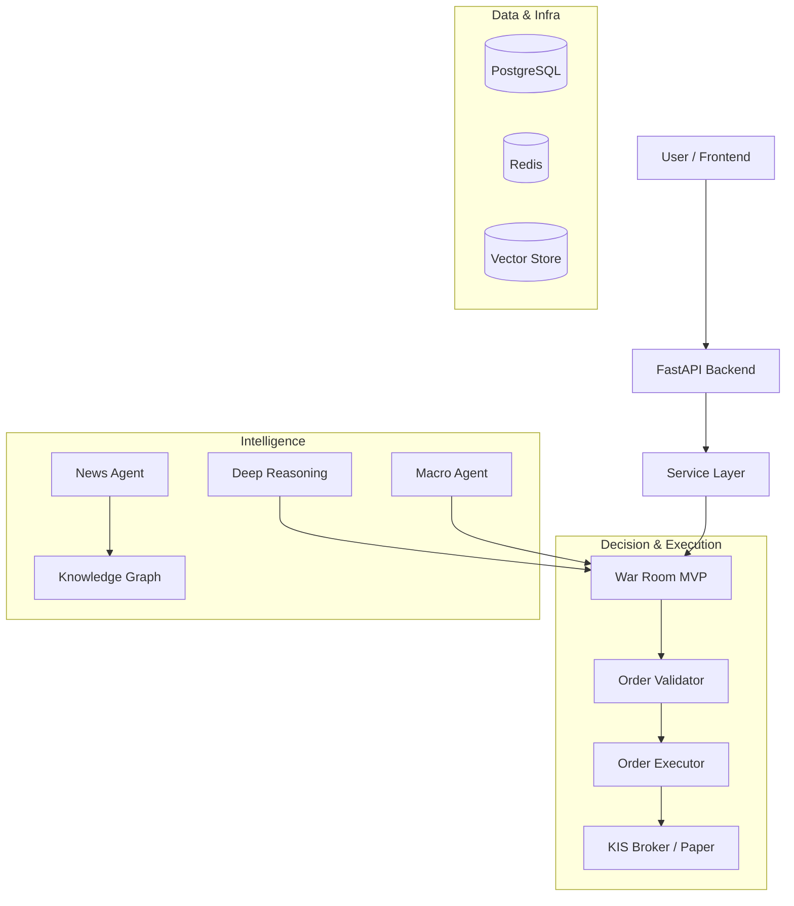

# 🤖💹 AI Trading System

**Multi-AI 기반 자동 주식 트레이딩 시스템 (Antigravity Enabled)**

> Claude, Gemini, ChatGPT를 활용한 앙상블 AI 투자 플랫폼 & 자율 에이전트 시스템

[](https://www.python.org/)
[](https://fastapi.tiangolo.com/)
[](https://reactjs.org/)
[](https://www.postgresql.org/)
[](https://google.deepmind.com/)

---

## 📊 프로젝트 개요

AI Trading System은 다중 AI 모델을 활용한 엔터프라이즈급 자동 트레이딩 플랫폼입니다. 뉴스 분석, 시그널 생성, 백테스팅, 리스크 관리, 실시간 모니터링을 통합하여 데이터 기반 투자 결정을 지원합니다.

특히 **Antigravity Agentic Workflow**가 적용되어, 개발 프로세스(TDD, 문서화, DB 관리 등)까지 AI가 주도적으로 관리하는 자율 진화형 시스템입니다.

### 🎯 핵심 가치

- **Multi-AI 앙상블**: Claude Sonnet 4.5, ChatGPT-4, Gemini Pro를 조합하여 정교한 시장 분석
- **Antigravity Workflow**: 개발 규칙 준수, DB 변경 안전 관리, 문서 자동화 지원
- **Deep Reasoning**: Knowledge Graph 기반의 3단계 추론(직접/간접/전략적 영향) 분석
- **MVP War Room**: 의사결정(War Room) → 검증(Validator) → 실행(Order Execution)의 안전한 단방향 파이프라인
- **실시간 뉴스 & 시그널**: 50+ 금융 소스 크롤링 및 즉각적인 트레이딩 시그널 생성

---

## 📁 문서 가이드 (Documentation)

프로젝트 문서는 `docs/` 디렉토리에서 체계적으로 관리됩니다.

- **[빠른 시작 (Quick Start)](docs/guides/QUICK_START.md)**: 설치 및 실행 방법
- **[아키텍처 맵 (Structure Map)](docs/architecture/structure-map.md)**: 시스템 의존성 및 파일 구조 (자동 업데이트)
- **[시스템 구조 분석](docs/architecture/260114_Analysis_System_Structure.md)**: 백엔드 아키텍처 상세 분석 리포트
- **[개발 가이드 (Development)](docs/guides/배치파일_사용법_최종.md)**: 배치 파일 및 유틸리티 사용법

---

## 🚀 워크플로우 (Development Workflows)

이 프로젝트는 Antigravity 에이전트를 통해 다음과 같은 자동화된 워크플로우를 제공합니다.

### 1. 🏗️ 구조 및 의존성 관리
- **Structure Map**: 개발 전 `python backend/utils/structure_mapper.py`를 실행하여 최신 구조 확인.
- **규칙**: `docs/architecture/structure-map.md` 자동 갱신 필수.

### 2. 🗄️ DB 스키마 변경 (`/db-schema-change`)
- **안전한 변경**: 영향도 분석 → 마이그레이션 생성 → 로컬 테스트 → 적용 단계를 AI가 가이드.
- **금지**: 운영 DB 직접 수정 절대 금지.

### 3. 📜 헌법(Constitution) 수정 (`/constitution-amendment`)
- **Core Rules**: 리스크 한도, 손절 규칙 등 '헌법' 수정 시 엄격한 승인 절차(백테스트 포함) 적용.

### 4. 📝 문서 표준화
- **파일명 규칙**: `YYMMDD_Category_Description.md` (예: `260114_Implementation_Feature.md`)
- **저장 위치**: `docs/` 하위 적절한 폴더 분류.

### 5. 🐙 GitHub 협업 (`/github-commit`)
- **Level별 가이드**: 초보자(Main Only)부터 고급 사용자(GitFlow)까지 맞춤형 커밋 가이드 제공.

---

## 🏗️ 시스템 아키텍처



> **상세 아키텍처**: `docs/architecture/structure-map.md` 파일 참조

---

## 💻 빠른 시작

### 1. 설치 및 환경 설정
```bash
# 가상환경 생성 및 의존성 설치
python -m venv venv
.\venv\Scripts\activate
pip install -r requirements.txt

# 프론트엔드 설치
cd frontend
npm install
```

### 2. 환경 변수 설정
`.env` 파일에 API Key 및 DB 접속 정보를 설정합니다. (예시: `.env.example` 참조)

### 3. 실행
```bash
# 전체 시스템 시작 (Docker + Backend + Frontend)
start_all.bat
```
또는 개별 실행:
```bash
python start_backend.py
cd frontend && npm run dev
```

---

## 🛠️ 기술 스택

### Backend
- **Core**: Python 3.11, FastAPI
- **AI**: Claude, Gemini, ChatGPT (Unified Client)
- **Data**: PostgreSQL, TimescaleDB, Redis, ChromaDB
- **Agent**: Antigravity, Custom Agent Framework

### Frontend
- **Framework**: React 18, Vite, TypeScript
- **UI**: Tailwind CSS, Recharts, Lucide React

---

## 📝 라이선스
MIT License

---

**Version 2.0.0** | Last Updated: 2026-01-14 | Antigravity System Integration
