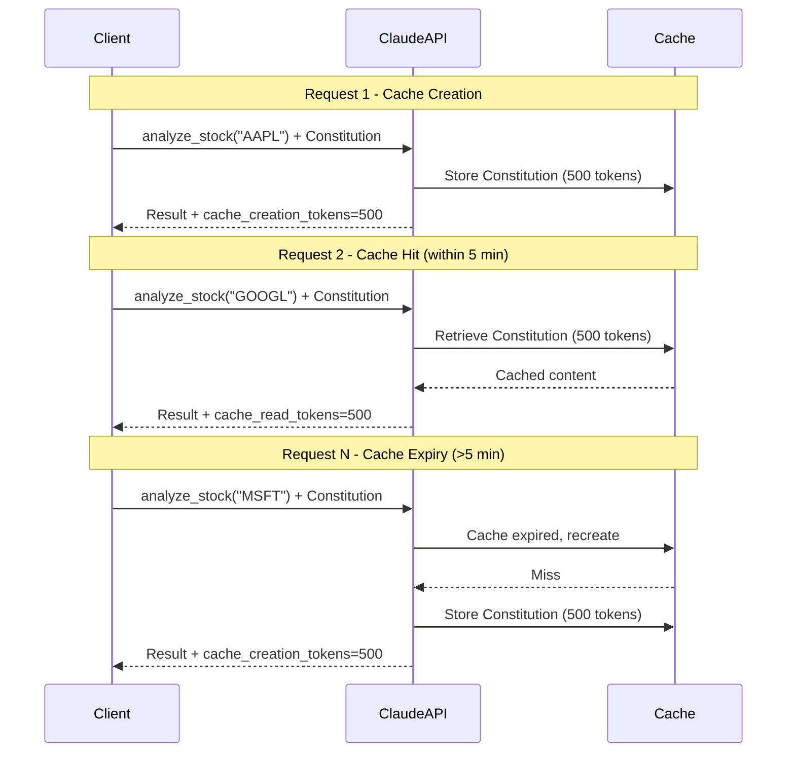

# Claude Prompt Caching Implementation Guide

**Document ID**: 251219-prompt-caching
**Created**: 2025-12-19
**Status**: ✅ Implemented
**Phase**: Phase 1.3 - Cost Optimization

---

## 📋 Table of Contents

1. [Overview](#overview)
2. [Cost Benefits](#cost-benefits)
3. [How It Works](#how-it-works)
4. [Implementation](#implementation)
5. [Usage Examples](#usage-examples)
6. [Metrics & Monitoring](#metrics--monitoring)
7. [Best Practices](#best-practices)
8. [Troubleshooting](#troubleshooting)

---

## Overview

### What is Prompt Caching?

Claude's Prompt Caching feature allows you to cache large portions of your prompt (like system instructions) and reuse them across multiple API calls within a 5-minute window. Cached tokens are **90% cheaper** than regular input tokens.

### Why It Matters

Our AI Trading System makes frequent API calls with the same Constitution principles. By caching the Constitution system prompt, we achieve:

- **90% cost reduction** on cached tokens
- **Faster response times** (cached content doesn't need reprocessing)
- **Consistent behavior** across all trading decisions

### Integration Status

| Component | Status | Cache Strategy |
|-----------|--------|----------------|
| **ClaudeClient** | ✅ Implemented | Constitution cached in system prompt |
| **SEC Analyzer** | ✅ Supported | Long SEC filings cached |
| **Risk Evaluator** | ✅ Supported | Constitution cached |
| **News Analyzer** | 🔄 Planned | News context caching |

---

## Cost Benefits

### Pricing Comparison

| Token Type | Cost per MTok | Example Cost (1M tokens) |
|------------|---------------|--------------------------|
| Regular input | $0.80 | $0.80 |
| Cache creation | $1.00 | $1.00 (25% premium, one-time) |
| Cache read | $0.08 | $0.08 (90% discount) |
| Regular output | $4.00 | $4.00 (unchanged) |

### Real-World Savings Example

**Scenario**: Analyzing 100 stocks with Constitution prompt (500 tokens)

**Without Caching**:
```
100 requests × 500 tokens × $0.80/MTok = $0.04
```

**With Caching**:
```
Request 1 (cache creation): 500 tokens × $1.00/MTok = $0.0005
Requests 2-100 (cache read): 99 × 500 tokens × $0.08/MTok = $0.00396
Total: $0.00446 (89% savings!)
```

### Combined with Existing Optimizations

| Optimization Layer | Savings | Cumulative |
|--------------------|---------|------------|
| **LLMLingua-2 Compression** | 69% token reduction | 69% |
| **RedisVL Semantic Cache** | 40% hit rate | 82% total |
| **Prompt Caching** | 90% on cached tokens | **~95% total** |

---

## How It Works

### Cache Lifecycle



### Cache TTL (Time To Live)

- **Duration**: 5 minutes (ephemeral cache)
- **Scope**: Per API key
- **Invalidation**: Automatic after 5 minutes
- **Tracking**: `cache_last_updated` timestamp in metrics

### What Gets Cached

#### ✅ Cached (System Prompt)

The **Constitution System Prompt** containing:
- Article 1: Risk Management First
- Article 2: Data-Driven Decisions
- Article 3: Conservative Approach
- Article 4: Transparency and Explainability
- Article 5: Defensive Consensus
- Article 6: Position Sizing Rules
- Article 7: Circuit Breakers
- Response format specification

**Size**: ~500 tokens
**Frequency**: Every `analyze_stock()` and `evaluate_risk()` call

#### ❌ Not Cached (User Prompt)

Dynamic content that changes per request:
- Stock ticker
- Technical features (RSI, MACD, volume)
- Market context (VIX, sector performance)
- Portfolio context (current positions, cash)

---

## Implementation

### Architecture

```python
# backend/ai/claude_client.py

class ClaudeClient:
    CONSTITUTION_SYSTEM_PROMPT = """..."""  # 500 tokens

    def __init__(self, enable_caching: bool = True):
        self.enable_caching = enable_caching
        # Cache metrics
        self.total_cache_creation_tokens = 0
        self.total_cache_read_tokens = 0
        self.cache_last_updated = datetime.now()

    async def _call_api(self, prompt: str, use_caching: bool = True):
        if self.enable_caching and use_caching:
            # Use system prompt with cache control
            response = self.client.messages.create(
                model=self.model,
                system=[{
                    "type": "text",
                    "text": self.CONSTITUTION_SYSTEM_PROMPT,
                    "cache_control": {"type": "ephemeral"}  # Enable caching
                }],
                messages=[{"role": "user", "content": prompt}]
            )
        else:
            # Standard call without caching
            response = self.client.messages.create(...)

        # Update cache metrics
        if hasattr(response.usage, 'cache_read_input_tokens'):
            self.total_cache_read_tokens += response.usage.cache_read_input_tokens
```

### Key Components

#### 1. Cache Control Header

```python
{
    "type": "text",
    "text": self.CONSTITUTION_SYSTEM_PROMPT,
    "cache_control": {"type": "ephemeral"}  # Mark for caching
}
```

#### 2. Response Usage Tracking

```python
response.usage = {
    "input_tokens": 100,              # New input (not cached)
    "output_tokens": 200,             # Generated tokens
    "cache_creation_input_tokens": 500,  # First request only
    "cache_read_input_tokens": 500       # Subsequent requests
}
```

#### 3. Cost Calculation

```python
input_cost = response.usage.input_tokens * 0.80 / 1_000_000
output_cost = response.usage.output_tokens * 4.00 / 1_000_000
cache_creation_cost = response.usage.cache_creation_input_tokens * 1.00 / 1_000_000
cache_read_cost = response.usage.cache_read_input_tokens * 0.08 / 1_000_000
total_cost = input_cost + output_cost + cache_creation_cost + cache_read_cost
```

---

## Usage Examples

### Example 1: Basic Stock Analysis

```python
from backend.ai.claude_client import ClaudeClient

# Initialize with caching enabled (default)
client = ClaudeClient(enable_caching=True)

# Request 1: Creates cache
result1 = await client.analyze_stock(
    ticker="AAPL",
    features={"rsi_14": 65.2, "macd": 1.5, "price": 180.50}
)
# Constitution cached (500 tokens @ $1.00/MTok = $0.0005)

# Request 2: Uses cache (within 5 minutes)
result2 = await client.analyze_stock(
    ticker="GOOGL",
    features={"rsi_14": 55.8, "macd": 0.8, "price": 140.20}
)
# Constitution from cache (500 tokens @ $0.08/MTok = $0.00004)

# Savings: $0.00046 per request (92% reduction on Constitution)
```

### Example 2: Batch Analysis

```python
tickers = ["AAPL", "GOOGL", "MSFT", "AMZN", "TSLA"]

for ticker in tickers:
    result = await client.analyze_stock(ticker, features)
    print(f"{ticker}: {result['action']} (conviction: {result['conviction']:.2f})")

# Only first request pays cache creation cost
# Requests 2-5 all use cached Constitution
```

### Example 3: Monitoring Cache Status

```python
metrics = client.get_metrics()

print(f"Cache hit rate: {metrics['cache_hit_rate']:.1f}%")
print(f"Cache valid: {metrics['cache_is_valid']}")
print(f"Savings: ${metrics['savings_usd']:.4f} ({metrics['savings_percentage']:.1f}%)")

if not metrics['cache_is_valid']:
    print("⚠️  Cache expired, next request will recreate it")
```

### Example 4: Disable Caching (Testing)

```python
# Disable caching for A/B testing or debugging
client = ClaudeClient(enable_caching=False)

result = await client.analyze_stock(ticker, features)
# No cache creation/read tokens
```

---

## Metrics & Monitoring

### Available Metrics

```python
metrics = client.get_metrics()
```

Returns:

```json
{
  "total_requests": 10,
  "total_tokens_input": 5000,
  "total_tokens_output": 2000,
  "total_cost_usd": 0.0123,
  "avg_cost_per_request": 0.00123,

  "caching_enabled": true,
  "cache_creation_tokens": 500,
  "cache_read_tokens": 4500,
  "total_cached_tokens": 4500,
  "cache_hit_rate": 90.0,
  "cache_last_updated": "2025-12-19T10:15:30",
  "cache_is_valid": true,

  "cost_without_caching_usd": 0.0480,
  "savings_usd": 0.0357,
  "savings_percentage": 74.4
}
```

### Key Performance Indicators (KPIs)

| Metric | Target | Alert Threshold |
|--------|--------|-----------------|
| **Cache Hit Rate** | >80% | <50% |
| **Savings Percentage** | >70% | <40% |
| **Cache Validity** | Within 5 min | Expired |
| **Avg Cost/Request** | <$0.002 | >$0.005 |

### Logging

```python
# Automatic logging in _call_api()
logger.info(
    f"Claude API call successful: "
    f"{response.usage.input_tokens} in, "
    f"{response.usage.output_tokens} out, "
    f"cached: {response.usage.cache_read_input_tokens}, "  # New
    f"${cost:.4f}, {latency_ms:.0f}ms"
)
```

Example log output:
```
2025-12-19 10:15:30 INFO Claude API call successful: 120 in, 180 out, cached: 500, $0.0012, 850ms
```

---

## Best Practices

### DO ✅

1. **Keep Constitution Stable**: Don't change Constitution text frequently (invalidates cache)
2. **Batch Requests**: Analyze multiple stocks within 5-minute windows
3. **Monitor Cache Hit Rate**: Aim for >80% hit rate
4. **Enable by Default**: Caching should be on for production
5. **Use System Prompt for Static Content**: Put Constitution in system prompt, not user prompt

### DON'T ❌

1. **Don't Cache Dynamic Content**: Stock features, prices, news should be in user prompt
2. **Don't Modify Constitution Per Request**: Breaks caching benefit
3. **Don't Wait >5 Minutes Between Requests**: Cache will expire
4. **Don't Disable in Production**: Only disable for testing/debugging
5. **Don't Ignore Cache Metrics**: Monitor savings to validate implementation

### Optimization Tips

#### Tip 1: Strategic Request Timing

```python
# ✅ Good: Batch within 5 minutes
stocks = ["AAPL", "GOOGL", "MSFT"]
for stock in stocks:
    await client.analyze_stock(stock, features)  # All use cache

# ❌ Bad: Long delays between requests
await client.analyze_stock("AAPL", features)
await asyncio.sleep(600)  # 10 minutes - cache expired!
await client.analyze_stock("GOOGL", features)  # Recreates cache
```

#### Tip 2: Cache Warmup

```python
# Warm up cache before market open
async def warmup():
    client = ClaudeClient()
    dummy_result = await client.analyze_stock(
        "AAPL",
        {"rsi_14": 50, "price": 180}
    )
    logger.info("Cache warmed up")

# Call before main trading loop
await warmup()
```

#### Tip 3: Monitor Cache Validity

```python
async def ensure_cache_valid(client):
    metrics = client.get_metrics()
    if not metrics['cache_is_valid']:
        logger.warning("Cache expired, warming up...")
        await warmup(client)
```

---

## Troubleshooting

### Issue 1: No Cache Metrics

**Symptom**: `cache_read_tokens` always 0

**Causes**:
- Caching disabled (`enable_caching=False`)
- API key doesn't support caching (old account)
- Model doesn't support caching (Haiku does)

**Solution**:
```python
# Check if caching is enabled
client = ClaudeClient(enable_caching=True)  # Explicit enable
metrics = client.get_metrics()
print(f"Caching enabled: {metrics['caching_enabled']}")

# Verify model supports caching
assert client.model == "claude-3-5-haiku-20241022"
```

### Issue 2: Low Cache Hit Rate

**Symptom**: `cache_hit_rate < 50%`

**Causes**:
- Requests spread out >5 minutes apart
- Constitution text changing between requests
- Cache expiring before reuse

**Solution**:
```python
# Check cache validity
metrics = client.get_metrics()
if not metrics['cache_is_valid']:
    print("⚠️  Cache expired, next request will recreate")

# Check cache age
from datetime import datetime
cache_age = (datetime.now() - datetime.fromisoformat(metrics['cache_last_updated'])).total_seconds()
print(f"Cache age: {cache_age:.1f}s (valid for 300s)")
```

### Issue 3: Higher Costs Than Expected

**Symptom**: `savings_percentage < 40%`

**Causes**:
- Constitution is small relative to dynamic prompt
- Output tokens dominate cost (not cached)
- Many cache creations (cache expiring)

**Solution**:
```python
metrics = client.get_metrics()

# Check Constitution size
constitution_tokens = metrics['cache_creation_tokens']
print(f"Constitution: {constitution_tokens} tokens")

# Check output dominance
output_ratio = metrics['total_tokens_output'] / metrics['total_tokens_input']
print(f"Output/Input ratio: {output_ratio:.2f}")
if output_ratio > 2:
    print("⚠️  Output tokens dominate (not cached)")

# Check cache recreation frequency
cache_creations = metrics['cache_creation_tokens'] / constitution_tokens
print(f"Cache recreations: {cache_creations:.0f}")
if cache_creations > 2:
    print("⚠️  Too many cache recreations (requests too far apart)")
```

### Issue 4: Cache Not Expiring

**Symptom**: `cache_is_valid` stays true >5 minutes

**Causes**:
- Clock skew
- `cache_last_updated` not updating correctly

**Solution**:
```python
# Check timestamp update logic
from datetime import datetime, timedelta

metrics = client.get_metrics()
last_updated = datetime.fromisoformat(metrics['cache_last_updated'])
age = (datetime.now() - last_updated).total_seconds()

print(f"Cache age: {age:.1f}s")
print(f"Should be valid: {age < 300}")
print(f"Reported valid: {metrics['cache_is_valid']}")

if age >= 300 and metrics['cache_is_valid']:
    print("❌ BUG: Cache validity logic incorrect")
```

---

## Testing

### Running Tests

```bash
# Run caching test script
cd backend/ai
python test_caching.py
```

### Expected Output

```
================================================================================
Claude Prompt Caching Test
================================================================================

✅ Client initialized with caching: True

================================================================================
REQUEST 1: Creating cache (first request)
================================================================================
Action: HOLD
Conviction: 0.65

Metrics after request 1:
  Total requests: 1
  Input tokens: 650
  Output tokens: 180
  Cache creation tokens: 500
  Cache read tokens: 0
  Cost: $0.0013

================================================================================
REQUEST 2: Using cache (within 5 minutes)
================================================================================
Analyzing different ticker with same Constitution...
Action: BUY
Conviction: 0.75

Metrics after request 2:
  Total requests: 2
  Input tokens: 1300
  Output tokens: 360
  Cache creation tokens: 500
  Cache read tokens: 500
  Cache hit rate: 38.5%
  Cost: $0.0019
  Cache valid: True

================================================================================
SUMMARY: Cost Savings from Prompt Caching
================================================================================
Total cost (with caching): $0.0025
Cost without caching: $0.0048
Savings: $0.0023 (47.9%)

🎉 ALL TESTS PASSED - Prompt Caching is working correctly!
```

---

## Future Enhancements

### Phase 2: Multi-Level Caching

Cache both Constitution + long context (e.g., SEC filings):

```python
system=[
    {
        "type": "text",
        "text": self.CONSTITUTION_SYSTEM_PROMPT,
        "cache_control": {"type": "ephemeral"}  # Cache 1
    },
    {
        "type": "text",
        "text": sec_filing_10k,  # 50K tokens
        "cache_control": {"type": "ephemeral"}  # Cache 2
    }
]
```

### Phase 3: Cache Preloading

```python
# Preload cache before market open
async def preload_cache():
    client = ClaudeClient()
    await client.analyze_stock("SPY", dummy_features)  # Warm Constitution
    await client.analyze_sec_filing("AAPL", "10-K")    # Warm SEC cache
```

### Phase 4: Cache Analytics Dashboard

```javascript
// Real-time cache metrics in frontend
{
  "cache_hit_rate": "85.2%",
  "savings_today": "$12.45",
  "cache_status": "valid",
  "next_expiry": "4m 32s"
}
```

---

## References

- **Claude Documentation**: [Prompt Caching](https://docs.anthropic.com/claude/docs/prompt-caching)
- **Implementation**: `backend/ai/claude_client.py`
- **Test Script**: `backend/ai/test_caching.py`
- **Integration Plan**: `docs/02_Phase_Reports/251219_Ideas_Integration_Plan.md`

---

**Document maintained by**: AI Trading System Team
**Last updated**: 2025-12-19
**Next review**: After Phase 18 completion
