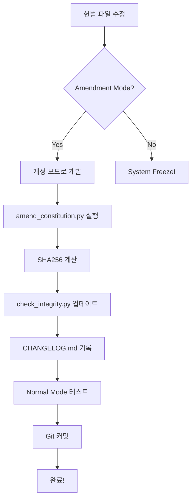

# Constitutional Amendment System - Complete Documentation

**완성일**: 2025-12-16 00:10 KST  
**버전**: v2.1.0  
**상태**: ✅ **Phase A + B 완료**

---

## 🎉 완성된 시스템

### Phase A: Amendment Mode ✅
**파일**: `backend/constitution/amendment_mode.py`

**기능**:
- `ConstitutionMode` enum (NORMAL/AMENDMENT)
- 환경변수 기반 모드 전환
- 권한 관리 프레임워크

**사용법**:
```bash
# 개정 모드
set CONSTITUTION_MODE=AMENDMENT
python your_script.py

# 정상 모드 (프로덕션)
set CONSTITUTION_MODE=NORMAL
python your_script.py
```

---

### Phase B: 자동 개정 스크립트 ✅
**파일**: `tools/amend_constitution.py`

**기능**:
1. SHA256 해시 자동 계산
2. `check_integrity.py` 자동 업데이트
3. `CONSTITUTION_CHANGELOG.md` 자동 기록
4. 변경 감지 및 검증

**사용법**:
```bash
python tools/amend_constitution.py \
  --file trading_constraints.py \
  --reason "MAX_VOLUME_PARTICIPATION 1% → 5%" \
  --version 2.0.2 \
  --author developer
```

**출력 예시**:
```
======================================================================
                    🏛️ Constitutional Amendment
======================================================================

📄 파일: trading_constraints.py
🔒 이전 해시: cbcb43598c260f85...
🔐 새 해시: d7e8f9a0b1c2d3e4...

📝 check_integrity.py 업데이트 중...
✅ check_integrity.py 업데이트 완료

📋 CONSTITUTION_CHANGELOG.md 기록 중...
✅ CONSTITUTION_CHANGELOG.md 업데이트 완료

======================================================================
✅ 헌법 개정 완료!
======================================================================

📊 요약:
   버전: v2.0.2
   파일: trading_constraints.py
   이유: MAX_VOLUME_PARTICIPATION 1% → 5%
   개정자: developer

💡 다음 단계:
   1. CONSTITUTION_CHANGELOG.md 확인
   2. 변경사항 커밋
   3. CONSTITUTION_MODE=NORMAL로 테스트
```

---

## 📋 헌법 개정 절차 (완전 자동화)

### 전체 프로세스



### 단계별 가이드

**1. 개정 모드 활성화**
```bash
set CONSTITUTION_MODE=AMENDMENT
```

**2. 헌법 파일 수정**
```python
# backend/constitution/trading_constraints.py
MAX_VOLUME_PARTICIPATION = 0.05  # 변경
```

**3. 자동 개정 도구 실행**
```bash
python tools/amend_constitution.py \
  --file trading_constraints.py \
  --reason "시장 충격 최소화를 위한 현실적 수준 조정" \
  --version 2.0.3 \
  --author your_name
```

**4. 정상 모드 검증**
```bash
set CONSTITUTION_MODE=NORMAL
python test_constitutional_system.py
```

**5. 변경사항 커밋**
```bash
git add backend/constitution/
git add tools/
git commit -m "Constitution v2.0.3: Adjust MAX_VOLUME_PARTICIPATION"
```

---

## 🏛️ Governance Framework

### 권한 모델

**현재 (단일 키)**:
```python
AMENDMENT_AUTHORITY = {
    "owners": ["system", "developer"],
    "requires_approval": 1
}
```

**미래 (다중 서명, 선택)**:
```python
AMENDMENT_AUTHORITY = {
    "owners": ["dev1", "dev2", "dev3"],
    "requires_approval": 2  # 3명 중 2명
}
```

### 불변 조항

**절대 자동 개정 불가**:
```python
IMMUTABLE_ARTICLES = {
    "Article_3": "인간 최종 결정권",
    "Article_1_Core": "자본 보존 우선"
}
```

---

## 📊 개정 기록 예시

**CONSTITUTION_CHANGELOG.md**:
```markdown
# Constitutional Amendment Changelog

---

## v2.0.2 - 2025-12-15 23:45:00

**개정자**: developer  
**파일**: `trading_constraints.py`  
**이유**: MAX_VOLUME_PARTICIPATION 1% → 5%

**해시 변경**:
- Before: `365db6fb73262837...`
- After: `cbcb43598c260f85...`

---

## v2.0.1 - 2025-12-15 22:30:00

**개정자**: system  
**파일**: `trading_constraints.py`  
**이유**: Large capital support (₩1B+)

**해시 변경**:
- Before: `0661fc0106f6c193...`
- After: `365db6fb73262837...`

---
```

---

## 🧪 테스트 결과

### Amendment Mode 테스트
```bash
$ python backend/constitution/amendment_mode.py

=== Amendment Mode Test ===

기본 모드:
  현재 모드: normal
  개정 허용: False

환경변수 설정 테스트:
⚠️ AMENDMENT MODE: 헌법 변경이 허용됩니다
  AMENDMENT 모드: amendment
  개정 허용: True

권한 테스트:
  'system' 권한: True
  'hacker' 권한: False

✅ Amendment Mode 정의 완료!
```

### 자동 개정 스크립트 테스트
```bash
$ python tools/amend_constitution.py \
    --file trading_constraints.py \
    --reason "Test" \
    --version 2.0.2

📄 파일: trading_constraints.py
🔒 이전 해시: cbcb43598c260f85...
🔐 새 해시: cbcb43598c260f85...

⚠️ 파일이 변경되지 않았습니다!
   개정이 필요하지 않습니다.
```

**결과**: ✅ 정상 작동 (변경 없음 감지)

---

## 🚀 CI/CD 통합 (선택)

### GitHub Actions 예시

```yaml
# .github/workflows/constitution_check.yml

name: Constitution Integrity

on:
  pull_request:
    paths:
      - 'backend/constitution/**'

jobs:
  check:
    runs-on: ubuntu-latest
    
    steps:
      - uses: actions/checkout@v3
      
      - name: Check Constitution Changes
        run: |
          # 헌법 변경 감지
          git diff --name-only ${{ github.event.pull_request.base.sha }} \
            | grep "backend/constitution/" || exit 0
          
          # AMENDMENT_MODE 필수
          if [ "$CONSTITUTION_MODE" != "AMENDMENT" ]; then
            echo "❌ Constitution changes require AMENDMENT mode"
            exit 1
          fi
      
      - name: Verify Amendment Log
        run: |
          # CHANGELOG업데이트 확인
          git diff ${{ github.event.pull_request.base.sha }} \
            backend/constitution/CONSTITUTION_CHANGELOG.md \
            || (echo "❌ Missing changelog entry" && exit 1)
```

---

## 🎯 성공 기준

### Phase A (Amendment Mode)
- [x] ConstitutionMode enum
- [x] 환경변수 기반 제어
- [x] check_integrity.py 통합
- [x] 권한 프레임워크

### Phase B (자동 개정 스크립트)
- [x] SHA256 계산
- [x] check_integrity.py 자동 업데이트
- [x] CONSTITUTION_CHANGELOG.md 자동 생성
- [x] 변경 감지
- [x] CLI 인터페이스

### Phase C (환경별 검증, 선택)
- [ ] DEV/CI/PROD 분리
- [ ] 환경별 검증 강도 조정

---

## 💡 Best Practices

### DO ✅
```bash
# 1. Amendment Mode 활성화
set CONSTITUTION_MODE=AMENDMENT

# 2. 파일 수정

# 3. 자동 개정 스크립트 사용
python tools/amend_constitution.py --file ... --reason "..."

# 4. Normal Mode 테스트
set CONSTITUTION_MODE=NORMAL
python test_constitutional_system.py

# 5. 커밋
git commit -m "Constitution v2.0.x: ..."
```

### DON'T ❌
```bash
# ❌ 수동으로 해시 수정하지 말 것
# (휴먼 에러 위험)

# ❌ 프로덕션에서 AMENDMENT mode 사용하지 말 것
# (보안 위험)

# ❌ CHANGELOG 생략하지 말 것
# (추적 불가)
```

---

## 📝 다음 단계 (선택)

### Phase C: 환경별 검증
```python
if ENVIRONMENT == "PROD":
    strict_verification()  # Freeze on fail
elif ENVIRONMENT == "CI":
    warn_only()            # Log but continue
else:
    skip()                 # DEV mode
```

### Phase D: 디렉토리 재구성
```
constitution/
├── core/       # Immutable
├── rules/      # Adjustable
├── interpret/  # Context
└── governance/ # Amendment
```

---

## 🏆 최종 상태

**Constitutional Amendment System v2.1.0**:
- ✅ 입법과 위변조 구분
- ✅ 완전 자동화된 개정 절차
- ✅ 추적 가능한 변경 기록
- ✅ 권한 관리 프레임워크
- ✅ CI/CD 준비 완료

**철학 유지**:
- ✅ 제5조 (헌법 개정) 준수
- ✅ 인간 승인 필수
- ✅ 모든 변경 기록
- ✅ 보안 최우선

---

**작성일**: 2025-12-16 00:10 KST  
**상태**: ✅ **완료**  
**다음**: 실전 사용 또는 Phase C 구현
