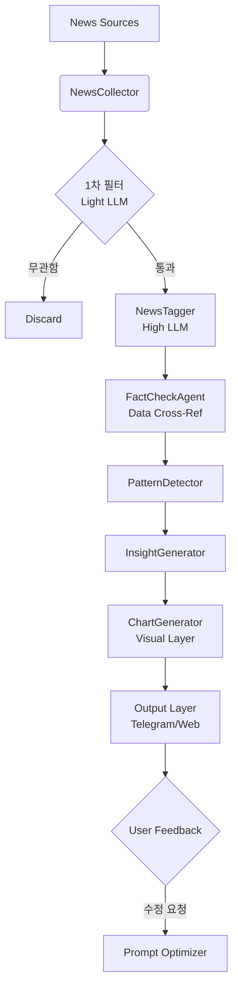

제공해주신 설계 문서는 **소수몽키(Sosumonkey)** 님의 분석 스타일(매크로-정책-테마-종목 연결)을 시스템적으로 매우 잘 구조화했습니다. 특히 '분석 레이어'를 7가지로 정의하고, 구체적인 2026년 시점의 데이터(그린란드, 방산 등)를 예시로 든 점이 인상적입니다.

Claude가 검토한 내용도 훌륭하지만, **실제 운용 가능한 시스템**으로 만들기 위해 **기술적 안정성(Hallucination 방지), 비용 효율성, 그리고 시각화(Visual)** 측면에서 보완해야 할 핵심 사항들을 추가 분석하여 제안합니다.

---

# 🚀 추가 및 보완 제안 보고서

## 1. 분석 및 보완이 필요한 핵심 영역

기존 문서에서 부족하거나 리스크가 있는 부분은 크게 4가지입니다.

### ① 데이터 검증 (Hallucination Control)

* **문제점:** LLM은 뉴스 텍스트만 보고 "매출이 50% 늘었다"를 해석할 때, 실제 수치와 다르게 해석하거나 단위를 착각할 수 있습니다.
* **보완:** **`FactCheckAgent`** 추가. LLM이 추출한 수치(EPS, 가이던스, 예산안)를 신뢰할 수 있는 정량 데이터 소스(Yahoo Finance, SEC API 등)와 교차 검증하는 단계가 필수입니다.

### ② 비용 및 속도 최적화 (Filter Layer)

* **문제점:** 모든 뉴스(RSS Feed의 모든 항목)를 고성능 LLM(Claude 3.5 Sonnet/Opus 등)에 넣으면 비용이 과다하게 발생하고 처리 속도가 느려집니다.
* **보완:** **Two-Stage Filtering**.
* 1단계: 가벼운 모델(GPT-4o-mini 또는 키워드 필터)로 "투자 연관성"만 O/X로 판단.
* 2단계: 통과된 뉴스만 고성능 모델로 정밀 분석.


### ③ 시각화 자동화 (Chart Generation)

* **문제점:** 소수몽키 분석의 핵심은 **"한눈에 들어오는 도식화 자료"**입니다. 텍스트 리포트만으로는 그 '맛'을 살리기 어렵습니다.
* **보완:** Python(`matplotlib`, `plotly`)을 이용해 **버블 차트(테마별 등락), 타임라인 차트(지정학 이슈)**를 이미지로 자동 생성하여 텔레그램으로 전송해야 합니다.

### ④ 피드백 루프 (Active Learning)

* **문제점:** 초기에는 "방산"으로 분류해야 할 것을 "제조업"으로 잘못 분류할 수 있습니다.
* **보완:** 사용자가 텔레그램 버튼으로 "분류 수정"을 누르면, 이를 DB에 저장하여 프롬프트를 자동 개선하는 루프가 필요합니다.

---

## 2. 시스템 아키텍처 보완 (Refined Architecture)

기존 3.3 데이터 흐름도에 **검증(Verification)**과 **시각화(Visualization)** 레이어를 추가했습니다.



---

## 3. 상세 컴포넌트 추가 설계

### 3.1 FactCheckAgent (신설)

**역할**: LLM이 추출한 정보가 숫자로 검증 가능한지 확인

```python
# backend/ai/intelligence/fact_checker.py

class FactChecker:
    """
    LLM이 추출한 태그 정보와 실제 시장 데이터 교차 검증
    """
    async def verify_financials(self, tags: Dict) -> Dict:
        """
        예: 기사에서 '엔비디아 실적 서프라이즈'라고 했다면,
        실제 yfinance 등에서 발표된 EPS가 컨센서스를 상회했는지 확인
        """
        ticker = tags.get('affected_tickers')[0]
        extracted_sentiment = tags.get('sentiment')
        
        # 실제 데이터 조회 (Mock)
        real_data = await self.market_data_provider.get_latest_earnings(ticker)
        
        # 검증 로직
        is_match = (real_data['surprise_pct'] > 0 and extracted_sentiment == 'BULLISH')
        
        return {
            "verified": is_match,
            "data_source_value": real_data['surprise_pct'],
            "llm_value": extracted_sentiment,
            "flag": "CAUTION" if not is_match else "CONFIRMED"
        }

```

### 3.2 ChartGenerator (신설)

**역할**: 소수몽키 스타일의 시각 자료 자동 생성

```python
# backend/visualization/chart_generator.py

class ChartGenerator:
    """
    데이터를 받아 이미지 파일로 변환
    """
    def generate_theme_bubble_chart(self, themes: List[Dict]):
        """
        테마별 등락률을 버블 차트로 시각화
        X축: YTD 수익률, Y축: 최근 1주 모멘텀, 버블크기: 언급량
        """
        # Matplotlib/Seaborn 코드 구현
        pass

    def generate_geopolitics_timeline(self, issue_name: str, events: List[Dict]):
        """
        지정학 타임라인을 수직 인포그래픽으로 생성
        """
        # Plotly 또는 PIL 이미지 드로잉 구현
        pass

```

---

## 4. 데이터베이스 스키마 추가

기존 스키마에 **검증 상태**와 **피드백**을 저장할 컬럼을 추가합니다.

```sql
-- news_tags 테이블 수정
ALTER TABLE news_tags 
ADD COLUMN verification_status VARCHAR(20) DEFAULT 'UNVERIFIED', -- VERIFIED, MISMATCH
ADD COLUMN fact_check_note TEXT; -- "실제 공시 데이터와 일치함"

-- user_feedback 테이블 신설 (RLHF 용도)
CREATE TABLE user_feedback (
    id SERIAL PRIMARY KEY,
    insight_id INTEGER REFERENCES insights(id),
    feedback_type VARCHAR(20), -- 'WRONG_THEME', 'BAD_SUMMARY', 'GOOD'
    user_comment TEXT,
    corrected_data JSONB, -- 사용자가 수정한 올바른 데이터
    created_at TIMESTAMP DEFAULT NOW()
);

```

---

## 5. 프롬프트 엔지니어링 강화 (Persona Tuning)

소수몽키님의 스타일을 완벽하게 재현하기 위해 프롬프트에 **'톤앤매너(Tone & Manner)'** 지시사항을 구체화해야 합니다.

### 수정된 Insight Generation Prompt

```python
INSIGHT_GENERATION_PROMPT = """
당신은 '소수몽키'라는 페르소나를 가진 주식 시장 분석가입니다.
당신의 분석 스타일은 다음과 같습니다:

1. **두괄식 결론**: 복잡한 미사여구 대신 "그래서 사야 돼? 팔아야 돼?"에 대한 힌트를 줍니다.
2. **연결고리 강조**: A뉴스가 터졌을 때 B기업이 수혜를 입는 논리적 연결고리(Value Chain)를 집요하게 파고듭니다.
3. **쉬운 비유**: 어려운 경제 용어 대신 "돈의 물줄기가 바뀐다", "공포에 살 기회" 같은 직관적 표현을 사용합니다.
4. **객관적 데이터 기반**: "좋아 보인다"가 아니라 "과거 3번의 사례에서 평균 15% 상승했다"고 말합니다.

[분석 대상 뉴스]
{news_list}

위 스타일을 유지하며 다음 JSON 포맷으로 인사이트를 작성하세요.
특히 'Actionable Insight'(당장 공부해야 할 종목/ETF)를 강조하세요.
"""

```

---

## 6. 구현 로드맵 보완 (Phase 1.5 추가)

Phase 1(수집)과 Phase 2(패턴) 사이에 **필터링 및 검증 단계**를 넣어야 프로젝트 실패 확률을 줄일 수 있습니다.

* **Phase 1.5: 효율화 및 검증 (Week 1.5)**
* OpenAI `gpt-4o-mini` 등을 활용한 뉴스 1차 필터링 구현.
* Yahoo Finance / Alpha Vantage API 연동하여 주가/실적 데이터 교차 검증 모듈 개발.


---

## 7. 결론 및 한 줄 요약

**[결론]**
작성하신 문서는 **'무엇(What)'**을 분석할지는 완벽합니다. 제가 보완한 내용은 이것을 **'어떻게(How)'** 신뢰성 있고 효율적으로, 그리고 **'매력적으로(Visual)'** 전달할지에 대한 기술적 디테일입니다.

**[다음 행동 제안]**
가장 먼저 **`NewsTagger`**를 만들 때, 모든 뉴스를 다 넣지 말고 **"제목만 보고 관련성을 판단하는 1차 필터"**를 먼저 코딩하시는 것을 추천드립니다. (API 비용 절감 핵심)

이 내용을 바탕으로 문서를 업데이트하시겠습니까? 아니면 특정 모듈(예: ChartGenerator)의 상세 코드를 먼저 짜드릴까요?