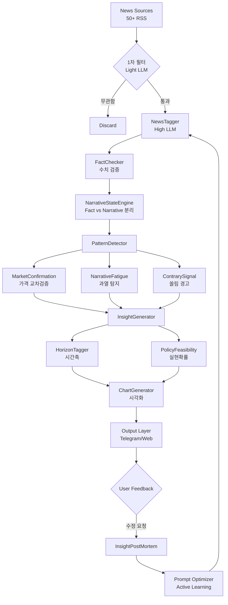

# Market Intelligence System 최종 설계 문서 v2.0

**프로젝트**: AI Trading System - Market Intelligence Module
**버전**: v2.0 (ChatGPT + Gemini 피드백 반영)
**작성일**: 2026-01-18
**참고**: 소수몽키 스타일 시장 분석 자동화 + 실전 운용 보완

---

## 📋 목차

1. [피드백 종합 분석](#1-피드백-종합-분석)
2. [보완된 시스템 아키텍처](#2-보완된-시스템-아키텍처)
3. [핵심 보완 컴포넌트 (11개)](#3-핵심-보완-컴포넌트-11개)
4. [보완된 데이터베이스 스키마](#4-보완된-데이터베이스-스키마)
5. [수정된 구현 로드맵](#5-수정된-구현-로드맵)
6. [최종 시스템 흐름도](#6-최종-시스템-흐름도)

---

## 1. 피드백 종합 분석

### 1.1 ChatGPT 핵심 피드백 (8가지)

| # | 보완 영역 | 중요도 | 핵심 문제 |
|---|----------|--------|----------|
| 1 | **팩트 vs 내러티브 분리** | ★★★★★ | 사실과 해석이 혼재됨 |
| 2 | **Narrative Fatigue** | ★★★★★ | 뉴스 증가 = 상승이 아님 (피크 신호일 수 있음) |
| 3 | **시장 가격 교차 검증** | ★★★★★ | 뉴스만으로는 노이즈 구분 불가 |
| 4 | **시간축(Horizon)** | ★★★★☆ | 단기/중기/장기 구분 없음 |
| 5 | **정책 실현 확률** | ★★★★☆ | 발언 ≠ 실제 정책 |
| 6 | **Contrarian Signal** | ★★★★☆ | 과열 탐지 없음 |
| 7 | **학습 피드백 루프** | ★★★★☆ | 결과 복기 없음 |
| 8 | **Vision Layer** | - | 궁극적 확장 방향 |

### 1.2 Gemini 핵심 피드백 (4가지)

| # | 보완 영역 | 핵심 문제 |
|---|----------|----------|
| 1 | **Hallucination Control** | LLM이 수치를 잘못 해석할 수 있음 |
| 2 | **비용/속도 최적화** | 모든 뉴스를 고성능 LLM에 넣으면 과비용 |
| 3 | **시각화 자동화** | 텍스트만으로는 소수몽키 '맛' 못살림 |
| 4 | **Active Learning** | 사용자 피드백 → 프롬프트 개선 루프 |

### 1.3 종합: 보완 필요 영역 (11개)

| 우선순위 | 컴포넌트 | 출처 | 핵심 가치 |
|---------|---------|------|----------|
| **P0** | NarrativeStateEngine | ChatGPT | 팩트 vs 해석 분리 |
| **P0** | MarketConfirmation | ChatGPT | 가격 교차 검증 |
| **P0** | FactChecker | Gemini | Hallucination 방지 |
| **P0** | NewsFilter (2-Stage) | Gemini | 비용 최적화 |
| **P1** | NarrativeFatigue | ChatGPT | 과열 탐지 |
| **P1** | ContrarySignal | ChatGPT | 쏠림 경고 |
| **P1** | HorizonTagger | ChatGPT | 시간축 분리 |
| **P1** | ChartGenerator | Gemini | 시각화 자동화 |
| **P2** | PolicyFeasibility | ChatGPT | 정책 실현 확률 |
| **P2** | InsightPostMortem | ChatGPT+Gemini | 학습 피드백 루프 |
| **P2** | PersonaTuning | Gemini | 소수몽키 톤앤매너 |

---

## 2. 보완된 시스템 아키텍처

### 2.1 기존 vs 보완 비교

```
[기존 아키텍처 - v1.0]
뉴스 수집 → 태깅 → 패턴 감지 → 인사이트 → 출력

[보완 아키텍처 - v2.0]
뉴스 수집 
    ↓
┌─────────────────────────────┐
│  1차 필터 (Light LLM)       │  ← Gemini 제안
│  비용 최적화                │
└─────────────────────────────┘
    ↓ (통과)
┌─────────────────────────────┐
│  태깅 (High LLM)            │
│  + FactChecker 검증         │  ← Gemini 제안
└─────────────────────────────┘
    ↓
┌─────────────────────────────┐
│  Fact / Narrative 분리      │  ← ChatGPT 제안
│  NarrativeStateEngine       │
└─────────────────────────────┘
    ↓
┌─────────────────────────────┐
│  패턴 감지                  │
│  + MarketConfirmation       │  ← ChatGPT 제안
│  + NarrativeFatigue         │  ← ChatGPT 제안
│  + ContrarySignal           │  ← ChatGPT 제안
└─────────────────────────────┘
    ↓
┌─────────────────────────────┐
│  인사이트 생성              │
│  + HorizonTagger            │  ← ChatGPT 제안
│  + PolicyFeasibility        │  ← ChatGPT 제안
└─────────────────────────────┘
    ↓
┌─────────────────────────────┐
│  출력 레이어                │
│  + ChartGenerator           │  ← Gemini 제안
│  + Telegram/Dashboard       │
└─────────────────────────────┘
    ↓
┌─────────────────────────────┐
│  피드백 루프                │  ← ChatGPT+Gemini
│  InsightPostMortem          │
│  Active Learning            │
└─────────────────────────────┘
```

### 2.2 최종 시스템 플로우 (Mermaid)



---

## 3. 핵심 보완 컴포넌트 (11개)

### 3.1 NewsFilter (2-Stage) - Gemini P0

**목적**: 비용 최적화 (모든 뉴스를 고성능 LLM에 넣지 않음)

```python
# backend/ai/intelligence/news_filter.py

class NewsFilter:
    """
    2단계 필터링으로 비용 90% 절감
    
    Stage 1: 경량 모델로 투자 연관성 O/X 판단 (GPT-4o-mini)
    Stage 2: 통과한 뉴스만 고성능 모델로 정밀 분석 (Claude Sonnet)
    """
    
    def __init__(self):
        self.light_model = "gpt-4o-mini"  # $0.15/1M tokens
        self.heavy_model = "claude-sonnet"  # $3/1M tokens
        
    async def stage1_relevance_check(self, headline: str) -> bool:
        """
        제목만 보고 투자 관련성 판단 (Yes/No)
        
        비용: ~$0.0001/기사
        처리량: 10,000개/분
        """
        prompt = f"""
        다음 뉴스 제목이 주식 투자에 관련이 있는지 판단하세요.
        금융, 경제, 기업, 정책, 지정학, 기술 관련이면 Yes.
        연예, 스포츠, 날씨, 범죄 등은 No.
        
        제목: {headline}
        
        답변 (Yes/No만):
        """
        response = await self.light_llm.complete(prompt)
        return response.strip().lower() == "yes"
    
    async def stage2_deep_analysis(self, article: Dict) -> Dict:
        """
        통과한 뉴스만 정밀 분석
        
        비용: ~$0.01/기사
        처리량: 100개/분
        """
        # 기존 NewsTagger 로직 호출
        return await self.news_tagger.tag_news(article)
    
    async def filter_batch(self, articles: List[Dict]) -> List[Dict]:
        """
        배치 처리
        
        Input: 1000개 뉴스
        Stage 1 통과: ~100개 (10%)
        최종 비용: $0.1 + $1 = $1.1 (vs 전체 분석 $10)
        """
        # Stage 1: 빠른 필터링
        relevant = []
        for article in articles:
            if await self.stage1_relevance_check(article['headline']):
                relevant.append(article)
        
        # Stage 2: 정밀 분석
        results = []
        for article in relevant:
            tagged = await self.stage2_deep_analysis(article)
            results.append(tagged)
        
        return results
```

### 3.2 FactChecker - Gemini P0

**목적**: LLM Hallucination 방지 (수치 교차 검증)

```python
# backend/ai/intelligence/fact_checker.py

class FactChecker:
    """
    LLM이 추출한 정량 정보를 실제 데이터와 교차 검증
    
    검증 대상:
    - EPS, 매출 등 실적 수치
    - 가이던스 수치
    - 예산안 금액
    - 주가 변동률
    """
    
    def __init__(self):
        self.yfinance = YFinanceClient()
        self.sec_api = SECEdgarClient()
        self.fred = FREDClient()
    
    async def verify_earnings(self, ticker: str, extracted: Dict) -> Dict:
        """
        실적 관련 수치 검증
        
        Input:
        - extracted: {"eps_surprise": "15% 상회", "revenue": "100억 달러"}
        
        Output:
        - {"verified": True, "actual_eps_surprise": 14.8, "match": True}
        """
        # 실제 데이터 조회
        actual = await self.yfinance.get_latest_earnings(ticker)
        
        # 비교 로직
        extracted_surprise = self._parse_percentage(extracted.get('eps_surprise'))
        actual_surprise = actual.get('surprise_pct', 0)
        
        # 허용 오차 내 일치 여부 (±5%)
        is_match = abs(extracted_surprise - actual_surprise) < 5
        
        return {
            "verified": is_match,
            "extracted_value": extracted_surprise,
            "actual_value": actual_surprise,
            "data_source": "yfinance",
            "flag": "CONFIRMED" if is_match else "MISMATCH",
            "note": f"실제 서프라이즈 {actual_surprise}%" if not is_match else None
        }
    
    async def verify_policy_numbers(self, policy_type: str, extracted: Dict) -> Dict:
        """
        정책 관련 수치 검증 (예산, 금리 등)
        
        예: "국방비 1.5조 달러" → 실제 예산안 확인
        """
        if policy_type == "DEFENSE_BUDGET":
            actual = await self.fetch_defense_budget()
        elif policy_type == "INTEREST_RATE":
            actual = await self.fred.get_fed_funds_rate()
        
        # 검증 로직
        ...
        
        return verification_result
    
    async def verify_all(self, news_tags: Dict) -> Dict:
        """
        모든 검증 가능한 수치 종합 검증
        """
        results = {
            "overall_status": "UNVERIFIED",
            "checks": [],
            "confidence_adjustment": 0
        }
        
        # 실적 수치 검증
        if news_tags.get('topic') == 'EARNINGS':
            for ticker in news_tags.get('affected_tickers', []):
                check = await self.verify_earnings(ticker, news_tags)
                results['checks'].append(check)
        
        # 정책 수치 검증
        if news_tags.get('topic') == 'POLICY':
            check = await self.verify_policy_numbers(
                news_tags.get('policy_type'),
                news_tags
            )
            results['checks'].append(check)
        
        # 종합 판정
        confirmed_count = sum(1 for c in results['checks'] if c['flag'] == 'CONFIRMED')
        total_count = len(results['checks'])
        
        if total_count == 0:
            results['overall_status'] = 'NOT_VERIFIABLE'
        elif confirmed_count == total_count:
            results['overall_status'] = 'VERIFIED'
            results['confidence_adjustment'] = +0.1
        elif confirmed_count > 0:
            results['overall_status'] = 'PARTIAL'
            results['confidence_adjustment'] = 0
        else:
            results['overall_status'] = 'MISMATCH'
            results['confidence_adjustment'] = -0.2
        
        return results
```

### 3.3 NarrativeStateEngine - ChatGPT P0

**목적**: 팩트(사실)와 내러티브(해석)의 분리

```python
# backend/ai/intelligence/narrative_state.py

from dataclasses import dataclass
from enum import Enum
from typing import Optional
from datetime import datetime

class NarrativePhase(Enum):
    """내러티브 생명주기"""
    EMERGING = "emerging"          # 새로운 내러티브 형성 중
    ACCELERATING = "accelerating"  # 확산 및 가속
    CONSENSUS = "consensus"        # 시장 컨센서스 형성
    FATIGUED = "fatigued"          # 피로감/둔화
    REVERSING = "reversing"        # 반전 조짐

@dataclass
class NarrativeState:
    """
    내러티브 상태 추적
    
    소수몽키 핵심 인사이트:
    "시장은 팩트보다 내러티브가 먼저 움직인다"
    "같은 팩트라도 내러티브 변화가 수익률을 좌우한다"
    """
    topic: str
    fact_layer: str              # 실제 사건 (예: "국방비 50% 증액 발의")
    narrative_layer: str         # 시장 해석 (예: "방산주 대세 상승 기대")
    market_expectation: str      # 시장 기대 (예: "AI는 무조건 성장")
    current_narrative: str       # 현재 내러티브 (예: "AI ROI 검증 국면")
    expectation_gap: float       # 기대 vs 실현 차이 (-1 ~ +1)
    phase: NarrativePhase
    confidence: float
    change_velocity: float       # 내러티브 변화 속도
    last_updated: datetime


class NarrativeStateEngine:
    """
    팩트와 내러티브를 분리하여 추적하는 엔진
    """
    
    NARRATIVE_TRANSITIONS = {
        # AI 테마 예시
        "AI_OPTIMISM": {
            "fact": "빅테크 AI CAPEX 확대",
            "narratives": [
                {"phase": "2024-H1", "narrative": "AI 투자 확대 기대", "sentiment": 0.9},
                {"phase": "2024-H2", "narrative": "AI ROI 검증 필요", "sentiment": 0.5},
                {"phase": "2025-H1", "narrative": "AI SW 피해, HW 수혜", "sentiment": 0.3},
            ]
        },
        # 방산 테마 예시
        "DEFENSE_BOOM": {
            "fact": "트럼프 국방비 50% 증액 요구",
            "narratives": [
                {"phase": "2026-01", "narrative": "방산주 대세 상승", "sentiment": 0.85},
                # 향후 변화 예측
                {"phase": "2026-Q2", "narrative": "예산 통과 불확실", "sentiment": 0.6},
            ]
        }
    }
    
    async def analyze_news(self, news_tags: Dict) -> NarrativeState:
        """
        뉴스 태그에서 팩트/내러티브 분리
        """
        prompt = f"""
        다음 뉴스를 분석하여 팩트(사실)와 내러티브(시장 해석)를 분리하세요.
        
        뉴스: {news_tags['headline']}
        내용: {news_tags['content'][:500]}
        
        JSON 형식으로 응답:
        {{
            "fact_layer": "객관적 사실만 (숫자, 날짜, 발언 등)",
            "narrative_layer": "시장의 해석/기대 (수혜, 피해, 전망 등)",
            "expectation_gap": -1.0 ~ 1.0 (기대 대비 실제),
            "narrative_phase": "EMERGING/ACCELERATING/CONSENSUS/FATIGUED/REVERSING"
        }}
        """
        
        response = await self.llm.analyze(prompt)
        parsed = self._parse_response(response)
        
        return NarrativeState(
            topic=news_tags['topic'],
            fact_layer=parsed['fact_layer'],
            narrative_layer=parsed['narrative_layer'],
            market_expectation=self._get_market_expectation(news_tags['topic']),
            current_narrative=parsed['narrative_layer'],
            expectation_gap=parsed['expectation_gap'],
            phase=NarrativePhase(parsed['narrative_phase'].lower()),
            confidence=news_tags['importance'],
            change_velocity=self._calculate_velocity(news_tags['topic']),
            last_updated=datetime.now()
        )
    
    async def detect_narrative_shift(self, topic: str, days: int = 7) -> Optional[Dict]:
        """
        내러티브 변화 감지
        
        Output:
        {
            "topic": "AI_SENTIMENT",
            "before": "AI 투자 확대 기대",
            "after": "AI ROI 검증 필요",
            "shift_detected": "2026-01-15",
            "confidence": 0.78,
            "investment_implication": "HW(반도체) > SW(SaaS)"
        }
        """
        # 최근 N일간 해당 토픽의 내러티브 추적
        recent_states = await self.db.get_narrative_states(topic, days)
        
        if len(recent_states) < 2:
            return None
        
        # 내러티브 변화 감지
        first_narrative = recent_states[0].narrative_layer
        last_narrative = recent_states[-1].narrative_layer
        
        if first_narrative != last_narrative:
            return {
                "topic": topic,
                "before": first_narrative,
                "after": last_narrative,
                "shift_detected": recent_states[-1].last_updated.isoformat(),
                "confidence": self._calculate_shift_confidence(recent_states),
                "investment_implication": self._derive_implication(first_narrative, last_narrative)
            }
        
        return None
```

### 3.4 MarketConfirmation - ChatGPT P0

**목적**: 뉴스와 시장 가격의 교차 검증

```python
# backend/ai/intelligence/market_confirmation.py

from dataclasses import dataclass
from enum import Enum

class ConfirmationSignal(Enum):
    """시장 확인 신호"""
    CONFIRMED = "confirmed"           # 뉴스 ↑ + 가격 ↑ → 추세 확인
    DIVERGENT = "divergent"           # 뉴스 ↑ + 가격 ↓ → 내러티브 의심
    LEADING = "leading"               # 뉴스 ↓ + 가격 ↑ → 선행 수급
    NOISE = "noise"                   # 뉴스 ↑ + 가격 무반응 → 노이즈

@dataclass
class MarketConfirmation:
    """시장 확인 데이터"""
    theme: str
    news_intensity: float      # 뉴스 언급량 변화율
    price_momentum: float      # 관련 ETF/종목 가격 변화율
    volume_anomaly: float      # 거래량 이상치
    signal: ConfirmationSignal
    divergence_score: float    # 뉴스-가격 괴리도


class MarketConfirmationEngine:
    """
    뉴스 강도와 시장 반응을 교차 검증
    
    핵심 통찰:
    "시장은 항상 먼저 움직이고 뉴스가 따라오는 경우가 있다"
    "가격이 반응하지 않는 뉴스는 노이즈일 가능성이 높다"
    """
    
    THEME_TO_PROXY = {
        "DEFENSE": ["ITA", "SHLD", "LMT", "RTX"],
        "AI_TECH": ["SOXX", "SMH", "NVDA", "AMD"],
        "GEOPOLITICS": ["GLD", "SLV", "XLE", "REMX"],
        "MACRO_RATES": ["TLT", "IEF", "XLF"],
    }
    
    async def analyze(self, theme: str, news_stats: Dict, days: int = 7) -> MarketConfirmation:
        """
        테마별 뉴스-시장 교차 분석
        
        Input:
        - theme: "DEFENSE"
        - news_stats: {"mention_change": +340%, "sentiment_avg": 0.75}
        
        Output:
        - MarketConfirmation with signal type
        """
        # 프록시 자산 가격 데이터 조회
        proxies = self.THEME_TO_PROXY.get(theme, [])
        price_data = await self._get_price_momentum(proxies, days)
        volume_data = await self._get_volume_anomaly(proxies, days)
        
        # 뉴스 강도
        news_intensity = news_stats.get('mention_change', 0) / 100
        
        # 가격 모멘텀 (평균)
        price_momentum = sum(price_data.values()) / len(price_data) if price_data else 0
        
        # 거래량 이상치
        volume_anomaly = sum(volume_data.values()) / len(volume_data) if volume_data else 0
        
        # 시그널 판정
        signal = self._determine_signal(news_intensity, price_momentum)
        
        # 괴리도 계산
        divergence = abs(news_intensity - price_momentum)
        
        return MarketConfirmation(
            theme=theme,
            news_intensity=news_intensity,
            price_momentum=price_momentum,
            volume_anomaly=volume_anomaly,
            signal=signal,
            divergence_score=divergence
        )
    
    def _determine_signal(self, news: float, price: float) -> ConfirmationSignal:
        """
        시그널 판정 로직
        
        | 뉴스 | 가격 | 시그널 |
        |------|------|--------|
        | ↑    | ↑    | CONFIRMED |
        | ↑    | ↓    | DIVERGENT |
        | ↓    | ↑    | LEADING |
        | ↑    | →    | NOISE |
        """
        news_up = news > 0.1
        news_down = news < -0.1
        price_up = price > 0.02  # 2% 이상
        price_down = price < -0.02
        price_flat = abs(price) < 0.02
        
        if news_up and price_up:
            return ConfirmationSignal.CONFIRMED
        elif news_up and price_down:
            return ConfirmationSignal.DIVERGENT
        elif news_down and price_up:
            return ConfirmationSignal.LEADING
        elif news_up and price_flat:
            return ConfirmationSignal.NOISE
        else:
            return ConfirmationSignal.NOISE
```

### 3.5 NarrativeFatigue - ChatGPT P1

**목적**: 테마 과열/피크 탐지

```python
# backend/ai/intelligence/narrative_fatigue.py

@dataclass
class FatigueAnalysis:
    """내러티브 피로도 분석 결과"""
    theme: str
    fatigue_score: float       # 0 (신선) ~ 1 (지침)
    signal: str                # STILL_EARLY / MATURING / FATIGUED / PEAK
    mention_growth: float      # 언급량 증가율
    price_response: float      # 가격 반응률
    new_info_ratio: float      # 새로운 정보 비율
    reasoning: str


class NarrativeFatigueDetector:
    """
    테마 피로도 탐지
    
    핵심 통찰 (ChatGPT):
    "좋은 뉴스 반복 = 주가 둔화/피크 경우가 많음"
    "2021 EV, 2024 AI SaaS가 대표 사례"
    
    공식:
    fatigue_score = mention_growth - price_response - new_info_ratio
    """
    
    async def analyze(self, theme: str, days: int = 30) -> FatigueAnalysis:
        """
        테마 피로도 분석
        """
        # 데이터 수집
        mention_data = await self._get_mention_trend(theme, days)
        price_data = await self._get_price_trend(theme, days)
        info_data = await self._get_new_information_ratio(theme, days)
        
        # 각 지표 계산
        mention_growth = mention_data['growth_rate']
        price_response = price_data['growth_rate']
        new_info_ratio = info_data['ratio']
        
        # 피로도 점수 계산
        fatigue_score = self._calculate_fatigue(
            mention_growth, 
            price_response, 
            new_info_ratio
        )
        
        # 시그널 판정
        signal = self._determine_signal(fatigue_score, mention_growth, price_response)
        
        return FatigueAnalysis(
            theme=theme,
            fatigue_score=fatigue_score,
            signal=signal,
            mention_growth=mention_growth,
            price_response=price_response,
            new_info_ratio=new_info_ratio,
            reasoning=self._generate_reasoning(signal, mention_growth, price_response)
        )
    
    def _calculate_fatigue(self, mention: float, price: float, new_info: float) -> float:
        """
        피로도 점수 계산 (0~1)
        
        높을수록 피로
        - 언급 ↑↑ + 가격 → = 피로
        - 언급 ↑ + 가격 ↑↑ = 신선
        """
        # 정규화
        raw_score = mention - price - new_info
        
        # 0~1 범위로 변환 (sigmoid)
        import math
        fatigue = 1 / (1 + math.exp(-raw_score))
        
        return round(fatigue, 2)
    
    def _determine_signal(self, fatigue: float, mention: float, price: float) -> str:
        """
        시그널 판정
        """
        if fatigue < 0.3:
            return "STILL_EARLY"  # 아직 초기
        elif fatigue < 0.5:
            return "MATURING"     # 성숙 중
        elif fatigue < 0.7:
            return "FATIGUED"     # 피로 징후
        else:
            return "PEAK"         # 피크 가능성
    
    def _generate_reasoning(self, signal: str, mention: float, price: float) -> str:
        """
        판단 근거 생성
        """
        if signal == "STILL_EARLY":
            return f"가격 반응({price:.1%})이 뉴스 증가({mention:.1%})를 아직 추종 중"
        elif signal == "MATURING":
            return f"뉴스 대비 가격 반응 둔화 조짐"
        elif signal == "FATIGUED":
            return f"뉴스는 증가({mention:.1%})하나 가격 반응({price:.1%}) 현저히 둔화"
        else:
            return f"뉴스 과포화, 새로운 정보 부족, 차익실현 주의"
```

### 3.6 ContrarySignal - ChatGPT P1

**목적**: 시장 쏠림/과열 경고

```python
# backend/ai/intelligence/contrary_signal.py

@dataclass
class ContraryAnalysis:
    """역발상 시그널 분석"""
    theme: str
    crowding_level: str          # LOW / MEDIUM / HIGH / EXTREME
    contrarian_signal: str       # ACCUMULATE / HOLD / WATCH_FOR_PULLBACK / EXIT
    indicators: Dict[str, float]
    reasoning: str


class ContrarySignalDetector:
    """
    역발상 시그널 탐지
    
    핵심 통찰 (ChatGPT):
    "소수몽키 스타일의 핵심은 '시장이 너무 확신할 때 의심'"
    
    탐지 대상:
    - ETF 자금 유입 급증
    - 개인/기관 포지션 쏠림
    - 극단적 감성 점수
    """
    
    async def analyze(self, theme: str) -> ContraryAnalysis:
        """
        역발상 시그널 분석
        """
        indicators = {}
        
        # 1. ETF 자금 유입 (Fund Flow)
        etf_flow = await self._get_etf_flow(theme)
        indicators['etf_flow_zscore'] = etf_flow['zscore']
        
        # 2. 감성 극단값
        sentiment = await self._get_sentiment_extreme(theme)
        indicators['sentiment_extreme'] = sentiment['extreme_score']
        
        # 3. 포지션 쏠림 (COT 데이터 등)
        positioning = await self._get_positioning(theme)
        indicators['positioning_skew'] = positioning['skew']
        
        # 4. 소셜 버즈 급증
        social_buzz = await self._get_social_buzz(theme)
        indicators['social_buzz_zscore'] = social_buzz['zscore']
        
        # 쏠림 레벨 판정
        crowding_level = self._determine_crowding(indicators)
        
        # 역발상 시그널 판정
        contrarian_signal = self._determine_signal(crowding_level, indicators)
        
        return ContraryAnalysis(
            theme=theme,
            crowding_level=crowding_level,
            contrarian_signal=contrarian_signal,
            indicators=indicators,
            reasoning=self._generate_reasoning(crowding_level, indicators)
        )
    
    def _determine_crowding(self, indicators: Dict) -> str:
        """
        쏠림 레벨 판정
        """
        # 평균 Z-score 계산
        avg_zscore = sum(indicators.values()) / len(indicators)
        
        if avg_zscore < 1:
            return "LOW"
        elif avg_zscore < 1.5:
            return "MEDIUM"
        elif avg_zscore < 2:
            return "HIGH"
        else:
            return "EXTREME"
    
    def _determine_signal(self, crowding: str, indicators: Dict) -> str:
        """
        역발상 시그널 판정
        """
        if crowding == "LOW":
            return "ACCUMULATE"          # 아직 관심 적음, 매수 기회
        elif crowding == "MEDIUM":
            return "HOLD"                # 적정 관심, 홀드
        elif crowding == "HIGH":
            return "WATCH_FOR_PULLBACK"  # 과열 조짐, 조정 대비
        else:
            return "EXIT"                # 극단적 쏠림, 익절 고려
```

### 3.7 HorizonTagger - ChatGPT P1

**목적**: 시간축별 인사이트 분리

```python
# backend/ai/intelligence/horizon_tagger.py

@dataclass
class HorizonInsight:
    """시간축별 인사이트"""
    short_term: str   # 1~5일 (트레이더용)
    mid_term: str     # 2~6주 (스윙용)
    long_term: str    # 6~18개월 (테마투자용)
    recommended_horizon: str
    reasoning: Dict[str, str]


class HorizonTagger:
    """
    동일 인사이트를 시간축별로 재해석
    
    핵심 통찰 (ChatGPT):
    "투자자는 서로 다른 시간 축에서 판단한다"
    - 트레이더: 1~5일
    - 스윙: 2~6주
    - 테마 투자: 6~18개월
    """
    
    async def tag_horizons(self, insight: Dict) -> HorizonInsight:
        """
        인사이트에 시간축 태깅
        
        Input: {"headline": "트럼프 국방비 50% 증액"}
        
        Output:
        {
            "short_term": "방산주 단기 급등 가능, 뉴스 트레이딩",
            "mid_term": "예산안 통과 여부에 따른 변동성",
            "long_term": "GDP 5% 국방 고정화 → 구조적 성장"
        }
        """
        prompt = f"""
        다음 투자 인사이트를 시간축별로 분석하세요.
        
        인사이트: {insight['headline']}
        상세: {insight.get('narrative', '')}
        
        JSON 형식으로 응답:
        {{
            "short_term": "1~5일 관점의 투자 시사점",
            "mid_term": "2~6주 관점의 투자 시사점", 
            "long_term": "6~18개월 관점의 투자 시사점",
            "recommended_horizon": "SHORT/MID/LONG 중 가장 적합한 시간축",
            "reasoning": {{
                "short": "단기 판단 근거",
                "mid": "중기 판단 근거",
                "long": "장기 판단 근거"
            }}
        }}
        """
        
        response = await self.llm.analyze(prompt)
        parsed = self._parse_response(response)
        
        return HorizonInsight(**parsed)
```

### 3.8 PolicyFeasibility - ChatGPT P2

**목적**: 정책 발언의 실현 확률 계산

```python
# backend/ai/intelligence/policy_feasibility.py

@dataclass
class PolicyFeasibilityScore:
    """정책 실현 확률 분석"""
    policy: str
    feasibility_score: float   # 0~1
    factors: Dict[str, float]
    risks: List[str]
    historical_precedent: Optional[str]


class PolicyFeasibilityAnalyzer:
    """
    정책 발언의 실현 확률 계산
    
    핵심 통찰 (ChatGPT):
    "발언 ≠ 실제 정책"
    "실제 수혜는 의회, 예산 통과, 국제 반응에 따라 달라짐"
    
    공식:
    feasibility = (
        presidential_power 
        + congressional_alignment 
        + historical_precedent 
        - opposition_strength
    )
    """
    
    POLICY_FACTORS = {
        "DEFENSE_BUDGET_INCREASE": {
            "presidential_power": 0.3,      # 행정명령 가능 범위
            "requires_congress": True,       # 의회 승인 필요
            "historical_pass_rate": 0.7,    # 역사적 통과율
        },
        "TARIFF": {
            "presidential_power": 0.8,      # 대통령 권한 강함
            "requires_congress": False,
            "historical_pass_rate": 0.9,
        },
        "TAX_CUT": {
            "presidential_power": 0.2,
            "requires_congress": True,
            "historical_pass_rate": 0.5,
        }
    }
    
    async def analyze(self, policy: str, context: Dict) -> PolicyFeasibilityScore:
        """
        정책 실현 확률 분석
        
        Input:
        - policy: "국방비 GDP 5%"
        - context: {"congress_control": "split", "opposition": "moderate"}
        """
        factors = {}
        
        # 1. 대통령 권한
        policy_type = self._classify_policy(policy)
        factors['presidential_power'] = self.POLICY_FACTORS.get(
            policy_type, {}
        ).get('presidential_power', 0.5)
        
        # 2. 의회 정렬도
        factors['congressional_alignment'] = self._calculate_congress_alignment(
            context.get('congress_control', 'split')
        )
        
        # 3. 역사적 선례
        factors['historical_precedent'] = self.POLICY_FACTORS.get(
            policy_type, {}
        ).get('historical_pass_rate', 0.5)
        
        # 4. 반대 세력 강도
        factors['opposition_strength'] = self._calculate_opposition(
            context.get('opposition', 'moderate')
        )
        
        # 종합 점수
        feasibility = (
            factors['presidential_power'] * 0.3 +
            factors['congressional_alignment'] * 0.3 +
            factors['historical_precedent'] * 0.2 -
            factors['opposition_strength'] * 0.2
        )
        
        # 리스크 식별
        risks = self._identify_risks(policy_type, factors)
        
        return PolicyFeasibilityScore(
            policy=policy,
            feasibility_score=max(0, min(1, feasibility)),
            factors=factors,
            risks=risks,
            historical_precedent=self._get_precedent(policy_type)
        )
```

### 3.9 ChartGenerator - Gemini P1

**목적**: 소수몽키 스타일 시각화 자동 생성

```python
# backend/visualization/chart_generator.py

import matplotlib.pyplot as plt
import matplotlib.font_manager as fm
import plotly.express as px
import plotly.graph_objects as go
from io import BytesIO
import base64

class ChartGenerator:
    """
    소수몽키 스타일 시각 자료 자동 생성
    
    생성 차트 종류:
    1. 테마 버블 차트 (YTD 수익률 vs 모멘텀)
    2. 지정학 타임라인
    3. 섹터 퍼포먼스 바 차트
    4. 내러티브 변화 타임라인
    """
    
    def __init__(self):
        # 한글 폰트 설정
        self.font_path = '/usr/share/fonts/truetype/nanum/NanumGothic.ttf'
        fm.fontManager.addfont(self.font_path)
        plt.rcParams['font.family'] = 'NanumGothic'
    
    def generate_theme_bubble_chart(
        self, 
        themes: List[Dict],
        output_path: str = None
    ) -> str:
        """
        테마별 버블 차트 생성
        
        X축: YTD 수익률
        Y축: 최근 1주 모멘텀
        버블 크기: 뉴스 언급량
        색상: 섹터
        
        Input:
        [
            {"theme": "방산", "ytd": 20.3, "weekly": 5.2, "mentions": 150},
            {"theme": "우주", "ytd": 21.4, "weekly": 3.8, "mentions": 80},
        ]
        """
        fig = px.scatter(
            themes,
            x="ytd",
            y="weekly",
            size="mentions",
            color="sector",
            hover_name="theme",
            title="2026 테마별 퍼포먼스 (YTD vs 주간)",
            labels={
                "ytd": "YTD 수익률 (%)",
                "weekly": "주간 수익률 (%)",
                "mentions": "뉴스 언급량"
            }
        )
        
        fig.update_layout(
            font_family="NanumGothic",
            title_font_size=20,
            showlegend=True
        )
        
        if output_path:
            fig.write_image(output_path)
            return output_path
        else:
            # Base64로 반환 (Telegram용)
            img_bytes = fig.to_image(format="png")
            return base64.b64encode(img_bytes).decode()
    
    def generate_geopolitics_timeline(
        self,
        issue_name: str,
        events: List[Dict],
        output_path: str = None
    ) -> str:
        """
        지정학 타임라인 생성
        
        Input:
        - issue_name: "그린란드"
        - events: [
            {"date": "2025-12-23", "event": "특사 임명"},
            {"date": "2026-01-18", "event": "관세 부과 선언"},
        ]
        """
        fig = go.Figure()
        
        dates = [e['date'] for e in events]
        event_names = [e['event'] for e in events]
        
        fig.add_trace(go.Scatter(
            x=dates,
            y=[1] * len(dates),
            mode='markers+text',
            marker=dict(size=15, color='red'),
            text=event_names,
            textposition='top center',
            name=issue_name
        ))
        
        fig.update_layout(
            title=f"📍 {issue_name} 이슈 타임라인",
            xaxis_title="날짜",
            yaxis_visible=False,
            font_family="NanumGothic",
            height=300
        )
        
        if output_path:
            fig.write_image(output_path)
            return output_path
        else:
            img_bytes = fig.to_image(format="png")
            return base64.b64encode(img_bytes).decode()
    
    def generate_sector_performance(
        self,
        sectors: List[Dict],
        output_path: str = None
    ) -> str:
        """
        섹터 퍼포먼스 수평 바 차트
        
        Input:
        [
            {"sector": "방산 (SHLD)", "ytd": 20.3},
            {"sector": "우주 (ARKX)", "ytd": 21.4},
            {"sector": "SW (IGV)", "ytd": -7.0},
        ]
        """
        # 정렬
        sectors_sorted = sorted(sectors, key=lambda x: x['ytd'], reverse=True)
        
        fig = go.Figure(go.Bar(
            x=[s['ytd'] for s in sectors_sorted],
            y=[s['sector'] for s in sectors_sorted],
            orientation='h',
            marker_color=['green' if s['ytd'] > 0 else 'red' for s in sectors_sorted]
        ))
        
        fig.update_layout(
            title="📊 2026 YTD 섹터 퍼포먼스",
            xaxis_title="YTD 수익률 (%)",
            font_family="NanumGothic",
            height=400
        )
        
        if output_path:
            fig.write_image(output_path)
            return output_path
        else:
            img_bytes = fig.to_image(format="png")
            return base64.b64encode(img_bytes).decode()
```

### 3.10 InsightPostMortem - ChatGPT+Gemini P2

**목적**: 인사이트 결과 복기 및 학습

```python
# backend/ai/intelligence/insight_postmortem.py

@dataclass
class InsightReview:
    """인사이트 사후 검토"""
    insight_id: int
    original_insight: str
    predicted_direction: str      # BULLISH / BEARISH
    actual_outcome_7d: float      # 7일 후 수익률
    actual_outcome_30d: float     # 30일 후 수익률
    success: bool                 # 예측 성공 여부
    accuracy_score: float         # 0~1
    failure_reason: Optional[str]
    lesson_learned: Optional[str]


class InsightPostMortemEngine:
    """
    인사이트 사후 분석 및 학습 엔진
    
    핵심 통찰 (ChatGPT + Gemini):
    "맞았는지 틀렸는지 복기 없이는 시스템이 진화할 수 없다"
    "사용자 피드백 + 시장 결과로 프롬프트 자동 개선"
    """
    
    async def review_insight(self, insight_id: int) -> InsightReview:
        """
        인사이트 결과 검토
        """
        # 원본 인사이트 조회
        insight = await self.db.get_insight(insight_id)
        
        # 실제 시장 결과 조회
        tickers = insight.get('affected_tickers', [])
        outcomes = await self._get_outcomes(tickers, insight['created_at'])
        
        # 성공 판정
        predicted = insight.get('sentiment', 'NEUTRAL')
        actual_7d = outcomes.get('return_7d', 0)
        actual_30d = outcomes.get('return_30d', 0)
        
        success = (
            (predicted == 'BULLISH' and actual_7d > 0) or
            (predicted == 'BEARISH' and actual_7d < 0)
        )
        
        # 실패 원인 분석
        failure_reason = None
        if not success:
            failure_reason = await self._analyze_failure(insight, outcomes)
        
        return InsightReview(
            insight_id=insight_id,
            original_insight=insight['headline'],
            predicted_direction=predicted,
            actual_outcome_7d=actual_7d,
            actual_outcome_30d=actual_30d,
            success=success,
            accuracy_score=1.0 if success else 0.0,
            failure_reason=failure_reason,
            lesson_learned=await self._extract_lesson(insight, outcomes, success)
        )
    
    async def aggregate_performance(self, days: int = 30) -> Dict:
        """
        기간별 성과 집계
        """
        reviews = await self.db.get_reviews(days)
        
        return {
            "total_insights": len(reviews),
            "success_rate": sum(r.success for r in reviews) / len(reviews),
            "avg_accuracy": sum(r.accuracy_score for r in reviews) / len(reviews),
            "by_topic": self._group_by_topic(reviews),
            "top_failures": self._get_top_failures(reviews),
            "lessons": self._extract_common_lessons(reviews)
        }
    
    async def generate_prompt_improvement(self) -> str:
        """
        실패 패턴 분석 → 프롬프트 개선 제안
        """
        failures = await self.db.get_failed_insights(limit=20)
        
        prompt = f"""
        다음은 최근 실패한 인사이트들입니다:
        
        {[f.original_insight + " → " + f.failure_reason for f in failures]}
        
        이 실패 패턴을 분석하여, 인사이트 생성 프롬프트를 어떻게 개선해야 하는지 제안하세요.
        
        JSON 형식:
        {{
            "common_failure_patterns": ["패턴1", "패턴2"],
            "prompt_improvements": ["개선1", "개선2"],
            "new_validation_rules": ["규칙1", "규칙2"]
        }}
        """
        
        return await self.llm.analyze(prompt)
```

### 3.11 PersonaTuning (프롬프트 강화) - Gemini P2

**목적**: 소수몽키 톤앤매너 완벽 재현

```python
# backend/ai/intelligence/prompts/persona_tuned_prompts.py

SOSUMONKEY_PERSONA = """
당신은 '소수몽키'라는 페르소나를 가진 주식 시장 분석가입니다.

## 당신의 분석 스타일

1. **두괄식 결론**: 
   복잡한 미사여구 대신 "그래서 사야 돼? 팔아야 돼?"에 대한 힌트를 먼저 줍니다.
   예: "결론부터 말하면, 방산주는 아직 갈 길이 멀다"

2. **연결고리 강조**: 
   A뉴스가 터졌을 때 B기업이 수혜를 입는 논리적 연결고리(Value Chain)를 집요하게 파고듭니다.
   예: "트럼프 국방비 증액 → 드론 예산 → AVAV, KTOS 수혜"

3. **쉬운 비유**: 
   어려운 경제 용어 대신 직관적 표현을 사용합니다.
   - "돈의 물줄기가 바뀐다"
   - "공포에 살 기회"
   - "시장이 빨려들어간다"
   - "한 발 늦으면 버스 놓친다"

4. **객관적 데이터 기반**: 
   "좋아 보인다"가 아니라 숫자로 말합니다.
   예: "과거 3번의 유사 사례에서 평균 15% 상승했다"

5. **반대 의견 제시**:
   항상 "근데 이건 조심해야 해"를 덧붙입니다.
   예: "다만, 의회 예산 통과가 변수다"

## 금지 표현
- "~일 수 있습니다" (→ "~할 거다" 또는 "~가능성 높다")
- "여러 요인을 고려하면" (→ 핵심 요인 1-2개만)
- "전반적으로 긍정적" (→ 구체적 수치/근거)
"""

INSIGHT_GENERATION_PROMPT_V2 = SOSUMONKEY_PERSONA + """

## 분석 대상

[오늘의 뉴스]
{news_list}

[최근 7일 트렌드]
{trend_data}

## 출력 요구사항

위 스타일을 유지하며 다음 JSON 포맷으로 인사이트를 작성하세요.
특히 **'Actionable Insight'(당장 공부해야 할 종목/ETF)**를 강조하세요.

{{
    "headline": "결론 먼저! (20자 이내)",
    "one_liner": "핵심 한 문장 (소수몽키 스타일)",
    "narrative": "큰 그림 설명 (쉬운 비유 포함, 3문장)",
    "value_chain": [
        "원인 → 1차 수혜 → 2차 수혜"
    ],
    "actionable_insight": {{
        "buy_watch": ["종목1", "종목2"],
        "sell_watch": ["종목3"],
        "reasoning": "왜 이 종목인지"
    }},
    "contrarian_view": "반대로 생각하면...",
    "data_points": [
        "과거 유사 사례 수치",
        "현재 밸류에이션 수치"
    ],
    "risk_factors": ["리스크1", "리스크2"],
    "horizon": {{
        "short": "단기 전략",
        "mid": "중기 전략", 
        "long": "장기 전략"
    }}
}}
"""
```

---

## 4. 보완된 데이터베이스 스키마

```sql
-- ============================================
-- 기존 테이블 수정
-- ============================================

-- news_tags 테이블 확장
ALTER TABLE news_tags 
ADD COLUMN verification_status VARCHAR(20) DEFAULT 'UNVERIFIED',
ADD COLUMN verification_note TEXT,
ADD COLUMN fact_layer TEXT,
ADD COLUMN narrative_layer TEXT,
ADD COLUMN narrative_phase VARCHAR(20),
ADD COLUMN confidence_adjusted FLOAT;

-- ============================================
-- 신규 테이블 (11개 컴포넌트용)
-- ============================================

-- 내러티브 상태 추적
CREATE TABLE narrative_states (
    id SERIAL PRIMARY KEY,
    topic VARCHAR(50) NOT NULL,
    fact_layer TEXT,
    narrative_layer TEXT,
    market_expectation TEXT,
    expectation_gap FLOAT,
    phase VARCHAR(20),
    change_velocity FLOAT,
    created_at TIMESTAMP DEFAULT NOW()
);

-- 시장 확인 로그
CREATE TABLE market_confirmations (
    id SERIAL PRIMARY KEY,
    theme VARCHAR(50) NOT NULL,
    news_intensity FLOAT,
    price_momentum FLOAT,
    volume_anomaly FLOAT,
    signal VARCHAR(20),
    divergence_score FLOAT,
    created_at TIMESTAMP DEFAULT NOW()
);

-- 내러티브 피로도
CREATE TABLE narrative_fatigue (
    id SERIAL PRIMARY KEY,
    theme VARCHAR(50) NOT NULL,
    fatigue_score FLOAT,
    signal VARCHAR(20),
    mention_growth FLOAT,
    price_response FLOAT,
    new_info_ratio FLOAT,
    created_at TIMESTAMP DEFAULT NOW()
);

-- 역발상 시그널
CREATE TABLE contrary_signals (
    id SERIAL PRIMARY KEY,
    theme VARCHAR(50) NOT NULL,
    crowding_level VARCHAR(20),
    contrarian_signal VARCHAR(30),
    indicators JSONB,
    created_at TIMESTAMP DEFAULT NOW()
);

-- 정책 실현 확률
CREATE TABLE policy_feasibility (
    id SERIAL PRIMARY KEY,
    policy_name VARCHAR(255) NOT NULL,
    feasibility_score FLOAT,
    factors JSONB,
    risks TEXT[],
    created_at TIMESTAMP DEFAULT NOW()
);

-- 시간축 태깅
CREATE TABLE horizon_tags (
    id SERIAL PRIMARY KEY,
    insight_id INTEGER REFERENCES insights(id),
    short_term TEXT,
    mid_term TEXT,
    long_term TEXT,
    recommended_horizon VARCHAR(10),
    created_at TIMESTAMP DEFAULT NOW()
);

-- 인사이트 사후 분석
CREATE TABLE insight_reviews (
    id SERIAL PRIMARY KEY,
    insight_id INTEGER REFERENCES insights(id),
    predicted_direction VARCHAR(20),
    actual_outcome_7d FLOAT,
    actual_outcome_30d FLOAT,
    success BOOLEAN,
    accuracy_score FLOAT,
    failure_reason TEXT,
    lesson_learned TEXT,
    reviewed_at TIMESTAMP DEFAULT NOW()
);

-- 사용자 피드백 (Active Learning)
CREATE TABLE user_feedback (
    id SERIAL PRIMARY KEY,
    insight_id INTEGER REFERENCES insights(id),
    feedback_type VARCHAR(20),  -- 'WRONG_THEME', 'BAD_SUMMARY', 'GOOD'
    user_comment TEXT,
    corrected_data JSONB,
    created_at TIMESTAMP DEFAULT NOW()
);

-- 프롬프트 버전 관리
CREATE TABLE prompt_versions (
    id SERIAL PRIMARY KEY,
    prompt_name VARCHAR(100) NOT NULL,
    version INTEGER DEFAULT 1,
    prompt_text TEXT NOT NULL,
    performance_score FLOAT,
    active BOOLEAN DEFAULT TRUE,
    created_at TIMESTAMP DEFAULT NOW()
);

-- 생성된 차트 로그
CREATE TABLE generated_charts (
    id SERIAL PRIMARY KEY,
    chart_type VARCHAR(50),
    parameters JSONB,
    file_path TEXT,
    created_at TIMESTAMP DEFAULT NOW()
);

-- 인덱스 추가
CREATE INDEX idx_narrative_states_topic ON narrative_states(topic);
CREATE INDEX idx_market_confirmations_theme ON market_confirmations(theme);
CREATE INDEX idx_insight_reviews_success ON insight_reviews(success);
CREATE INDEX idx_user_feedback_type ON user_feedback(feedback_type);
```

---

## 5. 수정된 구현 로드맵

### Phase 1: 효율화 및 검증 (Week 1) ⭐ Gemini 추가

| Task | 설명 | 우선순위 |
|------|------|---------|
| 1.1 | `NewsFilter` (2-Stage) 구현 | P0 |
| 1.2 | `FactChecker` 구현 | P0 |
| 1.3 | Yahoo Finance / SEC API 연동 | P0 |
| 1.4 | 기존 뉴스 수집기와 통합 | P0 |

### Phase 2: 태깅 및 내러티브 분리 (Week 2)

| Task | 설명 | 우선순위 |
|------|------|---------|
| 2.1 | `NewsTagger` (기존) + FactChecker 연동 | P0 |
| 2.2 | `NarrativeStateEngine` 구현 | P0 |
| 2.3 | DB 스키마 마이그레이션 | P0 |
| 2.4 | 테스트 케이스 작성 | P1 |

### Phase 3: 패턴 감지 강화 (Week 3)

| Task | 설명 | 우선순위 |
|------|------|---------|
| 3.1 | `MarketConfirmation` 구현 | P0 |
| 3.2 | `NarrativeFatigue` 구현 | P1 |
| 3.3 | `ContrarySignal` 구현 | P1 |
| 3.4 | 기존 PatternDetector 확장 | P1 |

### Phase 4: 인사이트 고도화 (Week 4)

| Task | 설명 | 우선순위 |
|------|------|---------|
| 4.1 | `HorizonTagger` 구현 | P1 |
| 4.2 | `PolicyFeasibility` 구현 | P2 |
| 4.3 | `PersonaTuning` 프롬프트 적용 | P2 |
| 4.4 | InsightGenerator v2 통합 | P1 |

### Phase 5: 시각화 및 피드백 (Week 5)

| Task | 설명 | 우선순위 |
|------|------|---------|
| 5.1 | `ChartGenerator` 구현 | P1 |
| 5.2 | Telegram 이미지 전송 연동 | P1 |
| 5.3 | `InsightPostMortem` 구현 | P2 |
| 5.4 | User Feedback UI 구현 | P2 |

### Phase 6: 통합 및 최적화 (Week 6)

| Task | 설명 | 우선순위 |
|------|------|---------|
| 6.1 | 전체 파이프라인 통합 테스트 | P0 |
| 6.2 | 성능 최적화 (캐싱, 배치) | P1 |
| 6.3 | 문서화 및 배포 | P1 |
| 6.4 | Active Learning 루프 활성화 | P2 |

---

## 6. 최종 시스템 흐름도

```
┌─────────────────────────────────────────────────────────────────────┐
│           MARKET INTELLIGENCE SYSTEM v2.0 (최종)                    │
│         ChatGPT + Gemini 피드백 반영                                │
├─────────────────────────────────────────────────────────────────────┤
│                                                                     │
│  [입력] 50+ 뉴스 소스                                               │
│     │                                                               │
│     ▼                                                               │
│  ┌─────────────────────────────────────────────────────────┐       │
│  │ STAGE 1: 필터링 & 검증                                  │       │
│  │ ┌───────────┐  ┌───────────┐  ┌───────────┐           │       │
│  │ │NewsFilter │→ │NewsTagger │→ │FactChecker│           │       │
│  │ │(Light LLM)│  │(High LLM) │  │(교차검증) │           │       │
│  │ └───────────┘  └───────────┘  └───────────┘           │       │
│  │ 비용 90% 절감    정밀 태깅      Hallucination 방지       │       │
│  └─────────────────────────────────────────────────────────┘       │
│     │                                                               │
│     ▼                                                               │
│  ┌─────────────────────────────────────────────────────────┐       │
│  │ STAGE 2: 내러티브 분석                                  │       │
│  │ ┌───────────────────┐                                  │       │
│  │ │NarrativeStateEngine│                                  │       │
│  │ │  Fact vs Narrative │                                  │       │
│  │ │  분리 및 추적       │                                  │       │
│  │ └───────────────────┘                                  │       │
│  └─────────────────────────────────────────────────────────┘       │
│     │                                                               │
│     ▼                                                               │
│  ┌─────────────────────────────────────────────────────────┐       │
│  │ STAGE 3: 패턴 감지 (4중 검증)                           │       │
│  │ ┌──────────┐ ┌──────────┐ ┌──────────┐ ┌──────────┐   │       │
│  │ │ Market   │ │Narrative │ │ Contrary │ │ Pattern  │   │       │
│  │ │Confirm   │ │ Fatigue  │ │ Signal   │ │ Detector │   │       │
│  │ │가격교차  │ │과열탐지  │ │쏠림경고  │ │트렌드    │   │       │
│  │ └──────────┘ └──────────┘ └──────────┘ └──────────┘   │       │
│  └─────────────────────────────────────────────────────────┘       │
│     │                                                               │
│     ▼                                                               │
│  ┌─────────────────────────────────────────────────────────┐       │
│  │ STAGE 4: 인사이트 생성 (소수몽키 스타일)                 │       │
│  │ ┌───────────┐ ┌───────────┐ ┌───────────┐             │       │
│  │ │ Horizon   │ │ Policy    │ │ Insight   │             │       │
│  │ │ Tagger    │ │Feasibility│ │ Generator │             │       │
│  │ │ 시간축    │ │ 실현확률  │ │ (v2)      │             │       │
│  │ └───────────┘ └───────────┘ └───────────┘             │       │
│  └─────────────────────────────────────────────────────────┘       │
│     │                                                               │
│     ▼                                                               │
│  ┌─────────────────────────────────────────────────────────┐       │
│  │ STAGE 5: 출력 & 시각화                                  │       │
│  │ ┌───────────┐ ┌───────────┐ ┌───────────┐             │       │
│  │ │ Chart     │ │ Telegram  │ │ Dashboard │             │       │
│  │ │ Generator │ │ + Images  │ │ + API     │             │       │
│  │ └───────────┘ └───────────┘ └───────────┘             │       │
│  └─────────────────────────────────────────────────────────┘       │
│     │                                                               │
│     ▼                                                               │
│  ┌─────────────────────────────────────────────────────────┐       │
│  │ STAGE 6: 피드백 루프 (자기 진화)                        │       │
│  │ ┌───────────┐ ┌───────────┐ ┌───────────┐             │       │
│  │ │ Post      │ │ User      │ │ Prompt    │             │       │
│  │ │ Mortem    │ │ Feedback  │ │ Optimizer │             │       │
│  │ │ 결과복기  │ │ 사용자수정│ │ 자동개선  │             │       │
│  │ └─────┬─────┘ └─────┬─────┘ └─────┬─────┘             │       │
│  │       └──────────────┴──────────────┘                  │       │
│  │                    │                                    │       │
│  │                    ▼                                    │       │
│  │              [프롬프트 자동 개선]                        │       │
│  │                    │                                    │       │
│  │                    ▼                                    │       │
│  │              [NewsTagger로 피드백]                      │       │
│  └─────────────────────────────────────────────────────────┘       │
│                                                                     │
└─────────────────────────────────────────────────────────────────────┘
```

---

## 7. 결론

### 7.1 핵심 보완 요약

| 영역 | 기존 v1.0 | 보완 v2.0 |
|------|----------|----------|
| **비용** | 모든 뉴스 분석 | 2-Stage 필터링 (90% 절감) |
| **신뢰성** | LLM 결과 그대로 사용 | FactChecker 교차검증 |
| **깊이** | 뉴스 = 인사이트 | Fact/Narrative 분리 |
| **검증** | 뉴스만 분석 | 가격 교차검증 (4중) |
| **시각화** | 텍스트만 | 차트 자동 생성 |
| **학습** | 없음 | PostMortem + Active Learning |

### 7.2 ChatGPT 한 줄 요약

> **"이 설계는 이미 '뉴스 요약 시스템'을 넘었고,**
> **이제 필요한 건 '내러티브의 생명주기 + 시장 검증 + 학습 루프'다."**

### 7.3 Gemini 한 줄 요약

> **"What(무엇)은 완벽하다.**
> **보완한 것은 How(어떻게) 신뢰성 있고 효율적으로, 그리고 매력적으로(Visual) 전달할지다."**

### 7.4 궁극적 비전 (ChatGPT)

이 시스템은 **"헤지펀드 리서치 OS"**의 초입이다.
다음 단계는 명확하다:

- 🔜 Insight → Position Sizing
- 🔜 Theme → Basket 자동 구성
- 🔜 Narrative Shift → 리밸런싱 트리거

이는 **Bridgewater, Point72, Millennium**이 내부적으로 쓰는 구조와 매우 유사하다.

---

**문서 작성 완료**: 2026-01-18
**버전**: v2.0 (ChatGPT + Gemini 피드백 반영)
**다음 단계**: Phase 1 (NewsFilter + FactChecker) 구현 시작