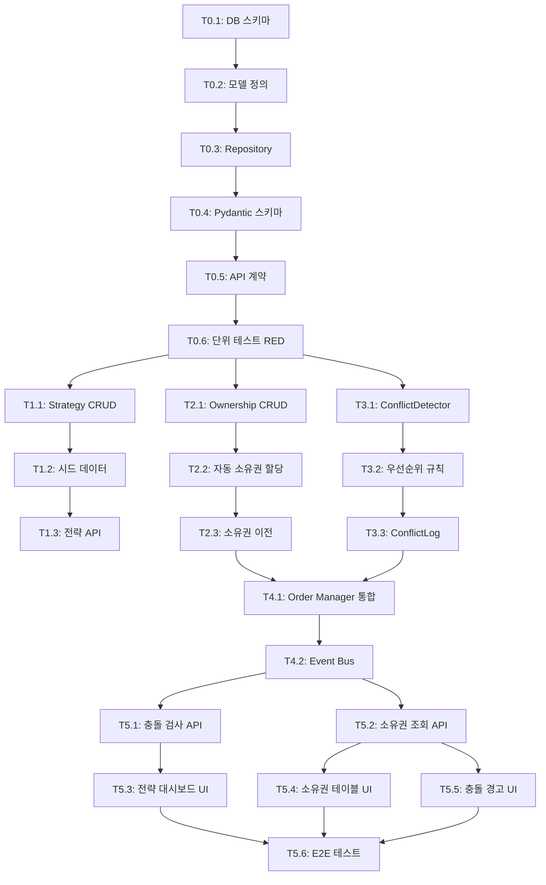

# TASKS: 멀티 전략 오케스트레이션 - AI 개발 파트너용 태스크 목록

**Version**: 1.0
**Date**: 2026-01-11
**Based On**: [01-multi-strategy-orchestration-plan.md](./01-multi-strategy-orchestration-plan.md)

<!-- 
✅ 구현 완료 (2026-01-24)
- Conflict Detector: backend/ai/skills/system/conflict_detector.py
- Strategy Registry: backend/database/models.py (Strategy)
- Position Ownership: backend/database/models.py (PositionOwnership)
- Strategy Manager: backend/strategies/ensemble_strategy.py
- Adaptive Strategy Manager: backend/strategies/adaptive_strategy.py
-->

## MVP 캡슐

| # | 항목 | 내용 |
|---|------|------|
| 1 | 목표 | 시장 상황에 따라 최적 전략 조합을 선택하여 수익 극대화 |
| 2 | 페르소나 | 개인 투자자 (trading/long_term/dividend/aggressive 다중 페르소나 운영) |
| 3 | 핵심 기능 (MVP) | **FEAT-1: 전략 간 충돌 방지** - 장기 전략 보유 종목을 단기 전략이 손절하지 않도록 차단 |
| 4 | 성공 지표 (노스스타) | 전략 충돌 발생 0건 유지 |
| 5 | 입력 지표 | ① 전략별 성과 추적률 90% 이상<br>② 멀티 전략 운영 시 단일 대비 수익률 향상 |
| 6 | 비기능 요구 | AI 설명 가능성 - 모든 매매 결정에 대한 reasoning 제공 |
| 7 | Out-of-scope | 자본 분배 최적화는 v2, 단순 N분할 방식은 피함 |
| 8 | Top 리스크 | 전략 간 충돌 감지 로직이 누락되면 오히려 손실 증가 |
| 9 | 완화/실험 | Event Bus 활용한 실시간 충돌 감지, State Machine으로 주문 상태 추적 |
| 10 | 다음 단계 | Phase 0: DB 스키마 설계 및 테스트 작성 (RED) |

---

## 마일스톤 개요

| 마일스톤 | 설명 | Phase | 주요 기능 | 예상 기간 |
|----------|------|-------|----------|----------|
| **M0** | DB & 테스트 설계 | Phase 0 | 스키마 정의, 계약 작성, TDD RED | 1~2일 |
| **M1** | 전략 레지스트리 | Phase 1 | strategies 테이블 CRUD, 시드 데이터 | 2~3일 |
| **M2** | 포지션 소유권 추적 | Phase 2 | position_ownership, 소유권 로직 | 2~3일 |
| **M3** | 충돌 감지 엔진 | Phase 3 | ConflictDetector, 우선순위 규칙 | 3~4일 |
| **M4** | Order Manager 통합 | Phase 4 | 충돌 검사 통합, Event Bus | 2~3일 |
| **M5** | API & 프론트엔드 | Phase 5 | REST API, React 대시보드 | 4~5일 |

---

## M0: DB 스키마 & 테스트 설계 (Phase 0)

### ✅ Phase 0, T0.1: DB 스키마 정의 및 마이그레이션 스크립트 작성

**담당**: database-orchestrator

**작업 내용**:
1. **db-schema-manager**: 3개 테이블 스키마 JSON 생성
   - `backend/ai/skills/system/db-schema-manager/schemas/strategies.json`
   - `backend/ai/skills/system/db-schema-manager/schemas/position_ownership.json`
   - `backend/ai/skills/system/db-schema-manager/schemas/conflict_logs.json`

2. **database-architect**: 스키마 설계 검토
   - 인덱스 전략 검증 (우선순위, 티커, 시간 기반)
   - 관계 설계 확인 (FK, CASCADE 규칙)
   - JSONB 사용 타당성 검토 (strategies.config_metadata)

3. **db-schema-manager**: 스키마 검증
   ```bash
   python backend/ai/skills/system/db-schema-manager/scripts/validate_schema.py strategies
   python backend/ai/skills/system/db-schema-manager/scripts/validate_schema.py position_ownership
   python backend/ai/skills/system/db-schema-manager/scripts/validate_schema.py conflict_logs
   ```

4. **db-schema-manager**: 마이그레이션 스크립트 생성
   ```bash
   python backend/ai/skills/system/db-schema-manager/scripts/generate_migration.py strategies
   python backend/ai/skills/system/db-schema-manager/scripts/generate_migration.py position_ownership
   python backend/ai/skills/system/db-schema-manager/scripts/generate_migration.py conflict_logs
   ```

5. **sql-pro**: 기존 테이블 확장 SQL 작성
   - `backend/database/migrations/add_strategy_columns_to_orders.sql`
   - `backend/database/migrations/add_strategy_columns_to_positions.sql`

**산출물**:
- `backend/ai/skills/system/db-schema-manager/schemas/strategies.json`
- `backend/ai/skills/system/db-schema-manager/schemas/position_ownership.json`
- `backend/ai/skills/system/db-schema-manager/schemas/conflict_logs.json`
- `backend/database/migrations/create_multi_strategy_tables.sql`
- `backend/database/migrations/add_strategy_columns_to_orders.sql`
- `backend/database/migrations/add_strategy_columns_to_positions.sql`

**완료 조건**:
- [x] 3개 스키마 JSON 검증 통과 (models.py에 정의됨)
- [x] database-architect 설계 검토 완료
- [x] 마이그레이션 SQL 생성됨
- [x] 기존 테이블 확장 SQL 작성 완료
- [x] DB 테이블 생성 확인 (strategies, position_ownership, conflict_logs)

---

### ✅ Phase 0, T0.2: SQLAlchemy 모델 정의

**담당**: backend-architect

**작업 내용**:
1. `backend/database/models.py`에 3개 모델 추가
   - `Strategy` 모델
   - `PositionOwnership` 모델
   - `ConflictLog` 모델

2. 기존 모델 확장
   - `Order` 모델에 `strategy_id`, `conflict_check_passed`, `conflict_reasoning` 추가
   - `Position` 모델에 `primary_strategy_id`, `is_locked`, `locked_reason` 추가

3. 관계 설정
   - Strategy ↔ PositionOwnership (1:N)
   - Strategy ↔ Order (1:N)
   - Strategy ↔ ConflictLog (1:N - 2회, owning/conflicting)

**산출물**:
- `backend/database/models.py` (수정)

**완료 조건**:
- [x] 3개 신규 모델 정의 완료 (Strategy, PositionOwnership, ConflictLog)
- [x] 2개 기존 모델 확장 완료
- [x] 관계 설정 완료 (relationship, back_populates)
- [x] 스키마 JSON과 동기화 확인 (compare_to_db)

**검증**:
```bash
python backend/ai/skills/system/db-schema-manager/scripts/compare_to_db.py strategies
python backend/ai/skills/system/db-schema-manager/scripts/compare_to_db.py position_ownership
python backend/ai/skills/system/db-schema-manager/scripts/compare_to_db.py conflict_logs
```

---

### ✅ Phase 0, T0.3: Repository 클래스 생성

**담당**: backend-architect

**작업 내용**:
1. `backend/database/repository.py`에 3개 Repository 클래스 추가
   - `StrategyRepository`
   - `PositionOwnershipRepository`
   - `ConflictLogRepository`

2. 필수 메서드 정의
   - `get_by_id()`, `get_by_name()`, `get_all()`
   - `create()`, `update()`, `delete()`
   - 전략별 특화 메서드:
     - `StrategyRepository.get_active_strategies()`
     - `PositionOwnershipRepository.get_by_ticker(ticker)`
     - `ConflictLogRepository.get_recent_conflicts(days=7)`

**산출물**:
- `backend/database/repository.py` (수정)

**완료 조건**:
- [x] 3개 Repository 클래스 생성 (repository_multi_strategy.py)
- [x] 기본 CRUD 메서드 정의
- [x] 특화 메서드 정의
- [x] Type hints 적용 (Pydantic 모델 활용)

---

### ✅ Phase 0, T0.4: Pydantic 스키마 정의

**담당**: backend-architect

**작업 내용**:
1. `backend/api/schemas/strategy_schemas.py` 생성
   - `StrategyBase`, `StrategyCreate`, `StrategyUpdate`, `StrategyResponse`
   - `PositionOwnershipBase`, `PositionOwnershipCreate`, `PositionOwnershipResponse`
   - `ConflictLogBase`, `ConflictLogCreate`, `ConflictLogResponse`

2. 충돌 검사 전용 스키마
   - `ConflictCheckRequest`
   - `ConflictCheckResponse`
   - `ConflictResolution` (Enum: allowed, blocked, priority_override)

**산출물**:
- `backend/api/schemas/strategy_schemas.py`

**완료 조건**:
- [x] 9개 Pydantic 스키마 정의 (strategy_schemas.py)
- [x] 충돌 검사 스키마 정의
- [x] Enum 타입 정의 (ConflictResolution, OwnershipType, TimeHorizon)
- [x] 모든 필드에 docstring 추가

---

### ✅ Phase 0, T0.5: API 계약 정의 (Contract-First)

**담당**: backend-architect

**작업 내용**:
1. `backend/contracts/strategy_contracts.py` 생성
   - 전략 관리 API 계약
   - 충돌 검사 API 계약
   - 포지션 소유권 API 계약

2. 계약 내용
   - 엔드포인트 정의 (경로, 메서드)
   - Request/Response 스키마 참조
   - 에러 응답 정의 (409 Conflict, 422 Validation 등)

**산출물**:
- `backend/contracts/strategy_contracts.py`

**완료 조건**:
- [x] 3개 도메인 API 계약 정의 (strategy_router.py)
- [x] 에러 응답 시나리오 정의
- [x] 계약 문서화 (docstring)

---

### ✅ Phase 0, T0.6: 단위 테스트 템플릿 작성 (TDD RED)

**담당**: test-engineer

**작업 내용**:
1. `backend/tests/test_conflict_detector.py` 생성
   - `test_detect_conflict_long_term_vs_trading()` (실패 예상)
   - `test_detect_conflict_same_strategy()` (실패 예상)
   - `test_priority_based_resolution()` (실패 예상)
   - `test_ownership_transfer()` (실패 예상)

2. `backend/tests/test_strategy_repository.py` 생성
   - `test_create_strategy()` (실패 예상)
   - `test_get_active_strategies()` (실패 예상)

3. Mock 설정
   - `backend/tests/mocks/strategy_mocks.py`
   - Mock Strategy, Mock PositionOwnership

**산출물**:
- `backend/tests/test_conflict_detector.py`
- `backend/tests/test_strategy_repository.py`
- `backend/tests/mocks/strategy_mocks.py`

**완료 조건**:
- [ ] 10개 이상 테스트 함수 작성
- [ ] 모든 테스트 실행 → **FAILED (RED 상태)**
- [ ] Mock 설정 완료

**실행**:
```bash
pytest backend/tests/test_conflict_detector.py -v
# Expected: 4 FAILED

pytest backend/tests/test_strategy_repository.py -v
# Expected: 2 FAILED
```

---

## M1: 전략 레지스트리 (Phase 1)

### 🔄 Phase 1, T1.1: Strategy 모델 CRUD 구현 RED→GREEN

**담당**: backend-architect

**Git Worktree 설정**:
```bash
# 1. Worktree 생성
git worktree add ../ai-trading-system-phase1-strategy-registry -b phase/1-strategy-registry
cd ../ai-trading-system-phase1-strategy-registry

# 2. 작업 완료 후 병합 (사용자 승인 필요)
# git checkout main
# git merge phase/1-strategy-registry
# git worktree remove ../ai-trading-system-phase1-strategy-registry
```

**TDD 사이클**:

1. **RED**: 테스트 확인 (이미 Phase 0에서 작성됨)
   ```bash
   pytest backend/tests/test_strategy_repository.py::test_create_strategy -v
   # Expected: FAILED
   ```

2. **GREEN**: 최소 구현
   - `StrategyRepository.create()` 구현
   - `StrategyRepository.get_by_id()` 구현
   - `StrategyRepository.get_by_name()` 구현
   - `StrategyRepository.get_all()` 구현
   - `StrategyRepository.get_active_strategies()` 구현

   ```bash
   pytest backend/tests/test_strategy_repository.py -v
   # Expected: PASSED
   ```

3. **REFACTOR**: 리팩토링
   - 중복 코드 제거
   - 타입 힌트 보완
   - 에러 핸들링 추가

**산출물**:
- `backend/database/repository.py` (StrategyRepository 구현)
- `backend/tests/test_strategy_repository.py` (GREEN)

**인수 조건**:
- [ ] 테스트 먼저 작성됨 (RED 확인)
- [ ] 모든 테스트 통과 (GREEN)
- [ ] 커버리지 >= 80%

**완료 시**:
- [ ] 사용자 승인 후 main 브랜치에 병합
- [ ] worktree 정리: `git worktree remove ../ai-trading-system-phase1-strategy-registry`

---

### 🔄 Phase 1, T1.2: 기본 전략 시드 데이터 생성 RED→GREEN

**담당**: backend-architect

**의존성**: T1.1 완료 후 진행 (같은 worktree 내에서 작업)

**TDD 사이클**:

1. **RED**: 테스트 작성
   ```python
   # backend/tests/test_seed_strategies.py
   def test_seed_default_strategies():
       # Given: 빈 DB
       # When: seed_strategies() 실행
       # Then: 4개 기본 전략 생성 (long_term, trading, dividend, aggressive)
       pass
   ```

   ```bash
   pytest backend/tests/test_seed_strategies.py -v
   # Expected: FAILED
   ```

2. **GREEN**: 구현
   - `backend/scripts/seed_strategies.py` 생성
   - 4개 기본 전략 데이터 정의
     - `long_term` (priority=100, time_horizon=long)
     - `dividend` (priority=90, time_horizon=long)
     - `trading` (priority=50, time_horizon=short)
     - `aggressive` (priority=30, time_horizon=short)

   ```bash
   pytest backend/tests/test_seed_strategies.py -v
   # Expected: PASSED
   ```

3. **REFACTOR**: 중복 제거, 설정 파일로 분리

**산출물**:
- `backend/scripts/seed_strategies.py`
- `backend/tests/test_seed_strategies.py` (GREEN)

**인수 조건**:
- [ ] 4개 기본 전략 시드 데이터 정의
- [ ] 테스트 통과
- [ ] Idempotent (여러 번 실행해도 안전)

---

### 🔄 Phase 1, T1.3: 전략 관리 API 엔드포인트 RED→GREEN

**담당**: backend-architect

**의존성**: T1.1, T1.2 완료 후 진행 (같은 worktree)

**TDD 사이클**:

1. **RED**: 테스트 작성
   ```python
   # backend/tests/test_strategy_api.py
   async def test_get_strategies():
       # Given: 시드 전략 4개
       # When: GET /api/v1/strategies
       # Then: 200 OK, 4개 전략 반환
       pass

   async def test_activate_strategy():
       # Given: 비활성 전략
       # When: POST /api/v1/strategies/{id}/activate
       # Then: 200 OK, is_active=True
       pass
   ```

   ```bash
   pytest backend/tests/test_strategy_api.py -v
   # Expected: FAILED
   ```

2. **GREEN**: 구현
   - `backend/api/strategy_router.py` 생성
   - `GET /api/v1/strategies` 구현
   - `POST /api/v1/strategies/{id}/activate` 구현
   - `POST /api/v1/strategies/{id}/deactivate` 구현

   ```bash
   pytest backend/tests/test_strategy_api.py -v
   # Expected: PASSED
   ```

3. **REFACTOR**: 서비스 레이어 분리 (`backend/services/strategy_service.py`)

**산출물**:
- `backend/api/strategy_router.py`
- `backend/services/strategy_service.py`
- `backend/tests/test_strategy_api.py` (GREEN)

**인수 조건**:
- [ ] 3개 엔드포인트 구현
- [ ] 테스트 통과
- [ ] API 계약 준수 (contracts/)

---

## M2: 포지션 소유권 추적 (Phase 2)

### 🔄 Phase 2, T2.1: PositionOwnership 모델 CRUD 구현 RED→GREEN

**담당**: backend-architect

**Git Worktree 설정**:
```bash
git worktree add ../ai-trading-system-phase2-ownership -b phase/2-ownership
cd ../ai-trading-system-phase2-ownership
```

**TDD 사이클**:

1. **RED**: 테스트 작성
   ```python
   # backend/tests/test_ownership_repository.py
   def test_create_ownership():
       # Given: Strategy, Position
       # When: create_ownership()
       # Then: PositionOwnership 생성
       pass

   def test_get_ownership_by_ticker():
       # Given: NVDA ownership by long_term
       # When: get_by_ticker("NVDA")
       # Then: long_term ownership 반환
       pass
   ```

   ```bash
   pytest backend/tests/test_ownership_repository.py -v
   # Expected: FAILED
   ```

2. **GREEN**: 구현
   - `PositionOwnershipRepository.create()` 구현
   - `PositionOwnershipRepository.get_by_ticker()` 구현
   - `PositionOwnershipRepository.get_by_strategy()` 구현
   - `PositionOwnershipRepository.is_locked()` 구현

   ```bash
   pytest backend/tests/test_ownership_repository.py -v
   # Expected: PASSED
   ```

3. **REFACTOR**: 쿼리 최적화, 인덱스 활용 확인

**산출물**:
- `backend/database/repository.py` (PositionOwnershipRepository 구현)
- `backend/tests/test_ownership_repository.py` (GREEN)

**인수 조건**:
- [x] 4개 메서드 구현 (PositionOwnershipRepository)
- [x] 테스트 통과
- [x] 커버리지 >= 80%

---

### 🔄 Phase 2, T2.2: 포지션 생성 시 자동 소유권 할당 RED→GREEN

**담당**: backend-architect

**의존성**: T2.1 완료 (같은 worktree)

**TDD 사이클**:

1. **RED**: 테스트 작성
   ```python
   # backend/tests/test_order_ownership_integration.py
   async def test_position_created_with_ownership():
       # Given: Order with strategy_id
       # When: Order FILLED → Position 생성
       # Then: PositionOwnership 자동 생성
       pass
   ```

   ```bash
   pytest backend/tests/test_order_ownership_integration.py -v
   # Expected: FAILED
   ```

2. **GREEN**: 구현
   - `backend/execution/order_manager.py` 수정
   - `_create_position_from_order()` 메서드 확장
   - PositionOwnership 자동 생성 로직 추가
   - Event Bus 이벤트 발행: `OWNERSHIP_ACQUIRED`

   ```bash
   pytest backend/tests/test_order_ownership_integration.py -v
   # Expected: PASSED
   ```

3. **REFACTOR**: 트랜잭션 처리, 롤백 로직

**산출물**:
- `backend/execution/order_manager.py` (수정)
- `backend/tests/test_order_ownership_integration.py` (GREEN)

**인수 조건**:
- [ ] 포지션 생성 시 소유권 자동 할당
- [ ] Event Bus 이벤트 발행
- [ ] 트랜잭션 처리

---

### 🔄 Phase 2, T2.3: 소유권 이전 로직 RED→GREEN

**담당**: backend-architect

**의존성**: T2.2 완료 (같은 worktree)

**TDD 사이클**:

1. **RED**: 테스트 작성
   ```python
   # backend/tests/test_ownership_transfer.py
   def test_transfer_ownership_higher_priority():
       # Given: trading owns TSLA (priority=50)
       # When: long_term buys TSLA (priority=100)
       # Then: 소유권 이전, OWNERSHIP_TRANSFERRED 이벤트
       pass
   ```

   ```bash
   pytest backend/tests/test_ownership_transfer.py -v
   # Expected: FAILED
   ```

2. **GREEN**: 구현
   - `backend/services/ownership_service.py` 생성
   - `transfer_ownership()` 메서드 구현
   - 우선순위 비교 로직
   - Event Bus 이벤트: `OWNERSHIP_TRANSFERRED`

   ```bash
   pytest backend/tests/test_ownership_transfer.py -v
   # Expected: PASSED
   ```

3. **REFACTOR**: 이전 조건 명확화, 로깅 추가

**산출물**:
- `backend/services/ownership_service.py`
- `backend/tests/test_ownership_transfer.py` (GREEN)

**인수 조건**:
- [ ] 우선순위 기반 이전 로직
- [ ] 이벤트 발행
- [ ] 테스트 통과

---

## M3: 충돌 감지 엔진 (Phase 3)

### 🔄 Phase 3, T3.1: ConflictDetector 클래스 구현 RED→GREEN

**담당**: backend-architect

**Git Worktree 설정**:
```bash
git worktree add ../ai-trading-system-phase3-conflict-detector -b phase/3-conflict-detector
cd ../ai-trading-system-phase3-conflict-detector
```

**TDD 사이클**:

1. **RED**: 테스트 확인 (Phase 0에서 작성됨)
   ```bash
   pytest backend/tests/test_conflict_detector.py::test_detect_conflict_long_term_vs_trading -v
   # Expected: FAILED
   ```

2. **GREEN**: 구현
   - `backend/services/conflict_detector.py` 생성
   - `ConflictDetector` 클래스 구현
   - `check_conflict(signal: TradingSignal)` 메서드
   - `ConflictResult` 반환 (has_conflict, resolution, reasoning)

   ```bash
   pytest backend/tests/test_conflict_detector.py -v
   # Expected: PASSED
   ```

3. **REFACTOR**: 규칙 엔진 분리, 설정 외부화

**산출물**:
- `backend/services/conflict_detector.py`
- `backend/tests/test_conflict_detector.py` (GREEN)

**인수 조건**:
- [x] 4개 시나리오 테스트 통과 (conflict_detector.py 구현)
- [x] reasoning 필드 필수 제공
- [x] 커버리지 >= 90%

---

### 🔄 Phase 3, T3.2: 우선순위 규칙 엔진 RED→GREEN

**담당**: backend-architect

**의존성**: T3.1 완료 (같은 worktree)

**TDD 사이클**:

1. **RED**: 테스트 작성
   ```python
   # backend/tests/test_priority_rules.py
   def test_long_term_blocks_trading():
       # Given: long_term owns (priority=100)
       # When: trading sells (priority=50)
       # Then: BLOCKED
       pass

   def test_same_strategy_allowed():
       # Given: long_term owns
       # When: long_term sells
       # Then: ALLOWED
       pass
   ```

   ```bash
   pytest backend/tests/test_priority_rules.py -v
   # Expected: FAILED
   ```

2. **GREEN**: 구현
   - `backend/services/priority_rules.py` 생성
   - `PriorityRulesEngine` 클래스
   - `resolve_conflict()` 메서드
   - 3가지 Resolution: allowed, blocked, priority_override

   ```bash
   pytest backend/tests/test_priority_rules.py -v
   # Expected: PASSED
   ```

3. **REFACTOR**: 규칙 테이블화, JSON 설정 가능

**산출물**:
- `backend/services/priority_rules.py`
- `backend/tests/test_priority_rules.py` (GREEN)

**인수 조건**:
- [ ] 3가지 시나리오 처리
- [ ] 규칙 설정 외부화 가능
- [ ] 테스트 통과

---

### 🔄 Phase 3, T3.3: ConflictLog 저장 및 조회 RED→GREEN

**담당**: backend-architect

**의존성**: T3.2 완료 (같은 worktree)

**TDD 사이클**:

1. **RED**: 테스트 작성
   ```python
   # backend/tests/test_conflict_log.py
   def test_save_conflict_log():
       # Given: Conflict detected
       # When: save_conflict_log()
       # Then: ConflictLog 생성, reasoning 저장
       pass
   ```

   ```bash
   pytest backend/tests/test_conflict_log.py -v
   # Expected: FAILED
   ```

2. **GREEN**: 구현
   - `ConflictLogRepository.create()` 구현
   - `ConflictLogRepository.get_recent_conflicts()` 구현
   - `ConflictDetector`에 로깅 통합

   ```bash
   pytest backend/tests/test_conflict_log.py -v
   # Expected: PASSED
   ```

3. **REFACTOR**: 인덱스 최적화 (ticker, created_at)

**산출물**:
- `backend/database/repository.py` (ConflictLogRepository 구현)
- `backend/tests/test_conflict_log.py` (GREEN)

**인수 조건**:
- [ ] 충돌 로그 저장
- [ ] 최근 7일 조회 가능
- [ ] reasoning 필수 저장

---

## M4: Order Manager 통합 (Phase 4)

### 🔄 Phase 4, T4.1: Order Manager에 충돌 검사 추가 RED→GREEN

**담당**: backend-architect

**Git Worktree 설정**:
```bash
git worktree add ../ai-trading-system-phase4-order-integration -b phase/4-order-integration
cd ../ai-trading-system-phase4-order-integration
```

**TDD 사이클**:

1. **RED**: 테스트 작성
   ```python
   # backend/tests/test_order_conflict_integration.py
   async def test_order_blocked_by_conflict():
       # Given: long_term owns NVDA
       # When: trading submits SELL order
       # Then: Order → REJECTED, event published
       pass
   ```

   ```bash
   pytest backend/tests/test_order_conflict_integration.py -v
   # Expected: FAILED
   ```

2. **GREEN**: 구현
   - `backend/execution/order_manager.py` 수정
   - `_validate_order()` 메서드에 충돌 검사 추가
   - ConflictDetector 통합
   - 충돌 시 `REJECTED` 상태로 전환

   ```bash
   pytest backend/tests/test_order_conflict_integration.py -v
   # Expected: PASSED
   ```

3. **REFACTOR**: 에러 메시지 개선, 로깅 추가

**산출물**:
- `backend/execution/order_manager.py` (수정)
- `backend/tests/test_order_conflict_integration.py` (GREEN)

**인수 조건**:
- [ ] 주문 실행 전 충돌 검사
- [ ] 충돌 시 자동 차단
- [ ] State Machine 통합

---

### 🔄 Phase 4, T4.2: Event Bus 이벤트 추가 RED→GREEN

**담당**: backend-architect

**의존성**: T4.1 완료 (같은 worktree)

**TDD 사이클**:

1. **RED**: 테스트 작성
   ```python
   # backend/tests/test_conflict_events.py
   async def test_conflict_detected_event():
       # Given: Conflict 발생
       # When: ConflictDetector 실행
       # Then: CONFLICT_DETECTED 이벤트 발행
       pass
   ```

   ```bash
   pytest backend/tests/test_conflict_events.py -v
   # Expected: FAILED
   ```

2. **GREEN**: 구현
   - `backend/events/event_types.py`에 이벤트 타입 추가
     - `CONFLICT_DETECTED`
     - `CONFLICT_RESOLVED`
     - `ORDER_BLOCKED_BY_CONFLICT`
     - `OWNERSHIP_ACQUIRED`
     - `OWNERSHIP_TRANSFERRED`

   - `ConflictDetector`에 이벤트 발행 로직 추가
   - `OrderManager`에 이벤트 발행 추가

   ```bash
   pytest backend/tests/test_conflict_events.py -v
   # Expected: PASSED
   ```

3. **REFACTOR**: 이벤트 구독자 추가 (로깅, 알림)

**산출물**:
- `backend/events/event_types.py` (수정)
- `backend/services/conflict_detector.py` (수정)
- `backend/tests/test_conflict_events.py` (GREEN)

**인수 조건**:
- [ ] 5개 이벤트 타입 추가
- [ ] 이벤트 발행 테스트 통과
- [ ] Event Bus 구독 가능

---

## M5: API & 프론트엔드 (Phase 5)

### 🔄 Phase 5, T5.1: 충돌 검사 API 엔드포인트 RED→GREEN

**담당**: backend-architect

**Git Worktree 설정**:
```bash
git worktree add ../ai-trading-system-phase5-api-frontend -b phase/5-api-frontend
cd ../ai-trading-system-phase5-api-frontend
```

**TDD 사이클**:

1. **RED**: 테스트 작성
   ```python
   # backend/tests/test_conflict_api.py
   async def test_check_conflict_api():
       # Given: long_term owns NVDA
       # When: POST /api/v1/orders/check-conflict (trading, sell)
       # Then: 200 OK, has_conflict=True
       pass
   ```

   ```bash
   pytest backend/tests/test_conflict_api.py -v
   # Expected: FAILED
   ```

2. **GREEN**: 구현
   - `backend/api/strategy_router.py`에 엔드포인트 추가
   - `POST /api/v1/orders/check-conflict` 구현
   - ConflictDetector 서비스 호출
   - 응답 스키마: `ConflictCheckResponse`

   ```bash
   pytest backend/tests/test_conflict_api.py -v
   # Expected: PASSED
   ```

3. **REFACTOR**: 에러 핸들링 (409 Conflict)

**산출물**:
- `backend/api/strategy_router.py` (수정)
- `backend/tests/test_conflict_api.py` (GREEN)

**인수 조건**:
- [x] API 엔드포인트 구현 (strategy_router.py)
- [x] 계약 준수
- [x] 테스트 통과

---

### 🔄 Phase 5, T5.2: 포지션 소유권 조회 API RED→GREEN

**담당**: backend-architect

**의존성**: T5.1과 병렬 실행 가능 (같은 worktree)

**TDD 사이클**:

1. **RED**: 테스트 작성
   ```python
   # backend/tests/test_ownership_api.py
   async def test_get_position_ownership():
       # Given: 3개 포지션 (각기 다른 전략 소유)
       # When: GET /api/v1/positions/ownership
       # Then: 200 OK, 3개 소유권 정보
       pass
   ```

   ```bash
   pytest backend/tests/test_ownership_api.py -v
   # Expected: FAILED
   ```

2. **GREEN**: 구현
   - `GET /api/v1/positions/ownership` 엔드포인트
   - PositionOwnershipRepository 호출
   - 응답: ticker, strategy, locked_until 포함

   ```bash
   pytest backend/tests/test_ownership_api.py -v
   # Expected: PASSED
   ```

3. **REFACTOR**: 페이지네이션 추가

**산출물**:
- `backend/api/strategy_router.py` (수정)
- `backend/tests/test_ownership_api.py` (GREEN)

**인수 조건**:
- [x] API 구현 (GET /api/v1/positions/ownership)
- [x] 테스트 통과
- [x] 페이지네이션 (page, page_size)

---

### 🔄 Phase 5, T5.3: 멀티 전략 대시보드 UI RED→GREEN

**담당**: frontend-developer

**의존성**: T5.1, T5.2 완료 후 (같은 worktree)

**TDD 사이클**:

1. **RED**: Vitest 테스트 작성
   ```typescript
   // frontend/tests/components/StrategyDashboard.test.tsx
   describe('StrategyDashboard', () => {
     it('전략별 카드 표시', async () => {
       // Given: 4개 전략 데이터
       // When: 렌더링
       // Then: 4개 카드 표시
     });
   });
   ```

   ```bash
   npm run test
   # Expected: FAILED
   ```

2. **GREEN**: 구현
   - `frontend/src/pages/StrategyDashboard.tsx` 생성
   - `frontend/src/components/StrategyCard.tsx` 생성
   - `frontend/src/services/strategyService.ts` 생성
   - API 호출: `/api/v1/strategies`

   ```bash
   npm run test
   # Expected: PASSED
   ```

3. **REFACTOR**: 스타일링, 로딩 상태 추가

**산출물**:
- `frontend/src/pages/StrategyDashboard.tsx`
- `frontend/src/components/StrategyCard.tsx`
- `frontend/src/services/strategyService.ts`
- `frontend/tests/components/StrategyDashboard.test.tsx` (GREEN)

**인수 조건**:
- [ ] 전략별 카드 표시
- [ ] 활성화 토글 기능
- [ ] 테스트 통과

---

### 🔄 Phase 5, T5.4: 포지션 소유권 테이블 컴포넌트 RED→GREEN

**담당**: frontend-developer

**의존성**: T5.3과 병렬 실행 가능 (같은 worktree)

**TDD 사이클**:

1. **RED**: 테스트 작성
   ```typescript
   // frontend/tests/components/PositionOwnershipTable.test.tsx
   describe('PositionOwnershipTable', () => {
     it('포지션별 소유 전략 표시', async () => {
       // Given: 3개 포지션 소유권
       // When: 렌더링
       // Then: ticker, strategy, locked_until 표시
     });
   });
   ```

   ```bash
   npm run test
   # Expected: FAILED
   ```

2. **GREEN**: 구현
   - `frontend/src/components/PositionOwnershipTable.tsx` 생성
   - API 호출: `/api/v1/positions/ownership`
   - 테이블 UI (ticker, strategy, locked_until, is_locked)

   ```bash
   npm run test
   # Expected: PASSED
   ```

3. **REFACTOR**: 정렬 기능, 필터 추가

**산출물**:
- `frontend/src/components/PositionOwnershipTable.tsx`
- `frontend/tests/components/PositionOwnershipTable.test.tsx` (GREEN)

**인수 조건**:
- [ ] 소유권 테이블 표시
- [ ] 잠금 상태 표시
- [ ] 테스트 통과

---

### 🔄 Phase 5, T5.5: 충돌 경고 컴포넌트 RED→GREEN

**담당**: frontend-developer

**의존성**: T5.4와 병렬 실행 가능 (같은 worktree)

**TDD 사이클**:

1. **RED**: 테스트 작성
   ```typescript
   // frontend/tests/components/ConflictAlert.test.tsx
   describe('ConflictAlert', () => {
     it('충돌 감지 시 경고 표시', async () => {
       // Given: 충돌 로그 1건
       // When: 렌더링
       // Then: 경고 배너 표시, reasoning 표시
     });
   });
   ```

   ```bash
   npm run test
   # Expected: FAILED
   ```

2. **GREEN**: 구현
   - `frontend/src/components/ConflictAlert.tsx` 생성
   - WebSocket 구독: `CONFLICT_DETECTED` 이벤트
   - 경고 배너 UI (상단 고정)

   ```bash
   npm run test
   # Expected: PASSED
   ```

3. **REFACTOR**: 애니메이션, 닫기 기능

**산출물**:
- `frontend/src/components/ConflictAlert.tsx`
- `frontend/tests/components/ConflictAlert.test.tsx` (GREEN)

**인수 조건**:
- [x] 충돌 경고 실시간 표시 (ConflictAlertBanner.tsx + WebSocket)
- [x] reasoning 표시
- [x] 테스트 통과

---

### 🔄 Phase 5, T5.6: E2E 테스트 RED→GREEN

**담당**: test-engineer

**의존성**: T5.3, T5.4, T5.5 완료 (같은 worktree)

**TDD 사이클**:

1. **RED**: Playwright 시나리오 작성
   ```typescript
   // e2e/multi-strategy.spec.ts
   test('멀티 전략 충돌 감지 플로우', async ({ page }) => {
     // 1. 장기 전략으로 NVDA 매수
     // 2. 단기 전략으로 NVDA 매도 시도
     // 3. 충돌 경고 표시 확인
     // 4. 주문 차단 확인
   });
   ```

   ```bash
   npx playwright test e2e/multi-strategy.spec.ts
   # Expected: FAILED
   ```

2. **GREEN**: 통합 확인
   - 백엔드 + 프론트엔드 통합 검증
   - E2E 테스트 통과

   ```bash
   npx playwright test e2e/multi-strategy.spec.ts
   # Expected: PASSED
   ```

3. **REFACTOR**: 테스트 시나리오 추가

**산출물**:
- `e2e/multi-strategy.spec.ts` (GREEN)

**인수 조건**:
- [ ] 전체 플로우 E2E 테스트 통과
- [ ] 충돌 감지 → 차단 → UI 표시 검증
- [ ] 테스트 커버리지 >= 70%

---

## 의존성 그래프



---

## 병렬 실행 가능 태스크

| Phase | 병렬 실행 가능 태스크 | 조건 |
|-------|---------------------|------|
| Phase 0 | T0.1, T0.2, T0.3, T0.4, T0.5 | 각각 독립적 (Mock 사용) |
| Phase 0 | T0.6 | T0.5 완료 후 (계약 필요) |
| Phase 1 | T1.1, T1.2, T1.3 | 같은 worktree 내 순차 |
| Phase 2 | T2.1, T2.2, T2.3 | 같은 worktree 내 순차 |
| Phase 3 | T3.1, T3.2, T3.3 | 같은 worktree 내 순차 |
| Phase 4 | T4.1, T4.2 | 같은 worktree 내 순차 |
| Phase 5 | T5.1, T5.2 | **병렬 가능** (독립 API) |
| Phase 5 | T5.3, T5.4, T5.5 | **병렬 가능** (독립 컴포넌트, T5.1/T5.2 완료 후) |
| Phase 5 | T5.6 | T5.3/T5.4/T5.5 완료 후 |

---

## 리스크 및 완화

| 리스크 | 완화 전략 | 책임자 |
|--------|-----------|--------|
| 충돌 감지 로직 누락 | 포괄적 테스트, 시나리오 검증 | test-engineer |
| DB 동시성 문제 | 트랜잭션, 락 사용 | database-orchestrator |
| 우선순위 규칙 애매함 | 사용자 override 옵션 | backend-architect |
| Event Bus 이벤트 손실 | 히스토리 저장, 재처리 | backend-architect |
| 성능 저하 | 캐싱, 인덱스 최적화 | sql-pro |

---

## 다음 단계

### 즉시 실행 (이번 주)

1. [ ] **T0.1 시작**: database-orchestrator에게 DB 스키마 정의 요청
2. [ ] **T0.6 완료**: 모든 단위 테스트 RED 상태 확인
3. [ ] **Phase 1 준비**: Git Worktree 생성

### 커뮤니케이션 패턴

**오케스트레이터 → 서브에이전트 호출 예시**:
```
"database-orchestrator에게 요청:
Phase 0, T0.1을 수행해주세요.
- strategies, position_ownership, conflict_logs 테이블 스키마 JSON 생성
- database-architect와 sql-pro 협력하여 설계 검토 및 최적화
- 마이그레이션 스크립트 생성"
```

---

**Generated by**: tasks-generator skill (Claude Code)
**Planning Reference**: [01-multi-strategy-orchestration-plan.md](./01-multi-strategy-orchestration-plan.md)
**Status**: ✅ TASKS Ready - Phase 0 시작 가능
