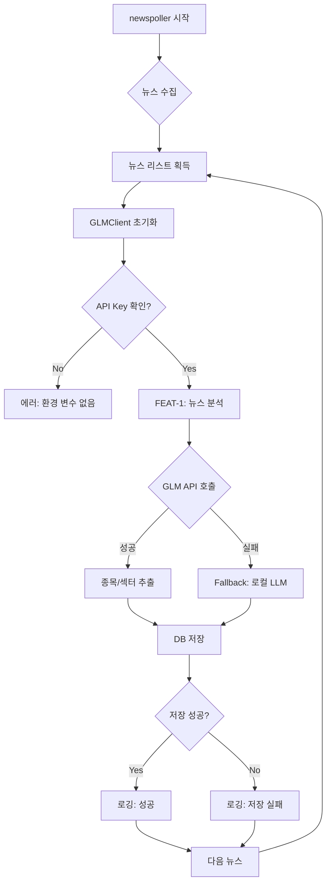
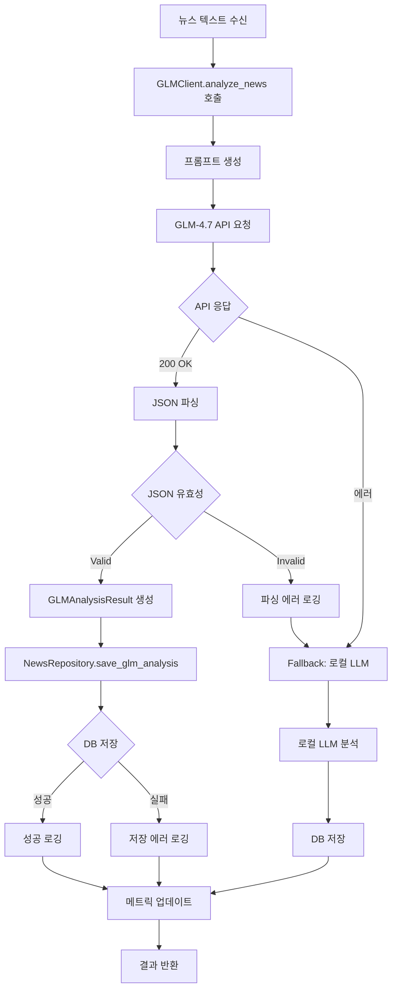
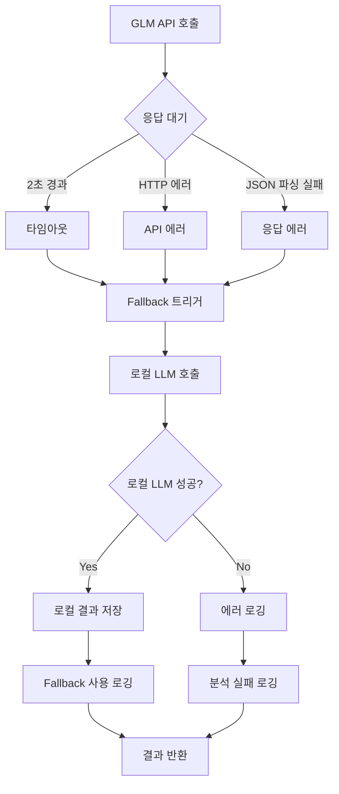
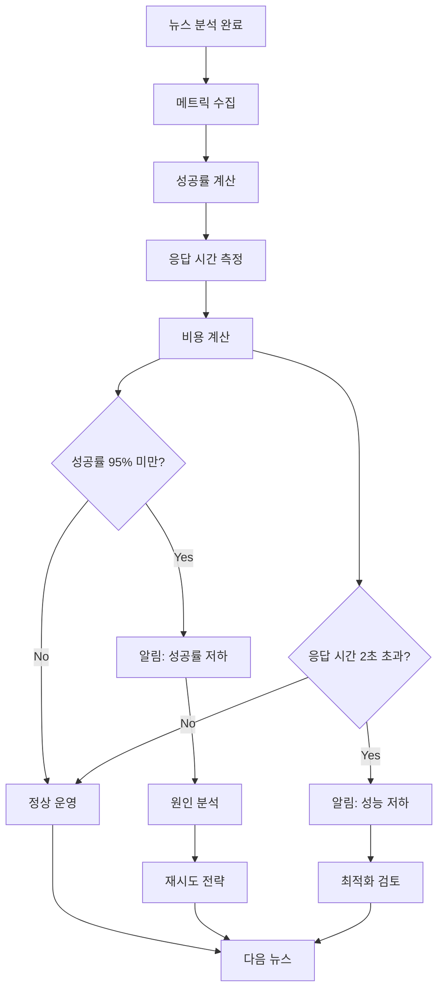
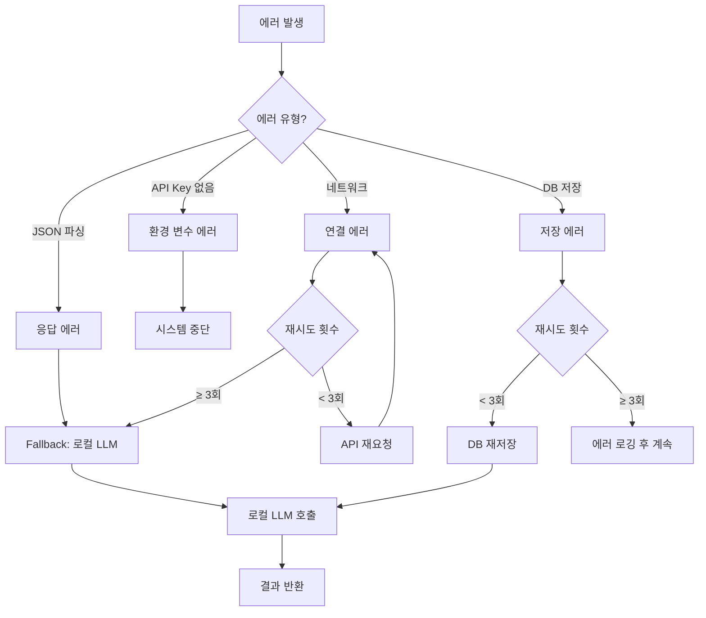
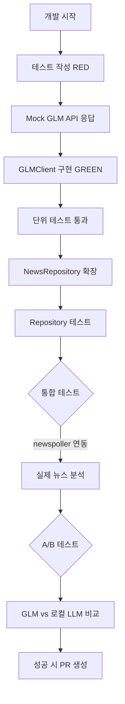
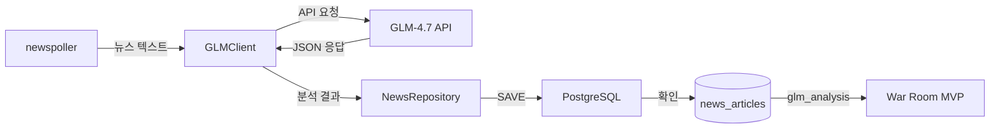

# User Flow (사용자 흐름도)
# GLM-4.7 뉴스 해석 서비스

> Mermaid 플로우차트로 핵심 기능의 주요 여정을 표현합니다.
> 이 시스템은 백엔드 모듈이므로 개발자 관점에서의 흐름을 표현합니다.

---

## MVP 캡슐

| # | 항목 | 내용 |
|---|------|------|
| 1 | 목표 | AI 트레이딩 시스템의 뉴스 해석 비용을 절감하고 분석 품질을 향상시키는 것 |
| 2 | 페르소나 | AI 트레이딩 시스템 개발자 (기존 시스템에 newspoller 존재, 로컬 LLM 사용 중) |
| 3 | 핵심 기능 | FEAT-1: 종목/섹터 식별 (뉴스에서 관련 종목과 섹터를 추출) |
| 4 | 성공 지표 (노스스타) | GLM API가 뉴스 분석 성공률 95% 이상, 평균 응답 시간 2초 이내 |
| 5 | 입력 지표 | GLM API 호출 성공률, 평균 응답 시간 |
| 6 | 비기능 요구 | 기존 Claude/Gemini/ChatGPT 클라이언트와 동일한 인터페이스로 통합 |
| 7 | Out-of-scope | 트레이딩 시그널 직접 생성, 포지션 사이즈 결정, 손절/익절 판단 |
| 8 | Top 리스크 | GLM API 장애 시 뉴스 분석 파이프라인 중단 |
| 9 | 완화/실험 | 기존 로컬 LLM을 Fallback으로 유지하여 A/B 테스트 |
| 10 | 다음 단계 | newspoller에 GLM 클라이언트 연동하여 실시간 뉴스 분석 테스트 |

---

## 1. 전체 사용자 여정 (Overview)

---

## 2. FEAT-1: 종목/섹터 식별 플로우

---

## 3. Fallback 플로우 (API 장애 시)

---

## 4. 리텐션 루프 (모니터링 & 개선)

---

## 5. 에러 처리 플로우

---

## 6. 개발자 플로우 (테스트 및 통합)

---

## 7. 화면/컴포넌트 목록 (Component Inventory)

| 컴포넌트 ID | 컴포넌트명 | FEAT | 파일 위치 | 주요 기능 |
|------------|-----------|------|-----------|----------|
| C-01 | GLMClient | FEAT-1 | backend/ai/glm_client.py | GLM-4.7 API 호출 및 응답 처리 |
| C-02 | NewsRepository | FEAT-1 | backend/database/repository.py | DB 저장 (save_glm_analysis) |
| C-03 | newspoller | FEAT-1 | backend/news/poller.py | 뉴스 수집 및 GLMClient 호출 |
| C-04 | GLMAnalysisResult | FEAT-1 | backend/ai/glm_client.py | Pydantic 모델 (응답 스키마) |
| C-05 | FallbackHandler | FEAT-1 | backend/ai/glm_client.py | 로컬 LLM Fallback 처리 |

---

## 8. 데이터 플로우 다이어그램

---

## Decision Log 참조

| ID | 항목 | 선택 | 관련 흐름 |
|----|------|------|----------|
| D-06 | 사용 상황 | 실시간 뉴스 처리, DB 저장, 리포트 | 전체 여정 (1) |
| D-11 | 사용 환경 | newspoller와 연동 | newspoller 통합 (1, 8) |
| D-13 | 데이터 저장 | 기존 테이블에 JSON 컬럼 추가 | DB 플로우 (8) |
| D-18 | 검증 방식 | 실시간 뉴스 분석 테스트 | 개발자 플로우 (7) |
