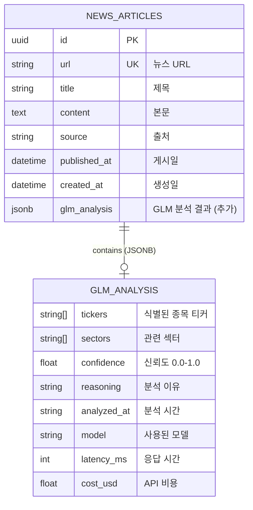
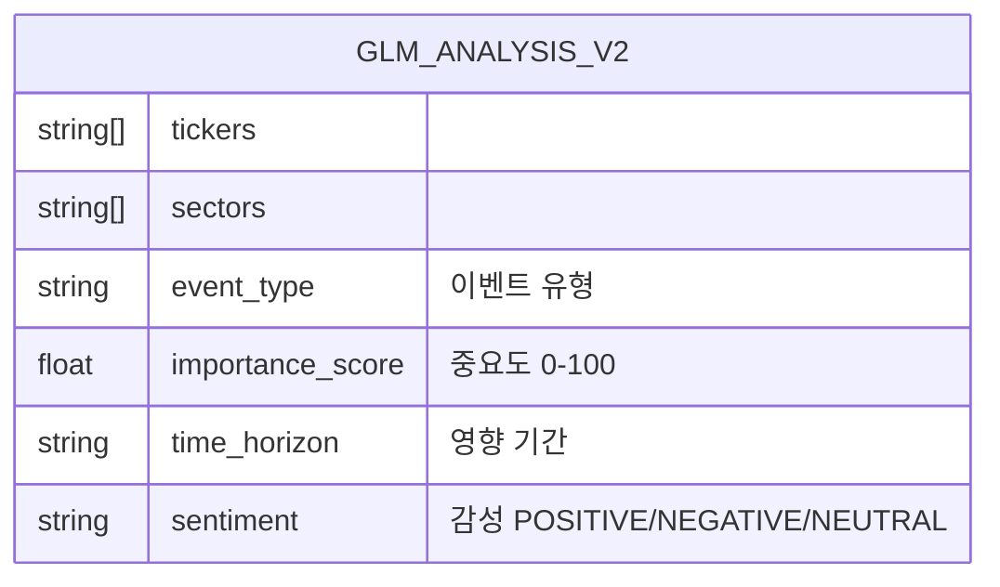

# Database Design (데이터베이스 설계)
# GLM-4.7 뉴스 해석 서비스

> Mermaid ERD로 주요 엔티티와 관계를 표현합니다.
> 기존 news_articles 테이블에 glm_analysis JSONB 컬럼을 추가하는 방식을 설명합니다.

---

## MVP 캡슐

| # | 항목 | 내용 |
|---|------|------|
| 1 | 목표 | AI 트레이딩 시스템의 뉴스 해석 비용을 절감하고 분석 품질을 향상시키는 것 |
| 2 | 페르소나 | AI 트레이딩 시스템 개발자 (기존 시스템에 newspoller 존재, 로컬 LLM 사용 중) |
| 3 | 핵심 기능 | FEAT-1: 종목/섹터 식별 (뉴스에서 관련 종목과 섹터를 추출) |
| 4 | 성공 지표 (노스스타) | GLM API가 뉴스 분석 성공률 95% 이상, 평균 응답 시간 2초 이내 |
| 5 | 입력 지표 | GLM API 호출 성공률, 평균 응답 시간 |
| 6 | 비기능 요구 | 기존 Claude/Gemini/ChatGPT 클라이언트와 동일한 인터페이스로 통합 |
| 7 | Out-of-scope | 트레이딩 시그널 직접 생성, 포지션 사이즈 결정, 손절/익절 판단 |
| 8 | Top 리스크 | GLM API 장애 시 뉴스 분석 파이프라인 중단 |
| 9 | 완화/실험 | 기존 로컬 LLM을 Fallback으로 유지하여 A/B 테스트 |
| 10 | 다음 단계 | newspoller에 GLM 클라이언트 연동하여 실시간 뉴스 분석 테스트 |

---

## 1. ERD (Entity Relationship Diagram)



---

## 2. 엔티티 상세 정의

### 2.1 NEWS_ARTICLES (뉴스 기사) - FEAT-1 (기존, 확장)

| 컬럼 | 타입 | 제약조건 | 설명 |
|------|------|----------|------|
| id | UUID | PK | 고유 식별자 |
| url | VARCHAR(500) | UNIQUE, NOT NULL | 뉴스 URL |
| title | VARCHAR(500) | NOT NULL | 제목 |
| content | TEXT | NULL | 본문 |
| source | VARCHAR(100) | NULL | 출처 |
| published_at | TIMESTAMP | NULL | 게시일 |
| created_at | TIMESTAMP | NOT NULL, DEFAULT NOW() | 생성일 |
| **glm_analysis** | **JSONB** | **NULL (추가)** | **GLM 분석 결과** |

**인덱스:**
- `idx_news_url` ON url (기존)
- `idx_news_source` ON source (기존)
- `idx_news_published_at` ON published_at DESC (기존)
- `idx_news_glm_analysis` ON glm_analysis USING GIN (추가)

**glm_analysis JSONB 내부 구조:**
```json
{
  "tickers": ["AAPL", "TSLA", "NVDA"],
  "sectors": ["Technology", "Consumer Electronics"],
  "confidence": 0.87,
  "reasoning": "뉴스에서 Apple, Tesla의 전력 반도체 공급망 언급",
  "analyzed_at": "2026-01-15T10:30:00Z",
  "model": "glm-4-flash",
  "latency_ms": 1234,
  "cost_usd": 0.001
}
```

### 2.2 GLM_ANALYSIS (GLM 분석 결과) - FEAT-1 (JSONB 내부)

| 필드 | 타입 | 필수여부 | 설명 |
|------|------|----------|------|
| tickers | string[] | Yes | 식별된 종목 티커 리스트 |
| sectors | string[] | Yes | 관련 섹터 리스트 |
| confidence | float | Yes | 신뢰도 (0.0-1.0) |
| reasoning | string | Yes | 분석 이유 |
| analyzed_at | string (ISO 8601) | Yes | 분석 시간 |
| model | string | Yes | 사용된 GLM 모델 |
| latency_ms | int | Yes | API 응답 시간 |
| cost_usd | float | Yes | API 호출 비용 |

---

## 3. 관계 정의

| 부모 | 자식 | 관계 | 설명 |
|------|------|------|------|
| NEWS_ARTICLES | GLM_ANALYSIS | 1:1 (JSONB) | 각 뉴스는 하나의 GLM 분석 결과 포함 |

---

## 4. 마이그레이션 스크립트

### 4.1 컬럼 추가

```sql
-- GLM 분석 결과 컬럼 추가
ALTER TABLE news_articles
ADD COLUMN glm_analysis JSONB;

-- 인덱스 생성 (JSONB 쿼리 최적화)
CREATE INDEX idx_news_articles_glm_analysis
ON news_articles USING GIN (glm_analysis);

-- 부분 인덱스 (분석 완료된 뉴스만)
CREATE INDEX idx_news_articles_glm_analyzed
ON news_articles (id)
WHERE glm_analysis IS NOT NULL;
```

### 4.2 Repository 확장

```python
# backend/database/repository.py

class NewsRepository:
    # ... 기존 메서드 ...

    def save_glm_analysis(
        self,
        news_id: str,
        glm_result: dict
    ) -> bool:
        """
        GLM 분석 결과 저장

        Args:
            news_id: 뉴스 ID
            glm_result: GLM 분석 결과 딕셔너리

        Returns:
            저장 성공 여부
        """
        try:
            with get_sync_session() as session:
                news = session.query(NewsArticle).filter(
                    NewsArticle.id == news_id
                ).first()

                if news:
                    news.glm_analysis = glm_result
                    session.commit()
                    return True
                return False
        except Exception as e:
            logger.error(f"Failed to save GLM analysis: {e}")
            return False

    def get_articles_by_ticker(
        self,
        ticker: str,
        limit: int = 100
    ) -> List[NewsArticle]:
        """
        특정 티커가 포함된 GLM 분석 결과 조회

        Args:
            ticker: 종목 티커
            limit: 최대 결과 수

        Returns:
            뉴스 기사 리스트
        """
        try:
            with get_sync_session() as session:
                articles = session.query(NewsArticle).filter(
                    NewsArticle.glm_analysis['tickers'].contains([ticker])
                ).order_by(
                    NewsArticle.published_at.desc()
                ).limit(limit).all()

                return articles
        except Exception as e:
            logger.error(f"Failed to get articles by ticker: {e}")
            return []
```

---

## 5. 데이터 생명주기

| 엔티티 | 생성 시점 | 보존 기간 | 삭제/익명화 |
|--------|----------|----------|------------|
| NEWS_ARTICLES | newspoller 수집 | 영구 | 보관 |
| GLM_ANALYSIS | GLM API 분석 완료 | 영구 (JSONB) | 부모 테이블과 동기 |

---

## 6. 확장 고려사항

### 6.1 v2에서 추가 예정 기능



### 6.2 인덱스 전략

- **GIN 인덱스**: JSONB 컬럼의 contain 쿼리 최적화
- **부분 인덱스**: 분석 완료된 뉴스만 대상으로 쿼리 최적화
- **복합 인덱스**: published_at + glm_analyzed (시간순 + 분석 완료)

---

## 7. 데이터 쿼리 예시

### 7.1 특정 티커 관련 뉴스 조회

```sql
SELECT
    id,
    title,
    url,
    published_at,
    glm_analysis->>'confidence' as confidence,
    glm_analysis->>'reasoning' as reasoning
FROM news_articles
WHERE glm_analysis->'tickers' ? 'AAPL'
ORDER BY published_at DESC
LIMIT 50;
```

### 7.2 GLM 분석 통계

```sql
SELECT
    COUNT(*) as total_analyzed,
    AVG((glm_analysis->>'confidence')::float) as avg_confidence,
    AVG((glm_analysis->>'latency_ms')::int) as avg_latency_ms,
    SUM((glm_analysis->>'cost_usd')::float) as total_cost
FROM news_articles
WHERE glm_analysis IS NOT NULL;
```

---

## Decision Log 참조

| ID | 항목 | 선택 | 관련 스키마 |
|----|------|------|------------|
| D-13 | 데이터 저장 | 기존 테이블에 JSON 컬럼 추가 | glm_analysis JSONB |
| D-21 | DB 저장 | NewsRepository 확장 | save_glm_analysis 메서드 |
