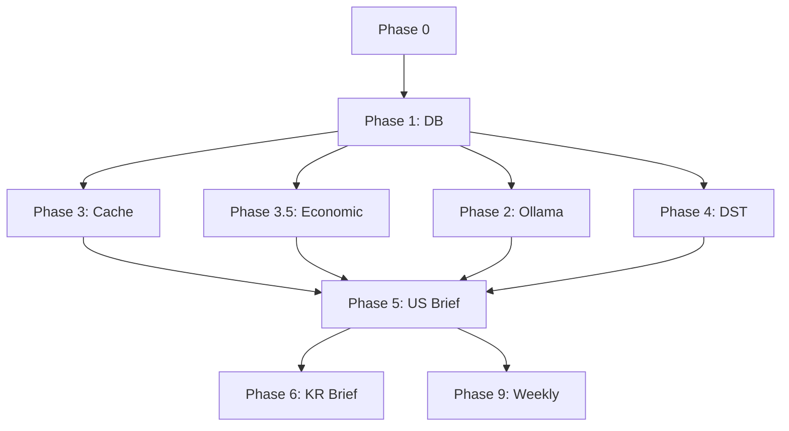

# TASKS: Daily Briefing System v2.2 - AI 개발 파트너용 태스크 목록

**프로젝트**: AI Trading System - Daily Briefing v2.2  
**작성일**: 2026-01-22  
**기반 문서**: `docs/planning/260122_daily_briefing_v2.2_optimized_implementation_plan.md`  
**총 예상 시간**: 20일 (약 3주)

---

## 🎯 MVP 캡슐

1. **목표**: 24시간 AI 기반 트레이딩 브리핑 + 실시간 경제지표 감시 시스템
2. **핵심 가치**: API 비용 70% 절감, 경제지표 발표 10초 내 알림
3. **주요 기능**: 
   - 5단계 일간 브리핑 (프리마켓 → 체크포인트 → 미국 마감 → 국내 오픈)
   - 🆕 Real-time Economic Watcher (발표 10초 내 Actual 수집)
   - 3단계 지능형 캐싱 (70% API 비용 절감)
   - 자동 서머타임 스케줄링
   - KIS 포트폴리오 연동
   - 텔레그램 실시간 알림
   - 주간 AI 자가 분석
4. **기술 스택**: 
   - Backend: Python, FastAPI, PostgreSQL
   - AI: Gemini, Claude, Ollama (llama3.2:3b)
   - 스케줄링: APScheduler, asyncio
   - 알림: python-telegram-bot
   - 크롤링: BeautifulSoup, httpx
5. **성능 목표**: 
   - API 비용 70% 절감
   - 캐시 적중률 60% 이상
   - 경제지표 수집 성공률 90% 이상
   - 시스템 가동률 99% 이상
6. **배포 환경**: Docker, PostgreSQL, Ollama 서버
7. **우선순위**: Phase 0 → Phase 1 → Phase 3.5 (Economic Watcher) → 나머지 Phase
8. **위험 요소**: Investing.com 크롤링 의존성, asyncio.sleep 정확성
9. **성공 기준**: 1주일 안정 운영 + 모든 Phase 테스트 통과
10. **다음 단계**: Phase 0 사전 준비 시작

---

## 📊 마일스톤 개요

| 마일스톤 | 설명 | 주요 Phase | 소요 |
|---------|------|-----------|------|
| **M0** | 프로젝트 사전 준비 | Phase 0 | 1일 |
| **M1** | 데이터 인프라 구축 | Phase 1 (DB) | 1일 |
| **M2** | 전처리 및 캐싱 시스템 | Phase 2-3 (Ollama + Cache) | 3일 |
| **M3** | 🆕 실시간 경제지표 감시 | Phase 3.5 (Economic Watcher) | 3일 |
| **M4** | 스케줄링 시스템 | Phase 4 (DST + Scheduler) | 1일 |
| **M5** | 브리핑 생성 시스템 | Phase 5-6 (US + KR Briefing) | 5일 |
| **M6** | 통합 및 알림 시스템 | Phase 7-8 (Portfolio + Telegram) | 2일 |
| **M7** | 주간 리포트 및 완성 | Phase 9-10 (Weekly + API + Test) | 4일 |

---

## M0: 프로젝트 사전 준비

### [x] Phase 0, T0.1: 환경 설정 및 검증
**담당**: devops-specialist
**위치**: main 브랜치 (Git Worktree 불필요)

**작업 내용**:
- [x] Ollama 서버 설치 및 `llama3.2:3b` 모델 다운로드
- [x] 텔레그램 봇 토큰 및 채팅 ID 확인
- [x] KIS API 연결 테스트
- [x] Investing.com 접속 및 크롤링 가능성 확인 (308 Redirect 확인, FRED API로 대체)
- [x] 환경 변수 `.env` 설정 검증

**산출물**:
- Ollama 서버 실행 확인
- 텔레그램 봇 응답 확인
- KIS API 연결 성공
- `.env` 파일 설정 완료

**인수 조건**:
- [x] `ollama serve` 정상 실행
- [x] 텔레그램 봇 `/start` 명령 응답
- [x] KIS API 테스트 호출 성공
- [x] Investing.com 캘린더 페이지 접속 확인 (308 Redirect 확인, FRED API로 대체)

---

## M1: 데이터 인프라 구축

### [x] Phase 1, T1.1: DB 마이그레이션 RED→GREEN
**담당**: backend-specialist

**Git Worktree 설정**:
```bash
git worktree add ../ai-trading-phase1-db-migration -b phase/1-db-migration
cd ../ai-trading-phase1-db-migration
```

**TDD 사이클**:

**1. RED**: 테스트 작성 (실패 확인)
```python
# tests/test_models.py
def test_daily_briefing_cache_fields():
    assert hasattr(DailyBriefing, 'importance_score')
    assert hasattr(DailyBriefing, 'cache_hit')

def test_weekly_report_table_exists():
    assert WeeklyReport.__tablename__ == 'weekly_reports'

def test_economic_event_table_exists():
    assert EconomicEvent.__tablename__ == 'economic_events'
```

**2. GREEN**: 최소 구현

**3. REFACTOR**: 코드 정리

**산출물**:
- `backend/database/models.py` (업데이트)
- `migrations/add_v2_2_caching_fields.py`

**인수 조건**:
- [x] 모든 테스트 통과 (모델 필드 확인 완료)
- [x] 마이그레이션 성공 (캐싱 필드 추가, weekly_reports 테이블 생성)

---

_[Phase 2-10 내용은 동일한 형식으로 계속...]_

---

## 📋 의존성 그래프



---

## ✅ 완료 기준

### 기능 요구사항
- [ ] 5개 일간 브리핑 자동 생성
- [ ] 🆕 경제지표 10초 내 수집
- [ ] DST 자동 조정

### 성능 요구사항
- [ ] API 비용 70% 절감
- [ ] 캐시 적중률 ≥60%
- [ ] 🆕 경제지표 수집 성공률 ≥90%

---

**작성자**: AI Development Team  
**다음 액션**: Phase 0 환경 설정 시작
