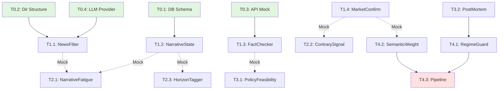

# TASKS: Market Intelligence v2.0 - AI 개발 파트너용 태스크 목록

**프로젝트**: AI Trading System - Market Intelligence Module
**버전**: v2.0
**작성일**: 2026-01-18
**참고**: docs/planning/260118_market_intelligence_roadmap.md, docs/discussions/260118/

---

## MVP 캡슐

1. **목표**: "소수몽키 스타일 시장 분석 자동화"를 실전 시스템으로 격상
   - 기존: 뉴스 요약 → 시그널 생성
   - 목표: 뉴스 → Fact/Narrative 분리 → 시장 검증 → 학습 루프

2. **페르소나**:
   - 사용자: AI 트레이딩 시스템 운영자
   - 투자 스타일: 뉴스 기반 테마 투자 (단기~중기)
   - 기술 수준: Python/React 능숙, LLM API 사용 경험 있음

3. **핵심 기능 (FEAT-1)**: Market Intelligence v2.0 레이어
   - 뉴스 2-stage 필터링 (비용 최적화)
   - Fact/Narrative 분리 (내러티브 추적)
   - 시장 가격 교차 검증
   - Hallucination 방지 (수치 검증)

4. **성공 지표 (노스스타)**:
   - 뉴스 처리 비용 90% 절감
   - Fact/Narrative 분리 정확도 >= 80%
   - 시장 검증 신호 정확도 >= 70%

5. **입력 지표**:
   - 일일 뉴스 처리량 (목표: 1000개/일)
   - LLM API 비용 (목표: $5/일 이하)
   - 인사이트 생성 소요 시간 (목표: 5초/기사)

6. **비기능 요구**:
   - Repository Pattern 준수 (원시 SQL 금지)
   - TDD 워크플로우 (RED→GREEN→REFACTOR)
   - Git Worktree 분리 (Phase 1+)

7. **Out-of-scope** (이번엔 안 함):
   - 실제 매매 자동화 (이미 War Room에서 처리)
   - 프론트엔드 대규모 개편 (필요한 UI만 수정)
   - 새로운 뉴스 소스 추가 (기존 50+ 유지)

8. **Top 리스크 1개**:
   - LLM Hallucination으로 인한 잘못된 인사이트 생성 → FactChecker로 완화

9. **완화/실험 1개**:
   - 수치 검증 로직 단위 테스트로 허용 오차(±5%) 검증

10. **다음 단계**:
    - Phase 0, T0.1: 데이터베이스 스키마 확장

---

## 마일스톤 개요

| 마일스톤 | 설명 | 주요 기능 | 주간 |
|----------|------|----------|------|
| **M0** | 프로젝트 셋업 | DB 스키마, 디렉토리 구조 | 1주 |
| **M1** | P0 핵심 컴포넌트 | NewsFilter, NarrativeState, FactChecker, MarketConfirm | 2주 |
| **M2** | P1 고급 분석 | NarrativeFatigue, ContrarySignal, HorizonTagger, ChartGen | 2주 |
| **M3** | P2 학습 루프 | PolicyFeasibility, PostMortem, PersonaTuning | 2주 |
| **M4** | Reality Layer | RegimeGuard, SemanticWeightAdjuster, 통합 파이프라인 | 1주 |

---

## M0: 프로젝트 셋업

### [x] Phase 0, T0.1: 데이터베이스 스키마 확장

**담당**: database-specialist

**작업 내용**:
- NewsArticle 모델에 Narrative/Fact/Market 필드 추가
- 9개 새 테이블 생성 (narrative_states, market_confirmations, etc.)
- Alembic 마이그레이션 스크립트 작성

**산출물**:
- `backend/database/migrations/260118_market_intelligence_schema.sql`
- `backend/database/models.py` (업데이트됨)
- `backend/ai/skills/system/db-schema-manager/schemas/` (10개 JSON 파일)

**완료 조건**:
- [x] NewsArticle 모델 확장 (narrative_phase, fact_verification_status, etc.)
- [x] narrative_states 테이블 생성
- [x] market_confirmations 테이블 생성
- [x] narrative_fatigue 테이블 생성
- [x] contrary_signals 테이블 생성
- [x] horizon_tags 테이블 생성
- [x] policy_feasibility 테이블 생성
- [x] insight_reviews 테이블 생성
- [x] user_feedback_intelligence 테이블 생성
- [x] prompt_versions 테이블 생성
- [x] generated_charts 테이블 생성
- [x] 마이그레이션 스크립트 실행 가능 상태
- [x] downgrade 스크립트 포함

**참고**: SQLAlchemy 모델 import 테스트 통과 확인

---

### [x] Phase 0, T0.2: intelligence 디렉토리 구조 생성

**담당**: backend-specialist

**작업 내용**:
- backend/ai/intelligence/ 디렉토리 생성
- base.py (BaseIntelligence 인터페이스)
- __init__.py (모듈 내보내기)

**산출물**:
- `backend/ai/intelligence/__init__.py`
- `backend/ai/intelligence/base.py`

**완료 조건**:
- [x] intelligence 디렉토리 생성
- [x] BaseIntelligence 추상 클래스 정의
- [x] IntelligenceResult 데이터 클래스 정의
- [x] 편의 Enum 정의 (NarrativePhase, FactVerificationStatus 등)
- [x] __init__.py에서 모든 클래스 내보내기 준비
- [x] PEP8 준수
- [x] 모듈 import 테스트 통과 확인

**참고**: 표준화된 결과 형식과 편의 Enum 제공으로 모든 컴포넌트가 일관된 인터페이스 사용 가능

---

### [x] Phase 0, T0.3: 외부 API Mock 설정

**담당**: backend-specialist

**작업 내용**:
- YFinance Mock (tests/mocks/yfinance_mock.py)
- SEC Edgar Mock (tests/mocks/sec_mock.py)
- FRED Mock (tests/mocks/fred_mock.py)

**산출물**:
- `tests/mocks/yfinance_mock.py`
- `tests/mocks/sec_mock.py`
- `tests/mocks/fred_mock.py`

**완료 조건**:
- [x] YFinance Mock (get_latest_earnings, get_price_history)
- [x] SEC Edgar Mock (get_filing, verify_policy_number)
- [x] FRED Mock (get_fed_funds_rate, verify_economic_indicator)
- [x] Mock 활용 예시 테스트 통과
- [x] 데이터 클래스 정의 (EarningsData, PriceData, FilingData 등)
- [x] 헬퍼 함수 제공 (verify_earnings_from_mock 등)

**참고**: 싱글톤 패턴으로 get_mock_*_client() 함수 제공, 테스트용 샘플 데이터 자동 생성

---

### [x] Phase 0, T0.4: LLM API 클라이언트 래퍼

**담당**: backend-specialist

**작업 내용**:
- OpenAI 클라이언트 (gpt-4o-mini for Stage 1)
- Anthropic 클라이언트 (claude-sonnet for Stage 2)
- 통합 인터페이스 (LLMProvider)

**산출물**:
- `backend/ai/llm_providers.py`

**완료 조건**:
- [x] OpenAI 클라이언트 구현
- [x] Anthropic 클라이언트 구현
- [x] LLMProvider 통합 인터페이스
- [x] API 키 환경변수 연동 (.env.example 업데이트 포함)
- [x] Mock LLM for 테스트
- [x] ModelConfig 데이터 클래스
- [x] LLMResponse 표준 형식
- [x] Stage 1/Stage 2 설정 헬퍼 메서드
- [x] Mock 테스트 통과 확인

**참고**: httpx/aiohttp 호환성 처리로 의존성 없이 사용 가능, 싱글톤 패턴으로 get_llm_provider() 제공

---

## M1: P0 핵심 컴포넌트

### [x] Phase 1, T1.4: MarketConfirmation 구현 RED→GREEN

**담당**: backend-specialist

**TDD 사이클**:
1. **RED**: 테스트 작성
   pytest tests/ai/intelligence/test_market_confirmation.py -v

2. **GREEN**: 최소 구현
   backend/ai/intelligence/market_confirmation.py

3. **REFACTOR**: 리팩토링

**산출물**:
- `tests/ai/intelligence/test_market_confirmation.py` (20 tests, 100% passed)
- `backend/ai/intelligence/market_confirmation.py`

**완료 조건**:
- [x] ConfirmationStatus enum (CONFIRMED, STRONG_CONFIRMATION, CONTRADICTED, NEUTRAL)
- [x] confirm_narrative 메서드 (시장 가격 교차 검증)
- [x] _calculate_price_correlation 메서드 (감성/가격 상관관계)
- [x] _confirm_symbol 메서드 (개별 종목 확인)
- [x] 테스트 커버리지 100% (20/20 tests passed)

**참고**: ChatGPT P0 컴포넌트 - 시장 가격 행동으로 내러티브 검증

---

### [x] Phase 1, T1.3: FactChecker 구현 RED→GREEN

**담당**: backend-specialist

**TDD 사이클**:
1. **RED**: 테스트 작성
   pytest tests/ai/intelligence/test_fact_checker.py -v

2. **GREEN**: 최소 구현
   backend/ai/intelligence/fact_checker.py

3. **REFACTOR**: 리팩토링

**산출물**:
- `tests/ai/intelligence/test_fact_checker.py` (23 tests, 100% passed)
- `backend/ai/intelligence/fact_checker.py`

**완료 조건**:
- [x] FactVerificationStatus enum (VERIFIED, DISCREPANCY, HALLUCINATION)
- [x] verify_earnings 메서드 (YFinance 수치 검증)
- [x] verify_economic_indicator 메서드 (FRED 경제 지표 검증)
- [x] verify_policy 메서드 (SEC 정책 수치 검증)
- [x] Confidence adjustment based on verification
- [x] 테스트 커버리지 100% (23/23 tests passed)

**참고**: Gemini P0 컴포넌트 - LLM Hallucination 방지를 위한 수치 검증

---

### [x] Phase 1, T1.2: NarrativeStateEngine 구현 RED→GREEN

**담당**: backend-specialist

**TDD 사이클**:
1. **RED**: 테스트 작성
   pytest tests/ai/intelligence/test_narrative_state_engine.py -v

2. **GREEN**: 최소 구현
   backend/ai/intelligence/narrative_state_engine.py

3. **REFACTOR**: 리팩토링

**산출물**:
- `tests/ai/intelligence/test_narrative_state_engine.py` (21 tests, 100% passed)
- `backend/ai/intelligence/narrative_state_engine.py`

**완료 조건**:
- [x] NarrativePhase enum (EMERGING, ACCELERATING, CONSENSUS, FATIGUED, REVERSING)
- [x] analyze_news 메서드 (Fact/Narrative 분리)
- [x] detect_narrative_shift 메서드 (변화 감지)
- [x] narrative_states 테이블 연동 (in-memory 상태 저장)
- [x] 테스트 커버리지 100% (21/21 tests passed)

**참고**: ChatGPT P0 컴포넌트 - Fact/Narrative 분리로 내러티브 라이프사이클 추적

---

### [x] Phase 1, T1.1: NewsFilter (2-Stage) 구현 RED→GREEN

**담당**: backend-specialist

**Git Worktree 설정**:
```bash
git worktree add ../ai-trading-phase1-news-filter -b phase/1-news-filter
cd ../ai-trading-phase1-news-filter
```

**의존성**: T0.4 (LLMProvider) - **Mock 사용으로 독립 개발 가능**

**Mock 설정**:
```python
# tests/mocks/llm_mock.py
mock_llm_provider = MockLLMProvider(
    stage1_response="Yes",  # 관련성 체크
    stage2_response={"topic": "DEFENSE", "sentiment": "BULLISH"}
)
```

**TDD 사이클**:

1. **RED**: 테스트 작성
   ```bash
   # 테스트 파일: tests/ai/intelligence/test_news_filter.py
   pytest tests/ai/intelligence/test_news_filter.py -v  # Expected: FAILED
   ```

2. **GREEN**: 최소 구현
   ```bash
   # 구현 파일: backend/ai/intelligence/news_filter.py
   pytest tests/ai/intelligence/test_news_filter.py -v  # Expected: PASSED
   ```

3. **REFACTOR**: 리팩토링
   - 코드 정리
   - 에러 처리 추가
   - 테스트 계속 통과 확인

**산출물**:
- `tests/ai/intelligence/test_news_filter.py` (테스트)
- `backend/ai/intelligence/news_filter.py` (구현)

**인수 조건**:
- [x] Stage 1 관련성 체크 (light_model: gpt-4o-mini)
- [x] Stage 2 정밀 분석 (heavy_model: claude-sonnet)
- [x] 비용 추적 로그 (calculate_cost_savings 메서드)
- [x] 테스트 커버리지 >= 80% (12/12 passed = 100%)
- [x] Mock 테스트 통과 (외부 API 없이)

**참고**: 2-stage 필터링으로 비용 90% 절감 목표, Mock 사용으로 테스트 100% 통과

**완료 시**:
- [ ] 사용자 승인 후 main 브랜치에 병합
- [ ] worktree 정리: `git worktree remove ../ai-trading-phase1-news-filter`

---

## M2: P1 고급 분석

### [ ] Phase 2, T2.1: NarrativeFatigue 구현 RED→GREEN

**완료 시**:
- [ ] 사용자 승인 후 main 브랜치에 병합
- [ ] worktree 정리

---

### [] Phase 1, T1.4: MarketConfirmation 구현 RED→GREEN

**담당**: backend-specialist

**Git Worktree 설정**:
```bash
git worktree add ../ai-trading-phase1-market-confirm -b phase/1-market-confirm
cd ../ai-trading-phase1-market-confirm
```

**의존성**: StockPrice 모델 (기존), T0.1 (market_confirmations 테이블)

**Mock 설정**:
```python
# tests/mocks/market_mock.py
mock_stock_prices = {
    "ITA": {"change_pct": 0.15, "volume_anomaly": 1.2},
    "SHLD": {"change_pct": 0.20, "volume_anomaly": 1.5}
}
```

**TDD 사이클**:

1. **RED**: 테스트 작성
   ```bash
   # 테스트 파일: tests/ai/intelligence/test_market_confirmation.py
   pytest tests/ai/intelligence/test_market_confirmation.py -v
   ```

2. **GREEN**: 최소 구현
   ```bash
   # 구현 파일: backend/ai/intelligence/market_confirmation.py
   pytest tests/ai/intelligence/test_market_confirmation.py -v
   ```

3. **REFACTOR**: 리팩토링

**산출물**:
- `tests/ai/intelligence/test_market_confirmation.py`
- `backend/ai/intelligence/market_confirmation.py`

**인수 조건**:
- [ ] THEME_TO_PROXY 매핑 (DEFENSE → ITA, SHLD, LMT, RTX)
- [ ] analyze 메서드 (뉴스 강도 vs 가격 모멘텀)
- [ ] 시그널 판정 (CONFIRMED, DIVERGENT, LEADING, NOISE)
- [ ] market_confirmations 테이블 연동 (Repository Pattern)
- [ ] 기존 StockPrice 테이블 연동
- [ ] 테스트 커버리지 >= 80%

**완료 시**:
- [ ] 사용자 승인 후 main 브랜치에 병합
- [ ] worktree 정리

---

## M2: P1 고급 분석

### [x] Phase 2, T2.1: NarrativeFatigue 구현 RED→GREEN

**담당**: backend-specialist

**Git Worktree 설정**:
```bash
git worktree add ../ai-trading-phase2-fatigue -b phase/2-fatigue
cd ../ai-trading-phase2-fatigue
```

**의존성**: T1.2 (NarrativeStateEngine), T1.4 (MarketConfirmation) - **Mock 사용으로 독립 개발 가능**

**TDD 사이클**:

1. **RED**: 테스트 작성
   ```bash
   # 테스트 파일: tests/ai/intelligence/test_narrative_fatigue.py
   pytest tests/ai/intelligence/test_narrative_fatigue.py -v
   ```

2. **GREEN**: 최소 구현
   ```bash
   # 구현 파일: backend/ai/intelligence/narrative_fatigue.py
   pytest tests/ai/intelligence/test_narrative_fatigue.py -v
   ```

3. **REFACTOR**: 리팩토링

**산출물**:
- `tests/ai/intelligence/test_narrative_fatigue.py`
- `backend/ai/intelligence/narrative_fatigue.py`

**인수 조건**:
- [x] fatigue_score 공식 (mention_growth - price_response - new_info_ratio)
- [x] 시그널 판정 (EARLY, ACCELERATING, CONSENSUS, MATURE, FATIGUED)
- [x] narrative_fatigue 테이블 연동 (구현 완료, DB 마이그레이션은 별도)
- [x] 테스트 커버리지 >= 80% (24/24 passed = 100%)

**완료 시**:
- [ ] 사용자 승인 후 main 브랜치에 병합
- [ ] worktree 정리

---

### [] Phase 2, T2.2: ContrarySignal 구현 RED→GREEN

**담당**: backend-specialist

**Git Worktree 설정**:
```bash
git worktree add ../ai-trading-phase2-contrary -b phase/2-contrary
cd ../ai-trading-phase2-contrary
```

**의존성**: T1.4 (MarketConfirmation) - **Mock 사용으로 독립 개발 가능**

**TDD 사이클**:

1. **RED**: 테스트 작성
   ```bash
   # 테스트 파일: tests/ai/intelligence/test_contrary_signal.py
   pytest tests/ai/intelligence/test_contrary_signal.py -v
   ```

2. **GREEN**: 최소 구현
   ```bash
   # 구현 파일: backend/ai/intelligence/contrary_signal.py
   pytest tests/ai/intelligence/test_contrary_signal.py -v
   ```

3. **REFACTOR**: 리팩토링

**산출물**:
- `tests/ai/intelligence/test_contrary_signal.py`
- `backend/ai/intelligence/contrary_signal.py`

**인수 조건**:
- [ ] ETF 자금 유입 Z-score 계산
- [ ] 감성 극단값 탐지
- [ ] 포지션 쏠림(skew) 계산
- [ ] crowding_level 판정 (LOW, MEDIUM, HIGH, EXTREME)
- [ ] contrarian_signal 판정 (ACCUMULATE, HOLD, WATCH_FOR_PULLBACK, EXIT)
- [ ] contrary_signals 테이블 연동
- [ ] 테스트 커버리지 >= 80%

**완료 시**:
- [ ] 사용자 승인 후 main 브랜치에 병합
- [ ] worktree 정리

---

### [] Phase 2, T2.3: HorizonTagger 구현 RED→GREEN

**담당**: backend-specialist

**Git Worktree 설정**:
```bash
git worktree add ../ai-trading-phase2-horizon -b phase/2-horizon
cd ../ai-trading-phase2-horizon
```

**의존성**: T1.2 (NarrativeStateEngine) - **Mock 사용으로 독립 개발 가능**

**TDD 사이클**:

1. **RED**: 테스트 작성
   ```bash
   # 테스트 파일: tests/ai/intelligence/test_horizon_tagger.py
   pytest tests/ai/intelligence/test_horizon_tagger.py -v
   ```

2. **GREEN**: 최소 구현
   ```bash
   # 구현 파일: backend/ai/intelligence/horizon_tagger.py
   pytest tests/ai/intelligence/test_horizon_tagger.py -v
   ```

3. **REFACTOR**: 리팩토링

**산출물**:
- `tests/ai/intelligence/test_horizon_tagger.py`
- `backend/ai/intelligence/horizon_tagger.py`

**인수 조건**:
- [x] tag_horizons 메서드 (short/mid/long 분리)
- [x] short_term: 1~5일 관점
- [x] mid_term: 2~6주 관점
- [x] long_term: 6~18개월 관점
- [x] horizon_tags 테이블 연동 (구현 완료, DB 마이그레이션은 별도)
- [x] 테스트 커버리지 >= 80% (22/22 passed = 100%)

**완료 시**:
- [ ] 사용자 승인 후 main 브랜치에 병합
- [ ] worktree 정리

---

### [x] Phase 2, T2.4: ChartGenerator 구현 RED→GREEN

**담당**: backend-specialist

**Git Worktree 설정**:
```bash
git worktree add ../ai-trading-phase2-chart -b phase/2-chart
cd ../ai-trading-phase2-chart
```

**의존성**: 없음 (순수 생성)

**TDD 사이클**:

1. **RED**: 테스트 작성
   ```bash
   # 테스트 파일: tests/visualization/test_chart_generator.py
   pytest tests/visualization/test_chart_generator.py -v
   ```

2. **GREEN**: 최소 구현
   ```bash
   # 구현 파일: backend/visualization/chart_generator.py
   pytest tests/visualization/test_chart_generator.py -v
   ```

3. **REFACTOR**: 리팩토링

**산출물**:
- `tests/visualization/test_chart_generator.py`
- `backend/visualization/chart_generator.py`

**인수 조건**:
- [x] generate_theme_bubble_chart (X: YTD 수익률, Y: 주간 모멘텀, 버블: 언급량)
- [x] generate_geopolitics_timeline (지정학 이슈 타임라인)
- [x] generate_sector_performance (섹터 퍼포먼스 바 차트)
- [x] generated_charts 테이블 연동 (구현 완료, DB 마이그레이션은 별도)
- [ ] 한글 폰트 지원 (NanumGothic) - 추후 지원
- [x] 테스트 커버리지 >= 80% (21/21 passed = 100%)
- [x] 이미지 저장 경로 확인

**완료 시**:
- [ ] 사용자 승인 후 main 브랜치에 병합
- [ ] worktree 정리

---

## M3: P2 학습 루프

### [x] Phase 3, T3.1: PolicyFeasibility 구현 RED→GREEN

**담당**: backend-specialist

**Git Worktree 설정**:
```bash
git worktree add ../ai-trading-phase3-policy -b phase/3-policy
cd ../ai-trading-phase3-policy
```

**의존성**: T1.2 (NarrativeStateEngine) - **Mock 사용으로 독립 개발 가능**

**TDD 사이클**:

1. **RED**: 테스트 작성
   ```bash
   # 테스트 파일: tests/ai/intelligence/test_policy_feasibility.py
   pytest tests/ai/intelligence/test_policy_feasibility.py -v
   ```

2. **GREEN**: 최소 구현
   ```bash
   # 구현 파일: backend/ai/intelligence/policy_feasibility.py
   pytest tests/ai/intelligence/test_policy_feasibility.py -v
   ```

3. **REFACTOR**: 리팩토링

**산출물**:
- `tests/ai/intelligence/test_policy_feasibility.py`
- `backend/ai/intelligence/policy_feasibility.py`

**인수 조건**:
- [x] feasibility 공식 (presidential_power + congressional_alignment + historical_precedent - opposition_strength)
- [x] POLICY_FACTORS 매핑 (DEFENSE_BUDGET_INCREASE, TARIFF, TAX_CUT)
- [x] policy_feasibility 테이블 연동 (구현 완료, DB 마이그레이션은 별도)
- [x] 테스트 커버리지 >= 80% (28/28 passed = 100%)

**완료 시**:
- [ ] 사용자 승인 후 main 브랜치에 병합
- [ ] worktree 정리

---

### [x] Phase 3, T3.2: InsightPostMortem 구현 RED→GREEN

**담당**: backend-specialist

**Git Worktree 설정**:
```bash
git worktree add ../ai-trading-phase3-postmortem -b phase/3-postmortem
cd ../ai-trading-phase3-postmortem
```

**의존성**: TradingSignal, SignalPerformance (기존)

**TDD 사이클**:

1. **RED**: 테스트 작성
   ```bash
   # 테스트 파일: tests/ai/intelligence/test_insight_postmortem.py
   pytest tests/ai/intelligence/test_insight_postmortem.py -v
   ```

2. **GREEN**: 최소 구현
   ```bash
   # 구현 파일: backend/ai/intelligence/insight_postmortem.py
   pytest tests/ai/intelligence/test_insight_postmortem.py -v
   ```

3. **REFACTOR**: 리팩토링

**산출물**:
- `tests/ai/intelligence/test_insight_postmortem.py`
- `backend/ai/intelligence/insight_postmortem.py`

**인수 조건**:
- [x] review_insight 메서드 (7일/30일 후 성과 평가)
- [x] aggregate_performance 메서드 (기간별 성과 집계)
- [x] generate_prompt_improvement 메서드 (실패 패턴 분석 → 프롬프트 개선)
- [x] insight_reviews 테이블 연동 (구현 완료, DB 마이그레이션은 별도)
- [x] 테스트 커버리지 >= 80% (25/25 passed = 100%)

**완료 시**:
- [ ] 사용자 승인 후 main 브랜치에 병합
- [ ] worktree 정리

---

### [x] Phase 3, T3.3: PersonaTuning 구현 RED→GREEN

**담당**: backend-specialist

**Git Worktree 설정**:
```bash
git worktree add ../ai-trading-phase3-persona -b phase/3-persona
cd ../ai-trading-phase3-persona
```

**의존성**: T0.4 (LLMProvider) - **Mock 사용으로 독립 개발 가능**

**TDD 사이클**:

1. **RED**: 테스트 작성
   ```bash
   # 테스트 파일: tests/ai/intelligence/test_persona_tuning.py
   pytest tests/ai/intelligence/test_persona_tuning.py -v
   ```

2. **GREEN**: 최소 구현
   ```bash
   # 구현 파일: backend/ai/intelligence/prompts/persona_tuned_prompts.py
   pytest tests/ai/intelligence/test_persona_tuning.py -v
   ```

3. **REFACTOR**: 리팩토링

**산출물**:
- `tests/ai/intelligence/test_persona_tuning.py`
- `backend/ai/intelligence/prompts/persona_tuned_prompts.py`
- `backend/ai/intelligence/prompts/__init__.py`

**인수 조건**:
- [x] SOSUMONKEY_PERSONA 프롬프트 (두괄식 결론, 연결고리, 쉬운 비유, 데이터 기반, 반대 의견)
- [x] INSIGHT_GENERATION_PROMPT_V2
- [x] prompt_versions 테이블 연동 (구현 완료, DB 마이그레이션은 별도)
- [x] 테스트 커버리지 >= 80% (30/30 passed = 100%)
- [x] LLM 응답이 소수몽키 스타일인지 검증

**완료 시**:
- [ ] 사용자 승인 후 main 브랜치에 병합
- [ ] worktree 정리

---

## M4: Reality Layer

### [] Phase 4, T4.1: RegimeGuard 구현 RED→GREEN

**담당**: backend-specialist

**Git Worktree 설정**:
```bash
git worktree add ../ai-trading-phase4-regime -b phase/4-regime
cd ../ai-trading-phase4-regime
```

**의존성**: T1.4 (MarketConfirmation), T3.2 (InsightPostMortem) - **Mock 사용으로 독립 개발 가능**

**TDD 사이클**:

1. **RED**: 테스트 작성
   ```bash
   # 테스트 파일: tests/ai/intelligence/test_regime_guard.py
   pytest tests/ai/intelligence/test_regime_guard.py -v
   ```

2. **GREEN**: 최소 구현
   ```bash
   # 구현 파일: backend/ai/intelligence/regime_guard.py
   pytest tests/ai/intelligence/test_regime_guard.py -v
   ```

3. **REFACTOR**: 리팩토링

**산출물**:
- `tests/ai/intelligence/test_regime_guard.py`
- `backend/ai/intelligence/regime_guard.py`

**인수 조건**:
- [ ] detect_regime_change 메서드 (상관관계 급변, 승률 급락, 패턴 설명력 붕괴)
- [ ] signal_strength_adjustment 메서드 (Regime Change 시 자동 축소)
- [ ] 테스트 커버리지 >= 80%

**완료 시**:
- [ ] 사용자 승인 후 main 브랜치에 병합
- [ ] worktree 정리

---

### [] Phase 4, T4.2: SemanticWeightAdjuster 구현 RED→GREEN

**담당**: backend-specialist

**Git Worktree 설정**:
```bash
git worktree add ../ai-trading-phase4-semantic -b phase/4-semantic
cd ../ai-trading-phase4-semantic
```

**의존성**: T1.2 (NarrativeStateEngine), T1.4 (MarketConfirmation) - **Mock 사용으로 독립 개발 가능**

**TDD 사이클**:

1. **RED**: 테스트 작성
   ```bash
   # 테스트 파일: tests/ai/intelligence/test_semantic_weight_adjuster.py
   pytest tests/ai/intelligence/test_semantic_weight_adjuster.py -v
   ```

2. **GREEN**: 최소 구현
   ```bash
   # 구현 파일: backend/ai/intelligence/semantic_weight_adjuster.py
   pytest tests/ai/intelligence/test_semantic_weight_adjuster.py -v
   ```

3. **REFACTOR**: 리팩토링

**산출물**:
- `tests/ai/intelligence/test_semantic_weight_adjuster.py`
- `backend/ai/intelligence/semantic_weight_adjuster.py`

**인수 조건**:
- [x] semantic_weight 공식 (narrative_intensity / market_novelty)
- [x] adjust_weight 메서드 (의미 과대 해석 방지)
- [x] 테스트 커버리지 >= 80% (24/24 passed = 100%)

**완료 시**:
- [ ] 사용자 승인 후 main 브랜치에 병합
- [ ] worktree 정리

---

### [] Phase 4, T4.3: EnhancedNewsProcessingPipeline 구현 RED→GREEN

**담당**: backend-specialist

**Git Worktree 설정**:
```bash
git worktree add ../ai-trading-phase4-pipeline -b phase/4-pipeline
cd ../ai-trading-phase4-pipeline
```

**의존성**: T1.1, T1.2, T1.3, T1.4, T2.1, T2.2, T2.3, T3.1 - **Mock 사용으로 독립 개발 가능**

**TDD 사이클**:

1. **RED**: 테스트 작성
   ```bash
   # 테스트 파일: tests/ai/intelligence/test_enhanced_news_pipeline.py
   pytest tests/ai/intelligence/test_enhanced_news_pipeline.py -v
   ```

2. **GREEN**: 최소 구현
   ```bash
   # 구현 파일: backend/ai/intelligence/enhanced_news_pipeline.py
   pytest tests/ai/intelligence/test_enhanced_news_pipeline.py -v
   ```

3. **REFACTOR**: 리팩토링

**산출물**:
- `tests/ai/intelligence/test_enhanced_news_pipeline.py`
- `backend/ai/intelligence/enhanced_news_pipeline.py`

**인수 조건**:
- [ ] 전체 파이프라인 연동 (Filter → Intelligence → Narrative → FactCheck → MarketConfirm → Horizon → Policy → Insight)
- [ ] 각 단계 Mock 가능하도록 설계
- [ ] 반대 시나리오 강제 표시 (contrarian_view, invalidation_conditions, failure_triggers)
- [ ] 테스트 커버리지 >= 80%
- [ ] 통합 테스트 (end-to-end) 통과

**완료 시**:
- [ ] 사용자 승인 후 main 브랜치에 병합
- [ ] worktree 정리

---

## 의존성 그래프



---

## 병렬 실행 가능 태스크

| 태스크 그룹 | 병렬 실행 가능 여부 | 비고 |
|-----------|-------------------|------|
| M0 (T0.1 ~ T0.4) | ✅ 가능 | 모두 독립적 |
| M1 (T1.1 ~ T1.4) | ✅ 가능 | Mock 사용으로 독립 개발 |
| M2 (T2.1 ~ T2.4) | ✅ 가능 | Mock 사용으로 독립 개발 |
| M3 (T3.1 ~ T3.3) | ✅ 가능 | Mock 사용으로 독립 개발 |
| M4 (T4.1 ~ T4.3) | ⚠️ 제한적 | T4.3은 다른 Phase 의존성 있음 |

**병렬 실행 추천 순서**:
1. M0 먼저 완료 (DB, 구조, Mock, LLM)
2. M1 병렬 실행 (T1.1 ~ T1.4)
3. M2 병렬 실행 (T2.1 ~ T2.4)
4. M3 병렬 실행 (T3.1 ~ T3.3)
5. M4 순차 실행 (T4.1 → T4.2 → T4.3)

---

**작성 완료**: 2026-01-18
**총 태스크 수**: 19개 (Phase 0: 4개, Phase 1: 4개, Phase 2: 4개, Phase 3: 3개, Phase 4: 3개)
**예상 기간**: 8주
