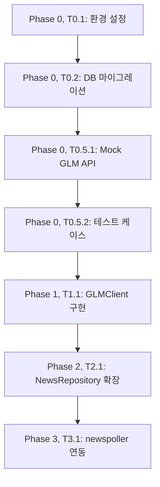

# TASKS: GLM-4.7 뉴스 해석 서비스 - AI 개발 파트너용 태스크 목록

## MVP 캡슐

| # | 항목 | 내용 |
|---|------|------|
| 1 | 목표 | AI 트레이딩 시스템의 뉴스 해석 비용을 절감하고 분석 품질을 향상시키는 것 |
| 2 | 페르소나 | AI 트레이딩 시스템 개발자 (기존 시스템에 newspoller 존재, 로컬 LLM 사용 중) |
| 3 | 핵심 기능 | FEAT-1: 종목/섹터 식별 (뉴스에서 관련 종목과 섹터를 추출) |
| 4 | 성공 지표 (노스스타) | GLM API가 뉴스 분석 성공률 95% 이상, 평균 응답 시간 2초 이내 |
| 5 | 입력 지표 | GLM API 호출 성공률, 평균 응답 시간 |
| 6 | 비기능 요구 | 기존 Claude/Gemini/ChatGPT 클라이언트와 동일한 인터페이스로 통합 |
| 7 | Out-of-scope | 트레이딩 시그널 직접 생성, 포지션 사이즈 결정, 손절/익절 판단 |
| 8 | Top 리스크 | GLM API 장애 시 뉴스 분석 파이프라인 중단 |
| 9 | 완화/실험 | 기존 로컬 LLM을 Fallback으로 유지하여 A/B 테스트 |
| 10 | 다음 단계 | newspoller에 GLM 클라이언트 연동하여 실시간 뉴스 분석 테스트 |

---

## 마일스톤 개요

| 마일스톤 | Phase | 설명 | 주요 기능 |
|----------|-------|------|----------|
| M0 | Phase 0 | 프로젝트 셋업 | 환경 설정, DB 마이그레이션 |
| M0.5 | Phase 0 | 계약 & 테스트 설계 | Mock GLM API, 테스트 케이스 작성 |
| M1 | Phase 1 | GLMClient 구현 | GLM-4.7 API 연동, 뉴스 분석 |
| M2 | Phase 2 | NewsRepository 확장 | DB 저장, 조회 메서드 |
| M3 | Phase 3 | newspoller 연동 | 실시간 뉴스 분석 통합 |

---

## 의존성 그래프



---

## 병렬 실행 가능 태스크

| 태스크 | 병렬 가능 | 설명 |
|--------|----------|------|
| T0.1, T0.2 | 순차적 | 환경 설정 후 DB 마이그레이션 |
| T0.5.1, T0.5.2 | 순차적 | Mock 설정 후 테스트 작성 |
| T1.1, T2.1 | 순차적 | GLMClient 후 Repository 확장 |
| T3.1 | 순차적 | 통합 테스트는 마지막 |

---

## M0: 프로젝트 셋업

### [] Phase 0, T0.1: 환경 설정

**담당**: backend-specialist

**작업 내용**:
- `.env` 파일에 `GLM_API_KEY` 추가
- GLM-4.7 API 문서 확인
- 기존 클라이언트 패턴 확인 (Claude, Gemini, ChatGPT)

**산출물**:
- `.env` (업데이트)

**완료 조건**:
- [ ] GLM_API_KEY 환경 변수 설정
- [ ] 기존 클라이언트 구조 파악

---

### [] Phase 0, T0.2: DB 스키마 변경

**담당**: database-specialist

**작업 내용**:
- `news_articles` 테이블에 `glm_analysis` JSONB 컬럼 추가
- GIN 인덱스 생성
- 부분 인덱스 생성 (glm_analyzed)

**산출물**:
- `backend/database/migrations/add_glm_analysis_column.sql`

**완료 조건**:
- [ ] glm_analysis 컬럼 생성
- [ ] GIN 인덱스 생성
- [ ] Repository Pattern 준수

---

## M0.5: 계약 & 테스트 설계

### [] Phase 0, T0.5.1: Mock GLM API 정의

**담당**: backend-specialist

**작업 내용**:
- GLM API 응답 JSON 스키마 정의
- Mock GLM API 응답 데이터 작성
- Pydantic 모델 작성 (GLMAnalysisResult)

**산출물**:
- `backend/tests/mocks/glm_mocks.py`

**완료 조건**:
- [ ] Mock GLM API 응답 정의
- [ ] Pydantic 모델 작성
- [ ] 테스트 데이터 준비

---

### [] Phase 0, T0.5.2: 테스트 케이스 작성

**담당**: test-specialist

**작업 내용**:
- GLMClient 테스트 케이스 작성 (실패 상태)
- NewsRepository 테스트 케이스 작성 (실패 상태)

**산출물**:
- `backend/tests/ai/test_glm_client.py` (RED 상태)

**완료 조건**:
- [ ] 테스트 실행 시 실패 (RED 확인)
- [ ] 모든 테스트 케이스 작성

---

## M1: FEAT-1 GLMClient 구현

### [] Phase 1, T1.1: GLMClient 클래스 구현 RED→GREEN

**담당**: backend-specialist

**Git Worktree 설정**:
```bash
# 1. Worktree 생성
git worktree add ../ai-trading-glm-client -b phase/1-glm-client
cd ../ai-trading-glm-client
```

**의존성**: T0.5.1 (Mock GLM API) - Mock 사용으로 독립 개발 가능

**Mock 설정**:
```python
# backend/tests/mocks/glm_mocks.py
MOCK_GLM_RESPONSE = {
    "tickers": ["AAPL", "TSLA"],
    "sectors": ["Technology"],
    "confidence": 0.87,
    "reasoning": "테스트용 Mock 응답",
    "analyzed_at": "2026-01-15T10:30:00Z",
    "model": "glm-4-flash",
    "latency_ms": 100,
    "cost_usd": 0.001
}
```

**TDD 사이클**:

1. **RED**: 테스트 작성 (실패 확인)
   ```bash
   # 테스트 파일: backend/tests/ai/test_glm_client.py
   pytest backend/tests/ai/test_glm_client.py -v  # Expected: FAILED
   ```

2. **GREEN**: 최소 구현 (테스트 통과)
   ```bash
   # 구현 파일: backend/ai/glm_client.py
   pytest backend/tests/ai/test_glm_client.py -v  # Expected: PASSED
   ```

3. **REFACTOR**: 리팩토링 (테스트 유지)
   - 코드 정리
   - 중복 제거
   - 기존 클라이언트와 패턴 일치

**산출물**:
- `backend/tests/ai/test_glm_client.py` (테스트)
- `backend/ai/glm_client.py` (구현)

**인수 조건**:
- [ ] 테스트 먼저 작성됨 (RED 확인)
- [ ] 모든 테스트 통과 (GREEN)
- [ ] 커버리지 >= 80%
- [ ] 기존 Claude/Gemini/ChatGPT 클라이언트와 동일한 인터페이스

**완료 시**:
- [ ] 사용자 승인 후 main 브랜치에 병합
- [ ] worktree 정리: `git worktree remove ../ai-trading-glm-client`

---

## M2: FEAT-1 NewsRepository 확장

### [] Phase 2, T2.1: NewsRepository 확장 RED→GREEN

**담당**: database-specialist

**Git Worktree 설정**:
```bash
# 1. Worktree 생성
git worktree add ../ai-trading-glm-repo -b phase/2-glm-repository
cd ../ai-trading-glm-repo
```

**의존성**: T1.1 (GLMClient) - Mock 사용으로 독립 개발 가능

**Mock 설정**:
```python
# backend/tests/mocks/repository_mocks.py
mock_news_repository = {
    "save_glm_analysis": lambda news_id, result: True
}
```

**TDD 사이클**:

1. **RED**: 테스트 작성 (실패 확인)
   ```bash
   # 테스트 파일: backend/tests/database/test_repository.py
   pytest backend/tests/database/test_repository.py -v  # Expected: FAILED
   ```

2. **GREEN**: 최소 구현 (테스트 통과)
   ```bash
   # 구현 파일: backend/database/repository.py
   pytest backend/tests/database/test_repository.py -v  # Expected: PASSED
   ```

3. **REFACTOR**: 리팩토링 (테스트 유지)
   - Repository Pattern 준수
   - 직접 SQL 사용 금지

**산출물**:
- `backend/tests/database/test_repository.py` (테스트)
- `backend/database/repository.py` (확장)

**인수 조건**:
- [ ] 테스트 먼저 작성됨 (RED 확인)
- [ ] 모든 테스트 통과 (GREEN)
- [ ] Repository Pattern 준수
- [ ] 직접 SQL 미사용

**완료 시**:
- [ ] 사용자 승인 후 main 브랜치에 병합
- [ ] worktree 정리: `git worktree remove ../ai-trading-glm-repo`

---

## M3: FEAT-1 newspoller 연동

### [] Phase 3, T3.1: newspoller 통합 테스트 RED→GREEN

**담당**: test-specialist

**Git Worktree 설정**:
```bash
# 1. Worktree 생성
git worktree add ../ai-trading-glm-integration -b phase/3-glm-integration
cd ../ai-trading-glm-integration
```

**의존성**: T1.1 (GLMClient), T2.1 (NewsRepository)

**TDD 사이클**:

1. **RED**: 통합 테스트 작성 (실패 확인)
   ```bash
   # 테스트 파일: backend/tests/integration/test_glm_newspoller.py
   pytest backend/tests/integration/test_glm_newspoller.py -v  # Expected: FAILED
   ```

2. **GREEN**: newspoller 연동 (테스트 통과)
   ```bash
   # 구현 파일: backend/news/poller.py (수정)
   pytest backend/tests/integration/test_glm_newspoller.py -v  # Expected: PASSED
   ```

3. **REFACTOR**: 리팩토링 (테스트 유지)
   - Fallback 로직 검증
   - 에러 처리 개선

**산출물**:
- `backend/tests/integration/test_glm_newspoller.py` (테스트)
- `backend/news/poller.py` (연동)

**인수 조건**:
- [ ] 테스트 먼저 작성됨 (RED 확인)
- [ ] 모든 테스트 통과 (GREEN)
- [ ] 실제 뉴스로 A/B 테스트 (GLM vs 로컬 LLM)

**완료 시**:
- [ ] 사용자 승인 후 main 브랜치에 병합
- [ ] worktree 정리: `git worktree remove ../ai-trading-glm-integration`

---

## 빌드/테스트 명령어

```bash
# 전체 테스트
pytest backend/tests/ -v

# 커버리지
pytest backend/tests/ --cov=backend/ai --cov=backend/database --cov-report=term-missing

# 린터
ruff check backend/

# 포매터
black backend/ai/glm_client.py
```

---

## 완료 체크리스트

- [ ] Phase 0 완료: 환경 설정, DB 마이그레이션
- [ ] Phase 0.5 완료: Mock 정의, 테스트 케이스
- [ ] Phase 1 완료: GLMClient 구현
- [ ] Phase 2 완료: NewsRepository 확장
- [ ] Phase 3 완료: newspoller 연동
- [ ] 모든 테스트 통과
- [ ] 커버리지 >= 80%
- [ ] 실시간 뉴스 분석 테스트 성공
