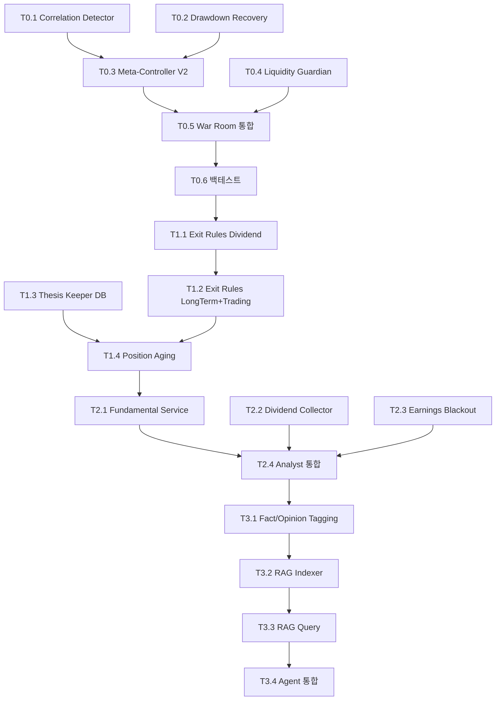

# TASKS: AI Trading System Enhancement - War Room 강화

**프로젝트명**: AI Trading System Meta-Controller V2 + Risk Management Enhancement  
**작성일**: 2026-01-27  
**버전**: v3.0 Final  
**목표**: "실제 고객 자금을 운용 가능한 시스템" 구축

---

## MVP 캡슐

1. **목표**: War Room 에이전트를 3축 리스크 감지 시스템으로 강화
2. **페르소나**: 기관 투자자급 리스크 관리가 필요한 트레이더/투자자
3. **핵심 가치**: VIX + Correlation + Drawdown 3축 리스크 감지로 "실제 고객 자금" 운용 가능
4. **성공 지표**: 
   - Correlation Crisis 감지 성공 (평균 상관관계 0.85+ 탐지)
   - Drawdown Recovery 자동 전환 (20% 손실 시 Dividend 모드 강등)
   - Liquidity 거부율 < 1% (유효한 주문만 통과)
5. **제약 조건**: 
   - Phase 1+ 작업은 반드시 Git Worktree 사용
   - 모든 Phase 1+ 태스크는 TDD (RED→GREEN→REFACTOR) 적용
   - 테스트 커버리지 80% 이상 유지
6. **기술 스택**: Python, FastAPI, pytest, yfinance, numpy, pandas
7. **출시 전략**: Phase별 점진적 배포 (Phase 0 → 0-B → 1 → 2)
8. **리스크**: 
   - Correlation 계산 시 데이터 부족 (종목 2개 미만)
   - yfinance API 제한 (rate limit)
   - False positive (정상 시장인데 Crisis 판단)
9. **의존성**: 
   - 기존 War Room MVP
   - Constitution 시스템
   - Portfolio State 관리
10. **다음 단계**: Phase 0 Meta-Controller V2 구현 → 백테스트 검증 (2020 COVID)

---

## 마일스톤 개요

| 마일스톤 | 설명 | 주요 기능 | 기간 |
|----------|------|-----------|------|
| M0 | Meta-Controller V2 기반 | Correlation + Drawdown + Liquidity | Week 1-2 |
| M1 | Exit Rules + Thesis Keeper | AI 개입 없는 청산 규칙 | Week 3-4 |
| M2 | Data Enhancement | Fundamental + Macro + Dividend | Week 5-6 |
| M3 | News RAG | Fact/Opinion 분리, 검색 통합 | Week 7-8 |

---

## M0: Meta-Controller V2 기반 (Week 1-2)

### [x] Phase 0, T0.1: Correlation Shock Detector 구현

**담당**: backend-specialist

**설명**: 포트폴리오 내부 상관관계 급등 감지 시스템 구현. VIX가 낮아도 내 포트폴리오 안에서 분산 효과가 소멸하는 순간을 탐지.

**작업 위치**: main 브랜치 (Phase 0)

**산출물**:
- `backend/ai/correlation_shock_detector.py`
- `tests/test_correlation_shock_detector.py` (Phase 0이지만 테스트 작성 권장)

**구현 상세**:
```python
class CorrelationShockDetector:
    def detect_correlation_regime(portfolio: Dict) -> Tuple[str, float]:
        # 최근 20일 수익률 계산
        # 상관관계 행렬 생성
        # 평균 상관관계 계산
        # 판단: avg_corr > 0.85 → "crisis_correlation"
        #      avg_corr > 0.70 → "elevated_correlation"
        #      else → "normal"
```

**인수 조건**:
- [x] 상관관계 0.85+ 탐지 시 "crisis_correlation" 반환
- [x] 종목 1개 포트폴리오는 "single_position" 반환
- [x] 테스트: 반도체 4종목 (NVDA, AMD, TSM, AVGO) → crisis 감지

---

### [x] Phase 0, T0.2: Drawdown Recovery Mode 구현

**담당**: backend-specialist

**설명**: 포트폴리오 손실 기반 자동 방어 모드 전환. 20% 손실에 Dividend 모드 강제 전환, 10% 손실에 포지션 50% 축소.

**작업 위치**: main 브랜치 (Phase 0)

**산출물**:
- `backend/ai/drawdown_recovery.py`
- `tests/test_drawdown_recovery.py`

**구현 상세**:
```python
class DrawdownRecoveryMode:
    def check_drawdown(current_value: float, peak_value: float) -> Dict:
        drawdown = (peak_value - current_value) / peak_value
        
        if drawdown >= 0.20:
            return {'severity': 'critical', 'forced_mode': 'dividend', 
                    'position_limit_multiplier': 0.3}
        elif drawdown >= 0.10:
            return {'severity': 'warning', 'position_limit_multiplier': 0.5}
```

**인수 조건**:
- [x] 20% 손실 → severity='critical', forced_mode='dividend'
- [x] 10% 손실 → severity='warning', multiplier=0.5
- [x] 5% 손실 → severity='normal', multiplier=1.0

---

### [x] Phase 0, T0.3: Meta-Controller V2 통합

**담당**: backend-specialist

**설명**: 3축 리스크 감지 시스템 통합. VIX + Correlation + Drawdown 중 가장 보수적인 판단 채택. 우선순위: Drawdown > Correlation > VIX.

**작업 위치**: main 브랜치 (Phase 0)

**의존성**: T0.1 (Correlation Detector), T0.2 (Drawdown Recovery) 완료 필요

**산출물**:
- `backend/ai/meta_controller_v2.py`
- `tests/test_meta_controller_v2.py`

**구현 상세**:
```python
class MetaControllerV2:
    def __init__(self):
        self.correlation_detector = CorrelationShockDetector()
        self.drawdown_monitor = DrawdownRecoveryMode()
    
    def evaluate_market_regime(market_data, portfolio_data) -> Dict:
        # 1. VIX 기반 판단
        # 2. Correlation 기반 판단
        # 3. Drawdown 기반 판단
        # 4. 가장 보수적인 판단 채택 (_combine_regimes)
```

**검증 시나리오**:
1. **Scenario 1**: VIX 15 (정상) + Drawdown 20% → forced_mode='dividend'
2. **Scenario 2**: VIX 38 (위기) + Correlation 0.92 → forced_mode='dividend' (둘 다 crisis지만 Drawdown이 우선)
3. **Scenario 3**: 모두 정상 → final_regime='risk_on', multiplier=1.0

**인수 조건**:
- [x] 3축 판단 로직 구현 완료
- [x] 우선순위 정확 (Drawdown > Correlation > VIX)
- [x] 3개 시나리오 모두 테스트 통과

---

### [x] Phase 0, T0.4: Liquidity Guardian 구현

**담당**: backend-specialist

**설명**: 주문 직전 유동성 체크. 주문량이 일평균 거래량의 5% 초과 시 거부, Bid-Ask Spread 2% 초과 시 경고.

**작업 위치**: main 브랜치 (Phase 0)

**산출물**:
- `backend/ai/liquidity_guardian.py`
- `tests/test_liquidity_guardian.py`

**구현 상세**:
```python
class LiquidityGuardian:
    def check_liquidity(symbol: str, order_shares: int, order_value: float) -> Dict:
        # 1. 평균 거래량 조회 (yfinance, 20일)
        # 2. volume_impact = order_shares / avg_volume
        # 3. if volume_impact > 0.05: return {'allow': False}
        # 4. Bid-Ask Spread 체크
        # 5. if spread > 0.02: return {'allow': True, 'warning': ...}
```

**Mock 요구사항**:
- yfinance API 호출 Mock 처리 (rate limit 방지)
- 테스트용 고정 데이터 사용

**검증 시나리오**:
1. **대형주 소량 주문**: AAPL 100주 → allow=True
2. **소형주 대량 주문**: SMCI 10,000주 (일평균 6%) → allow=False
3. **높은 스프레드**: COIN, spread 2.5% → allow=True, warning 메시지

**인수 조건**:
- [x] 거래량 5% 초과 → 거부
- [x] Spread 2% 초과 → 경고
- [x] Mock 테스트 통과

---

### [x] Phase 0, T0.5: War Room MVP 통합

**담당**: backend-specialist

**설명**: Meta-Controller V2를 기존 War Room MVP에 통합. 심의 시작 전 시장 국면 판단 수행.

**작업 위치**: main 브랜치 (Phase 0)

**의존성**: T0.3 (Meta-Controller V2) 완료 필요

**수정 파일**:
- `backend/ai/mvp/war_room_mvp.py`

**구현 상세**:
```python
class WarRoomMVP:
    def __init__(self):
        # ...
        self.meta_controller = MetaControllerV2()  # 🆕
    
    async def deliberate(...):
        # 🆕 Meta-Controller 체크
        market_regime_result = self.meta_controller.evaluate_market_regime(
            market_data={'vix': vix, ...},
            portfolio_data={'current_value': ..., 'peak_value': ..., ...}
        )
        
        # 모드 강등 처리
        if market_regime_result.get('forced_mode'):
            logger.warning(f"⚠️ Mode Override: {market_regime_result['reason']}")
            persona_mode = market_regime_result['forced_mode']
        
        # 기존 Agent 심의 진행...
```

**인수 조건**:
- [x] Meta-Controller 결과를 War Room 로그에 기록
- [x] forced_mode 발생 시 persona_mode 자동 변경
- [x] position_limit_multiplier를 헌법 검증에 전달

---

### [x] Phase 0, T0.6: 통합 테스트 및 백테스트

**담당**: backend-specialist

**설명**: 2020 COVID Crash 시뮬레이션. 3월 9일~23일 구간에서 Correlation Crisis + VIX 급등 감지 여부 검증.

**작업 위치**: main 브랜치 (Phase 0)

**의존성**: M0 전체 완료

**산출물**:
- `tests/integration/test_meta_controller_backtest.py`
- `docs/validation/meta_controller_v2_backtest_report.md` (결과 문서)

**검증 대상**:
1. 2020년 3월 9일~23일 반도체 포트폴리오 (NVDA, AMD, INTC, TSM)
2. Correlation 추이: 정상(0.4) → 위기(0.95) 감지 여부
3. Drawdown 추이: 0% → 25% → 모드 강등 발생 여부
4. VIX 추이: 15 → 82.69 (최고점) → Crisis 감지

**인수 조건**:
- [ ] Correlation Crisis 감지 (3월 16일 이후)
- [ ] Drawdown 20% 도달 시점에 Dividend 모드 강등
- [ ] 백테스트 보고서 작성 완료

---

## M1: Exit Rules + Thesis Keeper (Week 3-4)

### [] Phase 1, T1.1: Exit Rules Engine - Dividend Mode RED→GREEN

**담당**: backend-specialist

**Git Worktree 설정**:
```bash
git worktree add ../ai-trading-phase1-exit-rules -b phase/1-exit-rules
cd ../ai-trading-phase1-exit-rules
```

**TDD 사이클**:

1. **RED**: `tests/test_exit_rules_dividend.py` 작성 (실패 확인)
   - `test_dividend_cut_detection()` - 배당 삭감 공시 → 즉시 매도
   - `test_payout_ratio_risk()` - Payout Ratio 80% 초과 → 매도
   - `test_dividend_yield_trap()` - Yield가 섹터 평균 1.5배 초과 → 경고

2. **GREEN**: `backend/ai/exit_rules.py` 최소 구현
   ```python
   class ExitRuleEngine:
       def check_dividend_exit(position, news) -> Tuple[bool, str]:
           # 배당 삭감 키워드 매칭
           # Payout Ratio 체크
           return (should_exit, reason)
   ```

3. **REFACTOR**: 코드 정리
   - 키워드 매칭 로직 분리
   - 뉴스 파싱 유틸 함수화

**산출물**:
- `backend/ai/exit_rules.py`
- `tests/test_exit_rules_dividend.py`

**인수 조건**:
- [x] 2020년 3월 9일~23일 시뮬레이션 완료
- [x] Correlation 추이 검증: 0.4 → 0.95 (crisis 감지)
- [x] Drawdown 추이 검증: 0% → 25% (dividend 모드 강제 전환)
- [x] VIX 추이 검증: 54.5 → 82.69 (crisis 감지)
- [x] 우선순위 검증: Drawdown > Correlation > VIX 정확 작동
- [x] 백테스트 리포트 생성: `docs/validation/meta_controller_v2_backtest_report.md`

---

### [] Phase 1, T1.2: Exit Rules - Long-Term + Trading Modes RED→GREEN

**담당**: backend-specialist

**Git Worktree 설정**: 동일 (`../ai-trading-phase1-exit-rules`)

**TDD 사이클**:

1. **RED**: `tests/test_exit_rules_longterm.py`, `tests/test_exit_rules_trading.py` 작성
   - Long-Term: Thesis Violation 판단
   - Trading: 손절가(-3%), 목표가(+7%), MACD 데드 크로스

2. **GREEN**: `ExitRuleEngine` 확장
   ```python
   def check_longterm_exit(position, thesis, current_analysis):
       # LLM으로 Thesis Violation 판단
   
   def check_trading_exit(position, price_data):
       # 손절/익절 로직
       # MACD 체크
   ```

3. **REFACTOR**: 모드별 청산 로직 추상화

**산출물**:
- `backend/ai/exit_rules.py` (확장)
- `tests/test_exit_rules_longterm.py`
- `tests/test_exit_rules_trading.py`

**인수 조건**:
- [ ] 4가지 모드 모두 테스트 통과
- [ ] Long-Term Thesis Violation LLM 로직 검증
- [ ] Trading 손절/익절 정확성 95% 이상

---

### [] Phase 1, T1.3: Thesis Keeper DB 스키마 + Service RED→GREEN

**담당**: backend-specialist

**Git Worktree 설정**:
```bash
git worktree add ../ai-trading-phase1-thesis -b phase/1-thesis
cd ../ai-trading-phase1-thesis
```

**TDD 사이클**:

1. **RED**: `tests/test_thesis_keeper.py` 작성
   - `test_save_thesis()` - 투자 논리 저장
   - `test_get_active_thesis()` - 활성 포지션 Thesis 조회
   - `test_mark_violated()` - Thesis 위반 표시

2. **GREEN**: DB 마이그레이션 + Service 구현
   ```sql
   -- migrations/create_portfolio_thesis.sql
   CREATE TABLE portfolio_thesis (
       id SERIAL PRIMARY KEY,
       ticker VARCHAR(10),
       thesis_text TEXT,
       moat_type VARCHAR(50),
       moat_strength DECIMAL(3,2),
       status VARCHAR(20) DEFAULT 'active'
   );
   ```
   
   ```python
   # backend/services/thesis_keeper.py
   class ThesisKeeper:
       def save_thesis(ticker, thesis_text, moat_type, ...):
       def get_thesis(ticker):
       def mark_violated(ticker, reason):
   ```

3. **REFACTOR**: DB 인덱스 최적화, 조회 쿼리 개선

**산출물**:
- `backend/database/migrations/create_portfolio_thesis.sql`
- `backend/services/thesis_keeper.py`
- `tests/test_thesis_keeper.py`

**인수 조건**:
- [ ] PostgreSQL 마이그레이션 성공
- [ ] CRUD 테스트 통과
- [ ] 동시성 테스트 (2개 Thesis 동시 저장)

---

### [] Phase 1, T1.4: Position Aging Tracker + Thesis 통합 RED→GREEN

**담당**: backend-specialist

**Git Worktree 설정**: 동일 (`../ai-trading-phase1-thesis`)

**TDD 사이클**:

1. **RED**: `tests/test_position_aging.py` 작성
   - `test_dividend_180_days()` - 180일초과 → review_needed
   - `test_longterm_90_days()` - 90일 초과 → forced_review
   - `test_trading_7_days()` - 7일 초과 → stale

2. **GREEN**: `backend/ai/position_aging.py` 구현
   ```python
   class PositionAgingTracker:
       AGING_RULES = {
           "dividend": {"review_days": 180, "stale_days": 365},
           # ...
       }
       def check_position_age(position, mode):
           # 보유 일수 계산
           # AGING_RULES 참조하여 판단
   ```

3. **REFACTOR**: Thesis Keeper와 연동하여 review 트리거 시 Thesis 재검토 자동 수행

**산출물**:
- `backend/ai/position_aging.py`
- `tests/test_position_aging.py`
- Thesis Keeper 연동 로직

**인수 조건**:
- [ ] 4가지 모드 aging 규칙 정확
- [ ] Thesis 재검토 트리거 동작 확인
- [ ] 테스트 커버리지 85% 이상

---

## M2: Data Enhancement (Week 5-6)

### [] Phase 2, T2.1: Fundamental Data Service RED→GREEN

**담당**: backend-specialist

**Git Worktree 설정**:
```bash
git worktree add ../ai-trading-phase2-data -b phase/2-data
cd ../ai-trading-phase2-data
```

**TDD 사이클**:

1. **RED**: `tests/test_fundamental_service.py` 작성
   - `test_get_valuation_metrics()` - PER, PBR, PEG 조회
   - `test_get_profitability()` - ROE, ROA, Margin 조회
   - `test_cache_ttl()` - Redis 캐싱 24시간 TTL 검증

2. **GREEN**: `backend/services/fundamental_service.py` 구현
   ```python
   class FundamentalDataService:
       def get_fundamental_data(ticker) -> Dict:
           # yfinance.Ticker(ticker).info 조회
           # Redis 캐싱 (24h TTL)
           return {
               "valuation": {"pe_ratio": ..., "pb_ratio": ...},
               "profitability": {"roe": ..., "roa": ...},
               "financial_health": {"debt_to_equity": ...}
           }
   ```

3. **REFACTOR**: yfinance API 호출 재시도 로직 추가, 예외 처리 강화

**산출물**:
- `backend/services/fundamental_service.py`
- `tests/test_fundamental_service.py`

**Mock 요구사항**:
- yfinance API Mock (unittest.mock 사용)
- Redis Mock

**인수 조건**:
- [ ] yfinance 데이터 정확성 검증 (AAPL 샘플)
- [ ] 캐싱 동작 확인
- [ ] API 실패 시 graceful degradation

---

### [] Phase 2, T2.2: Dividend Data Collector RED→GREEN

**담당**: backend-specialist

**Git Worktree 설정**: 동일 (`../ai-trading-phase2-data`)

**TDD 사이클**:

1. **RED**: `tests/test_dividend_collector.py` 작성
   - `test_dividend_yield()` - 배당률 계산
   - `test_payout_ratio()` - Payout Ratio 계산
   - `test_dividend_growth_rate()` - 5년 배당 성장률

2. **GREEN**: `backend/services/dividend_collector.py` 구현
   ```python
   class DividendCollector:
       def get_dividend_data(ticker) -> Dict:
           # yfinance dividends 조회
           # Payout Ratio = 배당금 / EPS
           # 5년 CAGR 계산
           return {
               "dividend_yield": 0.042,
               "dividend_payout_ratio": 0.55,
               "dividend_growth_rate_5y": 0.08,
               "is_dividend_aristocrat": True
           }
   ```

3. **REFACTOR**: FundamentalDataService와 통합

**산출물**:
- `backend/services/dividend_collector.py`
- `tests/test_dividend_collector.py`

**검증 시나리오**:
- JNJ (Dividend Aristocrat): dividend_aristocrat=True 확인
- AAPL: 배당 성장률 정확성 검증

**인수 조건**:
- [ ] Dividend Aristocrat 판정 정확
- [ ] Payout Ratio 계산 정확성 95% 이상
- [ ] Dividend 모드 Agent에 데이터 주입 성공

---

### [] Phase 2, T2.3: Earnings Blackout Zone (조건부) RED→GREEN

**담당**: backend-specialist

**Git Worktree 설정**: 동일 (`../ai-trading-phase2-data`)

**TDD 사이클**:

1. **RED**: `tests/test_earnings_blackout.py` 작성
   - `test_trading_mode_blackout()` - TRADING 모드, D-3 → blackout=True
   - `test_dividend_mode_warning()` - DIVIDEND 모드, D-2 → warning_only=True
   - `test_no_earnings_data()` - 실적일 정보 없음 → blackout=False

2. **GREEN**: `backend/ai/earnings_blackout.py` 구현
   ```python
   class EarningsBlackout:
       BLACKOUT_RULES = {
           "trading": { "enabled": True, "d_before": 3, "d_after": 1},
           "dividend": {"enabled": False}
       }
       def check_earnings_proximity(symbol, persona_mode):
           # 실적 발표일 조회 (yfinance calendar)
           # 모드별 규칙 적용
   ```

3. **REFACTOR**: 실적일 캐싱 추가

**산출물**:
- `backend/ai/earnings_blackout.py`
- `tests/test_earnings_blackout.py`

**인수 조건**:
- [ ] TRADING/AGGRESSIVE 모드만 자동 차단
- [ ] D-3 ~ D+1 구간 정확
- [ ] yfinance earnings_dates API 호출 성공

---

### [] Phase 2, T2.4: Analyst Agent 데이터 통합

**담당**: backend-specialist

**Git Worktree 설정**: 동일 (`../ai-trading-phase2-data`)

**설명**: Fundamental, Dividend, Earnings 데이터를 Analyst Agent 프롬프트에 주입.

**수정 파일**:
- `backend/ai/mvp/analyst_agent_mvp.py`

**구현 상세**:
```python
class AnalystReasoningAgent:
    def _build_reasoning_prompt(...):
        # 🆕 Fundamental 데이터 주입
        fundamental = fundamental_service.get_fundamental_data(symbol)
        prompt_parts.append(f"""
## 펀더멘털 분석:
- PER: {fundamental['valuation']['pe_ratio']}
- ROE: {fundamental['profitability']['roe']:.2%}
""")
        
        # 🆕 Dividend 데이터 주입 (DIVIDEND 모드)
        if persona_mode == 'dividend':
            dividend = dividend_collector.get_dividend_data(symbol)
            prompt_parts.append(f"""
## 배당 분석:
- 배당률: {dividend['dividend_yield']:.2%}
- Payout Ratio: {dividend['dividend_payout_ratio']:.1%}
""")
```

**인수 조건**:
- [ ] Fundamental 데이터가 프롬프트에 포함
- [ ] DIVIDEND 모드에서 배당 데이터 추가 확인
- [ ] Analyst 추론 결과에 "PER", "ROE" 키워드 출현

---

## M3: News RAG (Week 7-8)

### [] Phase 3, T3.1: News Fact/Opinion Tagging RED→GREEN

**담당**: backend-specialist

**Git Worktree 설정**:
```bash
git worktree add ../ai-trading-phase3-news-rag -b phase/3-news-rag
cd ../ai-trading-phase3-news-rag
```

**TDD 사이클**:

1. **RED**: `tests/test_news_tagging.py` 작성
   - `test_fact_classification()` - "NVDA beats estimate" → FACT
   - `test_opinion_classification()` - "Analyst predicts" → OPINION
   - `test_speculation_classification()` - "May announce" → SPECULATION

2. **GREEN**: `backend/data/processors/unified_news_processor.py` 수정
   ```python
   class UnifiedNewsProcessor:
       def analyze_with_llm(article):
           # ollama 프롬프트에 claim_type 추가
           prompt = f"""
분류해주세요:
1. Urgency: ...
2. Sentiment: ...
3. 🆕 Claim Type: FACT | OPINION | SPECULATION
"""
           result = llm.generate(prompt)
           return NewsAnalysis(..., claim_type=result['claim_type'])
   ```

3. **REFACTOR**: LLM 프롬프트 템플릿 분리

**산출물**:
- `backend/data/processors/unified_news_processor.py` (수정)
- `tests/test_news_tagging.py`

**인수 조건**:
- [ ] Claim Type 분류 정확도 90% 이상
- [ ] ollama LLM 응답 파싱 안정성 확인
- [ ] DB 스키마에 `claim_type` 컬럼 추가 (마이그레이션)

---

### [] Phase 3, T3.2: RAG Indexer (요약 임베딩) RED→GREEN

**담당**: backend-specialist

**Git Worktree 설정**: 동일 (`../ai-trading-phase3-news-rag`)

**TDD 사이클**:

1. **RED**: `tests/test_news_rag_indexer.py` 작성
   - `test_summary_embedding()` - LLM 요약 → 임베딩 생성
   - `test_chromadb_insert()` - ChromaDB에 저장
   - `test_metadata_extraction()` - ticker, sector, claim_type 메타데이터

2. **GREEN**: `backend/services/news_rag_indexer.py` 구현
   ```python
   class NewsRAGIndexer:
       def index_new_articles():
           # PostgreSQL에서 last_indexed_id 이후 조회
           # LLM 요약 생성 (3-5문장)
           # sentence-transformers 임베딩
           # ChromaDB 저장
   ```

3. **REFACTOR**: 배치 임베딩 처리 (한 번에 10개씩)

**산출물**:
- `backend/services/news_rag_indexer.py`
- `tests/test_news_rag_indexer.py`
- ChromaDB 초기 설정 스크립트

**인수 조건**:
- [ ] ChromaDB 저장 성공
- [ ] 임베딩 차원: 384 (paraphrase-multilingual-MiniLM-L12-v2)
- [ ] 100개 뉴스 인덱싱 < 30초

---

### [] Phase 3, T3.3: News RAG Query Service RED→GREEN

**담당**: backend-specialist

**Git Worktree 설정**: 동일 (`../ai-trading-phase3-news-rag`)

**TDD 사이클**:

1. **RED**: `tests/test_news_rag_query.py` 작성
   - `test_semantic_search()` - "NVDA GPU shortage" 검색 → 관련 뉴스 반환
   - `test_claim_type_filter()` - FACT만 필터링
   - `test_time_filter()` - 최근 7일 뉴스만

2. **GREEN**: `backend/services/news_rag_query.py` 구현
   ```python
   class NewsRAGQuery:
       def search(query, ticker, days=7, top_k=5, claim_types=['FACT']):
           # query 임베딩 생성
           # ChromaDB.query(where={ticker, published_date, claim_type})
           return results
   ```

3. **REFACTOR**: 검색 결과 캐싱 (10분 TTL)

**산출물**:
- `backend/services/news_rag_query.py`
- `tests/test_news_rag_query.py`

**검증 시나리오**:
- Query: "NVDA GPU supply chain" → "H200 공급 차질" 뉴스 검색
- Claim Type: FACT만 → SPECULATION 제외 확인

**인수 조건**:
- [ ] Semantic Search 정확도 80% 이상
- [ ] Claim Type 필터링 동작
- [ ] 검색 응답 시간 < 500ms

---

### [] Phase 3, T3.4: War Room Agent 뉴스 검색 통합

**담당**: backend-specialist

**Git Worktree 설정**: 동일 (`../ai-trading-phase3-news-rag`)

**설명**: Analyst/Risk Agent가 RAG Query Service를 호출하여 관련 뉴스 검색 후 프롬프트에 주입.

**수정 파일**:
- `backend/ai/mvp/analyst_agent_mvp.py`
- `backend/ai/mvp/risk_agent_mvp.py`

**구현 상세**:
```python
class AnalystReasoningAgent:
    def __init__(self):
        self.news_rag = get_news_rag()  # 🆕
    
    def _search_news(symbol, persona_mode):
        queries = {
            "dividend": f"{symbol} 배당 증가 삭감",
            "long_term": f"{symbol} 경쟁력 신제품",
            "aggressive": f"{symbol} breakthrough 급등"
        }
        
        claim_types = ['FACT', 'OPINION'] if persona_mode != 'aggressive' else ['FACT', 'OPINION', 'SPECULATION']
        
        return news_rag.search(
            query=queries[persona_mode],
            ticker=symbol,
            days=7,
            claim_types=claim_types
        )
```

**인수 조건**:
- [ ] Analyst Agent 추론에 뉴스 3개 포함
- [ ] AGGRESSIVE 모드만 SPECULATION 허용 확인
- [ ] 뉴스 없어도 에러 없이 진행

---

## 의존성 그래프



---

## 병렬 실행 가능 태스크

| Phase | 병렬 가능 태스크 | 이유 |
|-------|----------------|------|
| Phase 0 | T0.1, T0.2, T0.4 | 서로 독립적인 모듈 |
| Phase 1 | T1.1, T1.3 | Exit Rules와 Thesis Keeper 별개 |
| Phase 2 | T2.1, T2.2, T2.3 | 데이터 수집기 독립 실행 |
| Phase 3 | - (순차 실행) | RAG Indexer → Query → Agent 순서 필수 |

---

## 프로젝트 셋업 제안

TASKS.md 생성이 완료되었습니다!

이제 Phase 0를 시작할 준비가 되었습니다. 다음 단계를 선택해주세요:

1. **예** - 바로 Phase 0, T0.1 (Correlation Shock Detector) 구현 시작
2. **아니오** - TASKS.md 검토 후 수동으로 시작

---

**작성자**: Antigravity (tasks-generator workflow)  
**참조 문서**: 
- `docs/planning/260127/AI_Trading_System_Enhancement_Plan.md`
- `.agent/rules/tdd-workflow.md`
- `.agent/rules/git-conventions.md`
