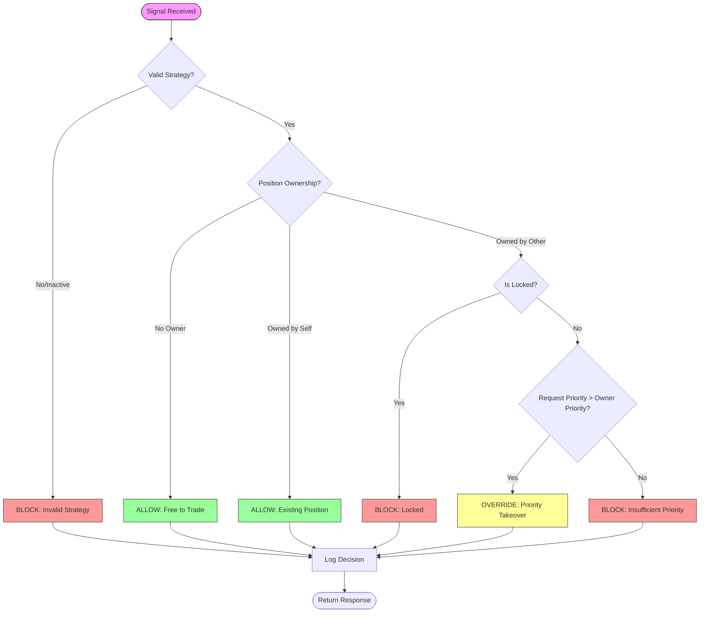

# Conflict Detection Algorithm

<!-- 
✅ 구현 완료 (2026-01-24)
- Conflict Detector: backend/ai/skills/system/conflict_detector.py
- Strategy Registry: backend/database/models.py (Strategy)
- Position Ownership: backend/database/models.py (PositionOwnership)
- Conflict Log: backend/database/models.py (ConflictLog)
-->

## Overview
This document outlines the decision logic for the `ConflictDetector` engine, which arbitrates access to trading resources (Tickers) among multiple strategies.

## Decision Tree

## Detailed Logic Steps

### 1. Input Validation
- **Action**: Verify `strategy_id` exists and `is_active=True`.
- **Failure**: Return `BLOCKED` with reasoning.

### 2. Ownership Check
- **Action**: Query `position_ownership` table for the ticker.
- **Scenario A (No Owner)**:
  - Result: `ALLOWED`
  - Reasoning: "No current owner. Free to trade."
- **Scenario B (Owned by Self)**:
  - Result: `ALLOWED`
  - Reasoning: "Already owned by requesting strategy."
- **Scenario C (Owned by Others)**:
  - Proceed to Step 3.

### 3. Lock Check
- **Action**: Check if `locked_until` timestamp > `datetime.now()`.
- **Result (Locked)**: `BLOCKED`
- **Reasoning**: "Target is LOCKED until {timestamp}"

### 4. Priority Comparison
- **Action**: Compare `requesting_strategy.priority` vs `owning_strategy.priority`.
- **Scenario A (Request > Owner)**:
  - Result: `PRIORITY_OVERRIDE`
  - Reasoning: "Priority Override: {req} > {own}"
  - **Side Effect**: This response signals the order manager to *transfer ownership* before execution.
- **Scenario B (Request <= Owner)**:
  - Result: `BLOCKED`
  - Reasoning: "Insufficient Priority: {req} <= {own}"

## Implementation Status
- The core logic is currently implemented in `backend/ai/skills/system/conflict_detector.py`.
- Integration points:
  - `OrderManager`: Must consult `ConflictDetector` before placing orders.
  - `OwnershipService`: Must be called to execute the transfer if `PRIORITY_OVERRIDE` is returned.
